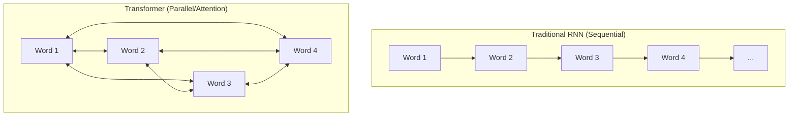

# Architecture Intuition

> **Mentor note:** Understanding the "why" behind Transformers is what separates prompt engineers from AI architects. Don't just memorize that Transformers are better; understand that they changed the fundamental way computers "hear" and "see" data by moving from sequential processing to simultaneous attention.

---

## What You'll Learn

- The shift from sequential (RNN) to parallel (Transformer) processing
- How the Multi-Head Attention mechanism solves the "long-range dependency" problem
- The quadratic cost of attention and why context windows aren't infinite
- The role of positional encodings in a non-sequential architecture
- Interview-ready mental models for transformer internals

---

## Theory & Intuition

### The Core Shift: Sequential vs. Parallel

Before 2017, AI processed language like a human reading a ticker tape: one word at a time. If the sentence was long, the "memory" of the beginning would fade by the time it reached the end (The Vanishing Gradient problem).

Transformers changed this by looking at every word in a block simultaneously.



### Self-Attention: The "Smart Hearing"

Think of Self-Attention as a "Dinner Party" where the AI can listen to everyone at once. When someone says, *"The robot was broken so **it** stopped moving,"* the model uses attention to "weight" the relationship between **"it"** and **"robot"** much higher than other words.

### Decoder-Only vs. Encoder-Decoder

Modern frontier LLMs (GPT-4, Gemini, Llama) are **Decoder-Only** Transformers — only the right-to-left masked generation stack, optimized for text completion. **Encoder-Decoder** models (like T5, BART) are better for tasks like translation where you need a full "understanding" pass before writing.

### Modern Architectural Optimizations (2023–2025 Frontier)

| Optimization | What it does | Used In |
|---|---|---|
| **Flash Attention** | Reorders GPU memory ops to avoid the O(N²) memory wall without changing the math | GPT-4, Llama 3, Gemini |
| **GQA (Grouped-Query Attention)** | Shares Key-Value heads across multiple Query heads — faster inference, less VRAM | Llama 3, Gemini Flash |
| **RoPE (Rotary Position Embeddings)** | Encodes position via rotation — naturally extends to longer contexts | Llama 3, Mistral, Qwen |
| **KV Cache** | Stores computed Key/Value matrices so prior tokens are never re-processed during generation | All production LLMs |
| **Sliding Window Attention** | Limits each token's attention to a local window for very long contexts | Mistral, Gemma |

---

## 💻 Code & Implementation

### Visualizing Attention Weights

This simulation shows how a model "attends" to different words to resolve pronouns like "it".

```python
def simulate_attention():
    # Scenario: "The robot was broken so it stopped moving."
    sentence = "The robot was broken so it stopped moving"
    words = sentence.split()
    
    # Simulated attention weights for the word 'it' (index 5)
    # High weights mean the model is 'focusing' on that word to understand 'it'
    attention_mapping = {
        "The":    0.02,
        "robot":  0.65,  # <-- Primary focus: 'it' refers to the robot
        "was":    0.03,
        "broken": 0.20,  # <-- Contextual focus: why did 'it' stop?
        "so":     0.05,
        "it":     0.00,
        "stopped":0.03,
        "moving": 0.02
    }

    print(f"Target Word: 'it'")
    print("-" * 30)
    for word in words:
        score = attention_mapping.get(word, 0)
        visual = "█" * int(score * 20)
        print(f"{word:10} | {visual} ({score*100:.0f}%)")

if __name__ == "__main__":
    simulate_attention()
```

> **Senior tip:** In real models (like GPT-4), this happens across dozens of "Attention Heads" simultaneously. One head might focus on grammar, another on entity resolution (like the example above), and another on sentiment.

---

## When NOT to Use Transformers

- **Simple Logic/Math:** Don't use a trillion-parameter model for what a 5-line regex or basic calculator can do.
- **Strict Deterministic Tasks:** If you need the *exact same* output every time with zero variance, LLMs are risky.
- **Ultra-Low Latency Edge Devices:** Running a local transformer still requires significant VRAM/Compute compared to legacy NLP models.

---

## Interview Questions & Model Answers

**Q: What is the primary advantage of Transformers over older RNN/LSTM models?**
> **Answer:** Parallelization. RNNs process tokens one-by-one, which is slow and suffers from memory loss over long sequences. Transformers process the entire sequence at once, allowing them to scale to massive datasets using GPUs and capture relationships across thousands of tokens.

**Q: Why do we need "Positional Encodings"?**
> **Answer:** Since Transformers see all words simultaneously, they are "permutation invariant" (they don't know the order). Without positional encodings, "Dog bites man" would look identical to "Man bites dog." Encodings add a unique mathematical signal to each token indicating its position.

**Q: Explain the $O(N^2)$ complexity of standard attention.**
> **Answer:** Standard "dense" attention compares every token to every other token. If you double the input length ($N$), the number of comparisons increases by $4$ ($N \times N$). This is why context windows have limits — eventually, you run out of memory to store the attention matrix.

**Q: What is Flash Attention and why does it matter?**
> **Answer:** Flash Attention is an I/O-aware exact attention algorithm that reorders computation using tiling to avoid materializing the full N×N matrix in slow GPU HBM memory. The math is identical, but it is 2-4x faster and uses up to 10x less memory — enabling longer contexts without any approximation.

**Q: What is a KV Cache and why is it critical for inference?**
> **Answer:** During autoregressive generation, every new token must attend to all previous tokens. Without the KV Cache, we'd recompute Key/Value matrices for all prior tokens on every new step — O(N²) repeated work. The KV Cache stores those computed matrices so only the new token's projection needs computing, making generation much faster and cheaper.

---

## Quick Reference

| Feature | RNN / LSTM | Transformer |
|---|---|---|
| **Processing** | Sequential (One by one) | Parallel (Simultaneous) |
| **Long-range Memory** | Poor (Gradients vanish) | Excellent (Multi-head Attention) |
| **Training Speed** | Slow | Very Fast (GPU optimized) |
| **Cost Complexity** | Linear $O(N)$ | Quadratic $O(N^2)$ (mitigated by Flash Attn) |
| **Best For** | Real-time audio streams | Complex reasoning, large-scale generation |
| **Position Encoding** | Implicit (Sequential) | RoPE / ALiBi / Learned Embeddings |
| **Modern Optimization** | N/A | Flash Attention, GQA, KV Cache, Sliding Window |
