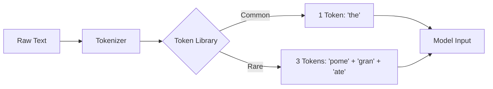

# Tokenization & Context Windows

> **Mentor note:** If compute is the fuel of AI, tokens are the currency. Beginners think in words; experts think in tokens. Mastering tokenization is how you optimize for both cost and performance. If you don't track your tokens, you're flying blind in production.

---

## What You'll Learn

- Why LLMs process "chunks" instead of words or characters
- The relationship between token count and the "Context Window"
- How to estimate costs and latency using token-to-word ratios
- Language bias in tokenizers and why it affects global pricing
- Local token counting to prevent API overflows

---

## Theory & Intuition

### The "Lego Brick" Analogy

Think of text as a pre-built house. 
- **Characters** are individual grains of sand (Too small and meaningless).
- **Words** are whole rooms (Too specific—what if you want a room that doesn't exist?).
- **Tokens** are **Lego Bricks**. You have a standard set of ~100k bricks that can build *anything*.



### The Context Window: The "Memory Bucket"

The context window is the maximum number of tokens a model can "remember" at one time. Once the bucket is full, the oldest tokens (usually the earliest part of the conversation) spill out and are lost forever.

### Modern Tokenizer Landscape (2024–2025)

| Model | Tokenizer | Vocab Size | Notes |
|---|---|---|---|
| **GPT-4o / o1** | `cl100k_base` (tiktoken) | 100,277 | Highly optimized for code |
| **Gemini 1.5 / 2.x** | SentencePiece (BPE) | 256,000 | Better multi-lingual coverage |
| **Llama 3** | tiktoken-based | 128,256 | Significantly improved over Llama 2 |
| **Mistral / Mixtral** | SentencePiece | 32,000 | Efficient European language support |

> **Gotcha:** Multimodal models (Gemini 2.0 Flash, GPT-4o) also tokenize **images**. A 1024x1024 image typically consumes 258-1024 "visual tokens" depending on the model's tile resolution, adding substantial hidden cost.

---

## 💻 Code & Implementation

### Counting Tokens Locally

In production, you should *always* count tokens before sending a request to save on failed API calls and costs.

```python
import tiktoken

def explore_tokens():
    text = "AI is amazing! Pomegranate is a long word."
    
    # cl100k_base is the standard for gpt-3.5-turbo and gpt-4
    encoding = tiktoken.get_encoding("cl100k_base")
    
    # Convert text -> token IDs
    tokens = encoding.encode(text)
    
    print(f"Original: {text}")
    print(f"Token Count: {len(tokens)}")
    print("-" * 30)
 
    # See how the model actually "sees" the text
    print(f"{'CHUNK':<15} | {'TOKEN ID'}")
    for t_id in tokens:
        # Decode individual ID back to text
        chunk = encoding.decode([t_id])
        print(f"'{chunk}':<15 | {t_id}")

if __name__ == "__main__":
    explore_tokens()
```

> **Gotcha:** **1000 tokens ≈ 750 words**. This ratio varies by language. For English, it's roughly 0.75, but for some Asian or Cyrillic languages, the ratio can be much higher, making them more expensive to process.

---

## When NOT to Use Tokenizers

- **Frontend Character Limits:** If you're just checking if a username fits in a 20-character input box, use `len(string)`.
- **Simple Regex/Parsing:** Don't use a tokenizer for basic task like "Is there a period at the end of this sentence?"
- **Low-Level Byte Processing:** If you're working with binary files or image headers, standard NLP tokenizers will fail.

---

## Interview Questions & Model Answers

**Q: What happens when a conversation exceeds the model's context window?**
> **Answer:** This is called "Context Overflow." Most production systems implement a **sliding window** or **summarization** strategy. The oldest messages are either deleted or summarized to make room for new input. If unmanaged, the model will "forget" initial instructions or user context.

**Q: Why do rare words take more tokens than common words?**
> **Answer:** Tokenizers use a technique called Byte Pair Encoding (BPE). Common words like "the" or "is" get their own single ID to save space. Rare words (like "pomegranate") or technical terms are split into smaller sub-word units that are already in the vocabulary, ensuring the model can reconstruct any word even if it's never seen it before.

**Q: How does token count impact latency?**
> **Answer:** LLMs are **Auto-regressive**—they generate exactly one token at a time. The total time to first token (TTFT) is based on the prompt size, but the total generation time is linearly proportional to the number of *output tokens*. More tokens = higher latency.

**Q: What is "Token Healing" and why does it matter for code generation?**
> **Answer:** Token Healing is a technique where the model "backs up" one token at the start of completion and re-generates it jointly with the next token. This prevents the common artifact where a completion starts with a partial token (e.g., completing `http` when the prefix already ends in `ht`) that would never appear in training data.

---

## Quick Reference

| Metric | Rule of Thumb | Why it matters |
|---|---|---|
| **English Ratio** | 1000 Tokens ≈ 750 Words | Budgeting and cost estimation |
| **Code Ratio** | 1000 Tokens ≈ 500-600 Lines | Code is token-dense |
| **CJK Languages** | 1 Character ≈ 1-3 Tokens | More expensive than English |
| **Context Window** | Fixed (e.g., 128k-1M) | Limits maximum document length |
| **Billing** | Input + Output Tokens | You pay for reasoning AND generation |
| **Image Tokens** | 258-1024 per image | Hidden multimodal cost |
| **Optimization** | Prompt Compressing | Save money by removing "fluff" tokens |
