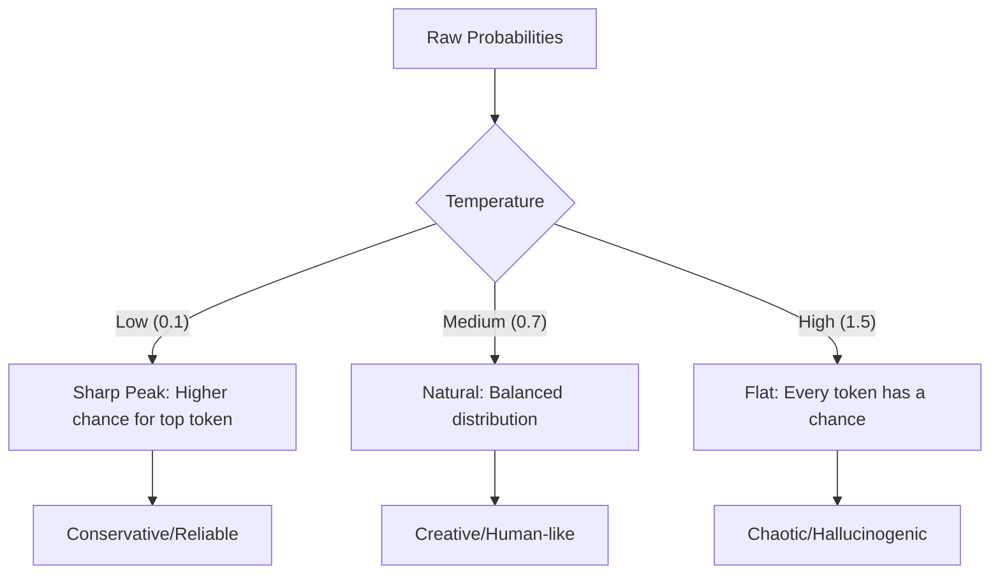

# 03. Sampling Parameters

> **Mentor note:** Tuning sampling parameters is like adjusting the "creative knobs" of the model. Too high, and the model starts talking nonsense; too low, and it becomes a boring, repetitive robot. For production agents, we usually favor stability (Low Temp) over creativity.

---

## What You'll Learn

- The mathematical intuition behind Temperature (Entropy)
- The difference between Top-K (Frequency) and Top-P (Probability)
- How to calibrate parameters for creative vs. factual use cases
- The "Hard Ceiling" effect of `max_tokens` and `stop_sequences`
- Model-agnostic configuration patterns

---

## Theory & Intuition

### Temperature: The "Risk" Knob

LLMs predict the next token by calculating a probability distribution. Temperature changes the "shape" of this distribution before the model picks the token.



### Top-K vs. Top-P (Nucleus Sampling)

Imagine predicting the next word for: *"The capital of France is..."*
- **Paris** (94%)
- **Lyon** (2%)
- **Marseille** (1%)
- **London** (0.5%)

**Top-K = 2** always takes the absolute top 2: `[Paris, Lyon]`.
**Top-P = 0.95** adds probabilities until they hit 0.95. Since Paris is 94%, it adds Lyon (2%) to hit 96% and stops. The pool is `[Paris, Lyon]`. Top-P is dynamic and safer for production.

---

## 💻 Code & Implementation

### Calibrating Gemini for Creative vs. Factual Tasks

```python
import google.generativeai as genai
import os
from dotenv import load_dotenv

load_dotenv()

def test_sampling():
    genai.configure(api_key=os.getenv("GEMINI_API_KEY"))
    model = genai.GenerativeModel('gemini-1.5-flash')
    
    prompt = "The most interesting thing about quantum physics is..."

    # 1. Factual Configuration (Low Temperature)
    config_strict = genai.types.GenerationConfig(
        temperature=0.1,
        top_p=0.1,
        max_output_tokens=100
    )
    
    # 2. Creative Configuration (High Temperature)
    config_creative = genai.types.GenerationConfig(
        temperature=1.0,
        top_p=0.9,
        top_k=40,
        max_output_tokens=100
    )

    print("--- Strict Output (Deterministic-ish) ---")
    print(model.generate_content(prompt, generation_config=config_strict).text)
    
    print("\n--- Creative Output (Varied) ---")
    print(model.generate_content(prompt, generation_config=config_creative).text)

if __name__ == "__main__":
    test_sampling()
```

> **Senior tip:** Never use `temperature=2.0` in a real app unless you want pure chaos. Most production systems use `0.0` for code/extraction and `0.7` for chat/creative writing.

---

## When NOT to Use High Temperature

- **Structured Output (JSON/Markdown):** High variance can break syntax (e.g., missing quotes or brackets).
- **Classification Tasks:** You want the model to be decisive, not "creative" about the labels.
- **Critical Calculations/Facts:** Reducing randomness is essential for grounding.

---

## Interview Questions & Model Answers

**Q: What is the difference between Top-P and Top-K sampling?**
> **Answer:** Top-K is a fixed limit on the number of candidate tokens. Top-P (Nucleus Sampling) is dynamic; it picks tokens whose cumulative probability exceeds a threshold. Top-P is generally superior because it adapts to the model's confidence—if it's very sure of the next word, the pool remains small.

**Q: Does setting Temperature to 0.0 make the model truly deterministic?**
> **Answer:** Usually, but not always. While it forces the model to pick the "Greedy" (highest probability) token, GPU non-determinism and model hosting architecture (like MoE) can still lead to slight variations across requests.

**Q: How does `max_tokens` affect the context window?**
> **Answer:** It doesn't affect the input window, but it acts as a hard ceiling for the **output response**. If reached, the model is forcibly stopped, often mid-sentence. You should always set this to prevent "infinite loop" generation and manage costs.

---

## Quick Reference

| Parameter | Recommended (Factual) | Recommended (Creative) | Impact |
|---|---|---|---|
| **Temperature** | 0.0 - 0.2 | 0.7 - 1.0 | Controls randomness/entropy |
| **Top-P** | 0.1 | 0.9 | Controls pool size based on probability |
| **Top-K** | 1 | 40 - 50 | Limits candidates to a fixed count |
| **Max Tokens** | 100 - 500 | 1000+ | Limits the length of output |

