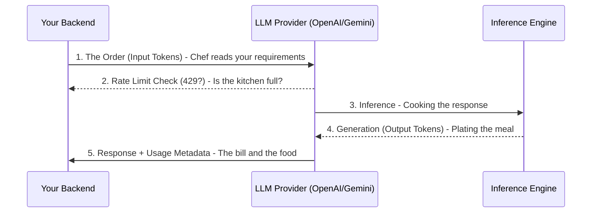

# 04. API Fundamentals

> **Mentor note:** Moving from a hobbyist script to a production-grade LLM application requires a shift in mindset. You are no longer just sending text; you are managing costs, handling fluctuating latencies, and building resilience against rate limits. Every millisecond and every token counts when you're scaling to thousands of users.

---

## What You'll Learn

- The structure of production-grade LLM API calls
- How to implement cost tracking and latency monitoring in real-time
- Strategies for handling API failures and Rate Limits (429 errors)
- The lifecycle of an LLM request: Prompting, Inference, and Decoding
- Caching strategies to reduce redundant compute and costs

---

## Theory & Intuition

### The Restaurant Analogy

LLM APIs are different from standard CRUD APIs. They are more like ordering at a high-end restaurant where every part of the service is billed separately.



### Key Production Metrics
1. **TTFT (Time to First Token):** How long before the user starts seeing text?
2. **TPS (Tokens Per Second):** How fast does the model "type"?
3. **Wait time vs. Streaming:** Streaming is non-negotiable for modern UX.

---

## 💻 Code & Implementation

### The Production-Ready API Wrapper

This script demonstrates how to wrap an LLM call with cost tracking, latency monitoring, and error handling.

```python
import os
import google.generativeai as genai
from dotenv import load_dotenv
import time

load_dotenv()

def production_api_call():
    # Setup
    genai.configure(api_key=os.getenv("GEMINI_API_KEY"))
    model = genai.GenerativeModel('gemini-1.5-flash')
    
    prompt = "Explain why API monitoring is critical for LLMs in 2 sentences."
    
    start_time = time.time()
    
    try:
        # 1. Call the API
        response = model.generate_content(prompt)
        end_time = time.time()
        
        # 2. Extract usage metadata (The "Bill")
        usage = response.usage_metadata
        in_tokens = usage.prompt_token_count
        out_tokens = usage.candidates_token_count
        
        # 3. Calculate Cost (Example rates for Gemini 1.5 Flash)
        # $0.075 / 1M input, $0.30 / 1M output
        cost = (in_tokens * 0.000000075) + (out_tokens * 0.00000030)
        
        print(f"Response: {response.text.strip()}")
        print("-" * 40)
        print(f"Latency: {end_time - start_time:.2f} seconds")
        print(f"Token Speed: {(in_tokens + out_tokens)/(end_time - start_time):.2f} tokens/sec")
        print(f"Cost: ${cost:.6f}")
        print("-" * 40)

    except Exception as e:
        # In production, use Exponential Backoff for 429 errors
        print(f"API Error: {e}")

if __name__ == "__main__":
    production_api_call()
```

> **Senior tip:** Never hardcode your API keys. Use environment variables. Also, set a `timeout` at the application level—LLMs can sometimes hang, and you don't want your server threads stuck forever.

---

## When NOT to Use LLM APIs

- **Sensitive Personal Data (PII):** Unless you have an Enterprise agreement with Zero Data Retention (ZDR), sending PII to a public API is a major security risk.
- **High-Frequency, Simple Tasks:** If you need to check if a string contains "bad words" 10,000 times a second, use a local keyword filter, not an expensive LLM.
- **Offline Environments:** If your app needs to work without internet access, you'll need local models (SLMs).

---

## Interview Questions & Model Answers

**Q: How do you handle a "429: Rate Limit Exceeded" error in a production pipeline?**
> **Answer:** We implement **Exponential Backoff with Jitter**. Instead of retrying immediately (which makes the problem worse), we wait for a short period that increases exponentially (1s, 2s, 4s...) and add a small random "jitter" to prevent all clients from retrying at the exact same millisecond (Thundering Herd problem).

**Q: Why are output tokens usually significantly more expensive than input tokens?**
> **Answer:** Input tokens are processed in parallel (pre-fill phase), which is computationally efficient. Output tokens are generated one-by-one (auto-regressive decoding), requiring many separate passes through the model's weights. This takes more time and GPU resources per token.

**Q: What is "Prompt Compression" and why do we use it?**
> **Answer:** Prompt compression involves stripping out unnecessary words, redundant instructions, or irrelevant context from the input to reduce token count. This improves latency and significantly reduces costs, especially for RAG systems with long retrieved contexts.

---

## Quick Reference

| Problem | Production Solution | Metric to Watch |
|---|---|---|
| **High Costs** | Semantic Caching (Redis) | Input/Output Token Count |
| **High Latency** | Streaming & Model Distillation | TTFT (Time to First Token) |
| **API Instability** | Retries & Model Fallbacks | Success Rate (%) |
| **Context Limit** | Chunking & Vector Search | Context Coverage |

