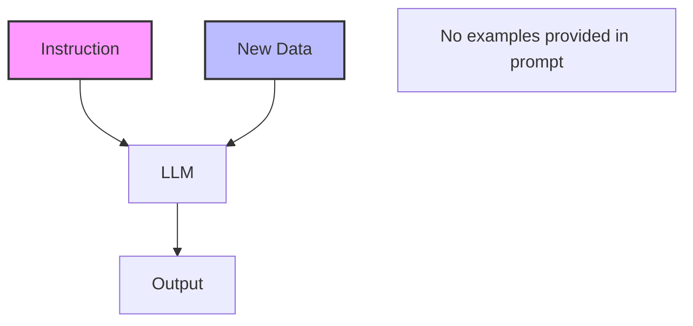

# Zero-Shot Prompting

> **Mentor note:** Zero-shot is the "stress test" of an LLM's general reasoning. It's the cheapest, fastest way to prototype, but it relies entirely on the model's pre-existing world knowledge. If a model fails at zero-shot, don't immediately switch models—try adding just one example (one-shot) first.

---

## What You'll Learn

- The definition of zero-shot vs. few-shot prompting
- How to write clear, constraint-heavy instructions for zero-shot tasks
- The relationship between model size and zero-shot performance
- Common failure modes like "format drifting" and hallucinated labels
- Scenarios where zero-shot is actually superior to few-shot

---

## Theory & Intuition

### The "Genius Intern" Analogy

Zero-shot is like hiring a super-smart intern who has read every book in the world but has never worked at your specific company. They know what a "complaint" is in general, so they can categorize your emails correctly on day one without any training.



### Why it Matters
It is the most cost-efficient way to use LLMs. You save on input tokens because you aren't sending a "tutorial" (examples) with every single request.

---

## 💻 Code & Implementation

### Sentiment Classification with Zero-Shot

This script demonstrates how to categorize text using a zero-shot approach with Gemini.

```python
import os
import google.generativeai as genai
from dotenv import load_dotenv

load_dotenv()

def run_zero_shot_demo():
    genai.configure(api_key=os.getenv("GEMINI_API_KEY"))
    # Using gemini-2.5-flash for latest compatibility
    model = genai.GenerativeModel('gemini-2.5-flash')

    # A mixed review that requires nuances
    test_review = "The delivery was lightning fast, but the product arrived broken. Annoying."

    # Zero-Shot Prompt: Explicit instructions, NO examples.
    prompt = f"""
    Categorize the following customer review. 
    Respond with EXACTLY one word from this list: [Positive, Negative, Mixed, Neutral].
    Do not provide any explanation or preamble.

    Review: "{test_review}"
    
    Response:
    """

    print("Analyzing review...")
    response = model.generate_content(prompt)
    
    print("-" * 40)
    print(f"Review: {test_review}")
    print(f"AI Categorization: {response.text.strip()}")
    print("-" * 40)

if __name__ == "__main__":
    run_zero_shot_demo()
```

> **Senior tip:** Huge models (GPT-4o, Gemini 1.5 Pro) are incredible at zero-shot. Smaller models (8B and below) often struggle with format constraints and may need "Few-Shot" examples to stay on track.

---

## When NOT to Use Zero-Shot

- **Complex Format Requirements:** If you need an incredibly specific JSON schema that isn't standard, zero-shot will likely fail.
- **Niche/Internal Knowledge:** If the task requires knowing "Product code X-15 means High Priority," a general model won't know that without being told in the prompt.
- **Small Models:** If you are running a local model to save money, you almost always need to use Few-Shot to achieve acceptable accuracy.

---

## Interview Questions & Model Answers

**Q: What is the most common failure mode for Zero-Shot prompted models?**
> **Answer:** Format instability. While the model usually gets the *answer* right, it often adds conversational fluff (e.g., "The answer is Positive") or uses synonyms you didn't ask for ("Bad" instead of "Negative"). Strict instruction and constrained decoding are the fixes.

**Q: Why is Zero-Shot prompting cheaper than Few-Shot?**
> **Answer:** Token cost. Few-shot prompts include examples, which can significantly increase the "Prompt Token" count. In a high-volume pipeline, removing examples can save thousands of dollars per month.

**Q: How do you choose between Zero-Shot and Few-Shot for a new task?**
> **Answer:** Use the "Rule of Three": Start with Zero-Shot. If accuracy is <90%, add 3-5 examples (Few-Shot). If accuracy is still low, refine the system prompt or consider fine-tuning.

---

## Quick Reference

| Feature | Zero-Shot | Few-Shot |
|---|---|---|
| **Cost** | Lowest | Higher (More input tokens) |
| **Complexity** | Simple (Instruction only) | Higher (Needs curated examples) |
| **Consistency** | Variable | High |
| **Best Model** | Large Frontier Models | Small/Mid-sized Models |
| **Use Case** | General classification, summary | Niche tasks, strict formatting |
