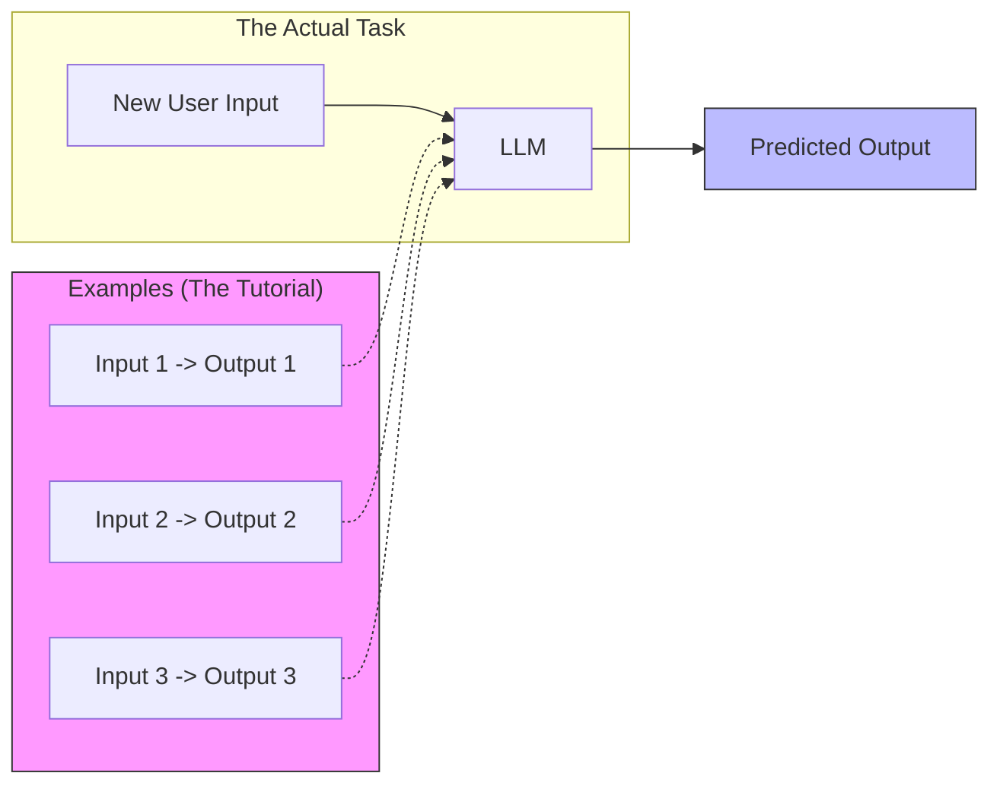

# Few-Shot Prompting

> **Mentor note:** If Zero-shot is a stress test, Few-shot is a "tutorial." It is the single most effective way to align an LLM with a specific, rigid output format or a subtle conversational style. In production, 3-5 high-quality examples are usually worth more than 1,000 words of instructions.

---

## What You'll Learn

- The mechanics of "In-Context Learning" (ICL)
- How to structure Input/Output pairs for maximum model alignment
- Strategies for selecting diverse and representative examples
- The impact of example ordering and bias on model output
- Balancing token cost vs. accuracy when adding "shots"

---

## Theory & Intuition

### The "Pattern Matching" Brain

LLMs are essentially giant pattern-completion machines. If you provide a sequence of examples, the model assumes the pattern is a rule to be followed for all subsequent turns. This is technically known as **In-Context Learning**.



---

## 💻 Code & Implementation

### Enforcing Strict JSON Output with Examples

While "JSON Mode" (Topic 06) handles syntax, Few-shot handles the **schema and labels**.

```python
import os
import google.generativeai as genai
from dotenv import load_dotenv

load_dotenv()

def run_few_shot_demo():
    genai.configure(api_key=os.getenv("GEMINI_API_KEY"))
    # Using gemini-2.5-flash for latest compatibility
    model = genai.GenerativeModel('gemini-2.5-flash')

    # Few-Shot Prompt: Show-and-Tell the pattern
    prompt = """
    Extract sentiment and confidence from the review. Respond with ONLY valid JSON.

    Input: "This is the best purchase I have ever made!"
    Output: {"sentiment": "positive", "confidence": 0.98}

    Input: "The product is fine, but the box was crushed."
    Output: {"sentiment": "mixed", "confidence": 0.75}

    Input: "I hate this company. Never buying again."
    Output: {"sentiment": "negative", "confidence": 0.99}

    Input: "Where is my order? It has been three weeks."
    Output: 
    """

    print("Sending few-shot prompt...")
    response = model.generate_content(prompt)
    
    print("-" * 40)
    print(f"AI Response:\n{response.text.strip()}")
    print("-" * 40)

if __name__ == "__main__":
    run_few_shot_demo()
```

---

## When NOT to Use Few-Shot

- **High-Volume, Low-Complexity Tasks:** If the model is already 95%+ accurate with Zero-shot, don't waste tokens (and money) on examples.
- **Vast, Unpredictable Schemas:** If the output structure changes for every single request, static examples will confuse the model.
- **Extremely Long Contexts:** If your examples are long and the input document is also long, you risk hitting the context limit or suffering from "lost in the middle" degradation.

---

## Interview Questions & Model Answers

**Q: What is "In-Context Learning" (ICL) in the context of LLMs?**
> **Answer:** ICL refers to the model's ability to learn a new task at inference time using only the examples provided in the prompt. Importantly, the model's underlying weights are NOT changed; it is simply leveraging its pre-trained pattern-matching capabilities to follow the "few-shot" examples.

**Q: Does adding 20 examples guarantee better results than adding 3?**
> **Answer:** No. There is a point of diminishing returns. Research shows that for most tasks, jump in performance is highest between 0 and 1-3 shots. Adding dozens of examples adds significant token cost and latency with marginal accuracy gains, and can sometimes introduce "recency bias" where the model over-weights the last few examples.

**Q: How does the order of examples affect the model?**
> **Answer:** LLMs suffer from "Recency Bias." They tend to pay more attention to the examples placed closest to the final question. In production, it's often best to randomize example order or place the most representative/critical example last.

---

## Quick Reference

| Factor | Description | Best Practice |
|---|---|---|
| **Quantity** | Number of examples (shots) | 3-5 is the sweet spot |
| **Diversity** | Variety in example labels | Include balanced samples (Pos/Neg/Mixed) |
| **Labels** | The tags used for shots | Use clear delimiters like `Input:` / `Output:` |
| **Cost** | Tokens per example | Keep examples concise; trim "fluff" text |
| **Recency** | Weight of the last example | Randomize order to avoid bias |
