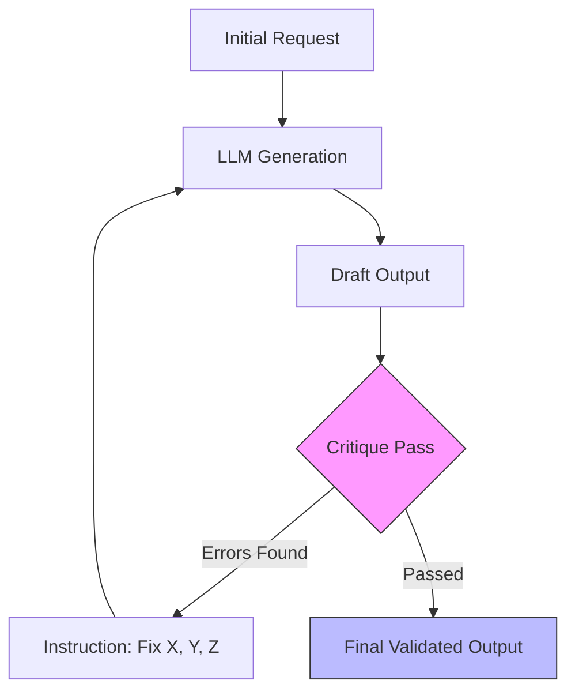

# 10. Self-Correction

> **Mentor note:** LLMs are often better critics than they are creators. When a model acts as a "creator," it is predicting tokens under pressure. When it acts as a "critic," it has the full context of its previous mistakes in front of it. Using a second "critique pass" is the most effective way to eliminate hallucinations and security flaws in AI-generated code.

---

## What You'll Learn

- The "Critic-Generator" pattern in LLM pipelines
- Why models can detect errors they just made (shifted objective)
- Implementing multi-pass self-correction for high-stakes code generation
- The cost-to-accuracy trade-offs of iterative refinement
- Strategies for cross-model verification (e.g., GPT-4o critiqued by Gemini Flash)

---

## Theory & Intuition

### The "Double-Check" Loop

When a model generates code or data, it is making thousand of micro-decisions. Self-correction allows the model to reread its own output as a static input, which triggers its pattern-matching and logic-checking routines rather than its creative generation routines.



**Why it matters:** In production, we rarely trust a single LLM pass for critical tasks. We build pipelines that act as "unit tests" for the LLM's own logic.

---

## 💻 Code & Implementation

### The Senior Code Review Pattern

This script demonstrates how to graduate from "Naive/Junior" code to "Hardened/Senior" code using a self-correction loop.

```python
import os
import google.generativeai as genai
from dotenv import load_dotenv

load_dotenv()

def run_self_correction_demo():
    genai.configure(api_key=os.getenv("GEMINI_API_KEY"))
    model = genai.GenerativeModel('gemini-1.5-flash')

    # Step 1: The "Naive" Request (Often ignores edge cases)
    task = "Write a Python function to read 'data.txt' and print each line."
    
    print("STEP 1: Generating Initial Answer...")
    initial_code = model.generate_content(task).text
    print("-" * 30 + " INITIAL DRAFT " + "-" * 30)
    print(initial_code.strip())

    # Step 2: The Self-Correction Prompt (The "Senior Architect" pass)
    critique_prompt = f"""
    You are a Senior Security & Performance Engineer. 
    Review the Python code below and find at least 3 vulnerabilities or missing safety checks.
    
    Code to review:
    {initial_code}

    Provide an IMPROVED, production-ready version of the code that handles:
    1. Standard I/O error handling (Missing files)
    2. Resource management (Context managers)
    3. Performance (Memory efficiency for large files)
    """

    print("\n\nSTEP 2: Running Self-Correction...")
    final_output = model.generate_content(critique_prompt).text
    
    print("-" * 30 + " CRITIQUE & IMPROVED CODE " + "-" * 30)
    print(final_output.strip())

if __name__ == "__main__":
    run_self_correction_demo()
```

> **Senior tip:** If you are extremely cost-conscious, use a powerful model (like GPT-4o) for the first pass and a cheaper model (like Gemini Flash or Llama 8B) to perform the critique. The cheaper model is often sufficient for catching basic syntax or formatting errors.

---

## When NOT to Use Self-Correction

- **High-Throughput, Low-Latency Apps:** Every correction pass doubles your latency. If the user expects a response in <1s, multi-pass loops are too slow.
- **Creative/Subjective Tasks:** If you ask an AI to "write a poem" and then "critique the poem," it will mostly just change things arbitrarily because there is no objective truth to measure against.
- **Strict Budget Constraints:** 2 passes = 2x API cost. Always measure the Accuracy Gain vs. the Cost increase before deploying.

---

## Interview Questions & Model Answers

**Q: Why is a model often able to detect an error in its own output that it made moments before?**
> **Answer:** This is due to a shift in objective. During generation, the model is focused on predicting the next most likely token. During critique, it is given the entire text as a **static prompt window**, allowing it to use its full attention mechanism to find logical or syntactical inconsistencies between the instructions and the generated text.

**Q: Describe the "Self-Consistency" technique.**
> **Answer:** Self-consistency is a specialized form of self-correction. You generate multiple independent responses to the same prompt at a high temperature, then compare the outcomes. If 4 out of 5 responses agree on an answer, you have high confidence that it's correct.

**Q: How do you prevent the AI from "hallucinating" problems during the critique phase?**
> **Answer:** Use "Constraint-Based Critiques." Instead of asking "Is this good?", give it a checklist (e.g., "Check specifically for Pydantic validation errors" or "Check for SQL injection vulnerabilities"). If it finds none, it should return the original code unchanged.

---

## Quick Reference

| Feature | Single Pass | Multi-Pass (Self-Correction) |
|---|---|---|
| **Reliability** | Moderate (70-80%) | High (95%+) |
| **Latency** | Low (Fast) | High (2x - 3x) |
| **Cost** | 1x | 2x or 3x |
| **Edge Case Handling** | Poor | Excellent |
| **Best For** | Casual chat, simple Q&A | Refactoring, extraction, security checks |

