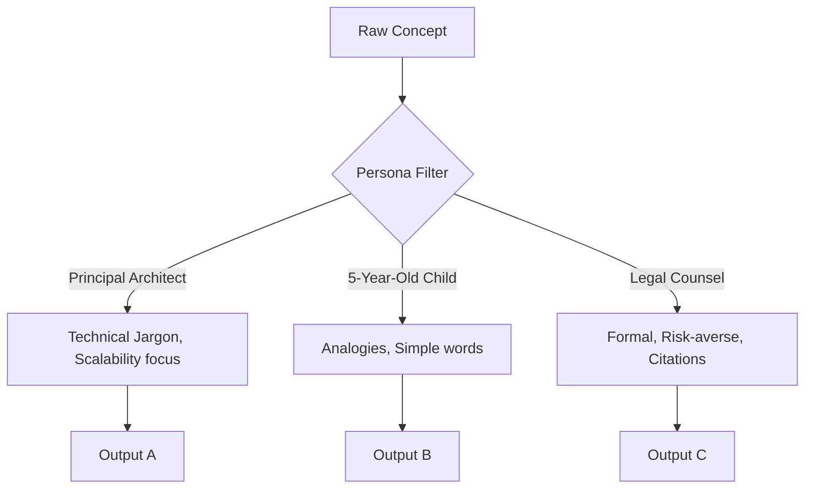

# 11. Role Prompting

> **Mentor note:** Role prompting is the art of "skinning" the AI's intelligence. An LLM is a generalist by default; by assigning it a persona (e.g., "Staff Security Engineer" or "Tenured History Professor"), you're forcing it to prioritize a specific lexicon and set of assumptions. It is the fastest way to align tone and depth without fine-tuning.

---

## What You'll Learn

- The "Persona Pattern": Why "Act as a [Role]" works mathematically
- How roles affect vocabulary, assumed knowledge, and tone
- The difference between Role Prompting and Audience Profiling
- Strategic role selection (e.g., Staff Engineer vs. Junior Developer)
- Using roles to minimize hallucinations in specialized domains

---

## Theory & Intuition

### The "Expert Filter"

When you assign a role, you are providing a "frame of reference" that narrows the model's search space. Instead of sampling from the entire internet's style, it focuses on the subset of data associated with that specific expertise.



**Why it matters:** Accuracy isn't just about truth; it's about **relevance**. An answer that is too technical for a CEO is just as useless as an answer that is too simple for a developer.

---

## 💻 Code & Implementation

### Adapting Explanations for Multiple Personas

```python
import os
import google.generativeai as genai
from dotenv import load_dotenv

load_dotenv()

def run_role_prompting_demo():
    genai.configure(api_key=os.getenv("GEMINI_API_KEY"))
    model = genai.GenerativeModel('gemini-1.5-flash')

    concept = "Microservices Architecture"

    # Persona 1: The Educator (Focus on Analogies)
    prompt_1 = f"You are a friendly 10-year veteran teacher. Explain {concept} using a LEGO analogy."

    # Persona 2: The Architect (Focus on Trade-offs)
    prompt_2 = f"You are a Principal Software Architect. Explain {concept} in terms of scalability, database sharding, and fault tolerance."

    print("--- PERSONA 1: TEACHER ---")
    print(model.generate_content(prompt_1).text.strip())

    print("\n" + "="*50 + "\n")

    print("--- PERSONA 2: ARCHITECT ---")
    print(model.generate_content(prompt_2).text.strip())

if __name__ == "__main__":
    run_role_prompting_demo()
```

> **Senior tip:** For the most robust results, place your Persona in the **System Prompt** (Topic 05). This makes the identity "global" for the entire conversation and prevents the AI from "breaking character" mid-way.

---

## When NOT to Use Role Prompting

- **Data Extraction & Transformation:** If you just need a JSON list of names from a PDF, a persona like "A meticulous librarian" just adds unnecessary token overhead.
- **Strict Logic/Math:** Personas can sometimes make the AI "talkative," leading it to explain its reasoning poorly or introduce narrative "fluff" that obscures the logic.
- **Highly Standardized Output:** If the output must follow a rigid schema (Topic 06), a persona might try to be "creative" with the field names.

---

## Interview Questions & Model Answers

**Q: What is the "Persona Pattern" in prompt engineering?**
> **Answer:** It's a technique where the prompt begins by assigning a specific identity to the model (e.g., "Act as a UX Researcher"). This primes the model to adopt the style, vocabulary, and professional standards associated with that identity, improving the relevance of the output.

**Q: Does Role Prompting affect the underlying model weights?**
> **Answer:** No. It is a purely "In-Context" technique. It leverages the attention mechanism to give higher weight to tokens and patterns associated with the requested persona during that specific inference session.

**Q: How do you prevent a persona from being "too creative" and hallucinating?**
> **Answer:** You pair the Persona with strict **Negative Constraints**. For example: "You are a Legal Assistant. Only use provided case law. If an answer is not in the text, say 'I do not know.' Do not invent statutes."

---

## Quick Reference

| Persona Level | Target Audience | Focus Area |
|---|---|---|
| **Executive / CEO** | Business Stakeholders | ROI, Risk, High-level strategy |
| **Principal Engineer** | Senior Tech Staff | Architecture, Performance, Trade-offs |
| **Junior / Entry** | New Learners | Concepts, Syntax, "How-to" steps |
| **End User** | Customers | Benefits, Simplicity, UX |
| **Adversary** | Security Teams | Vulnerabilities, Edge Cases, Pentesting |

