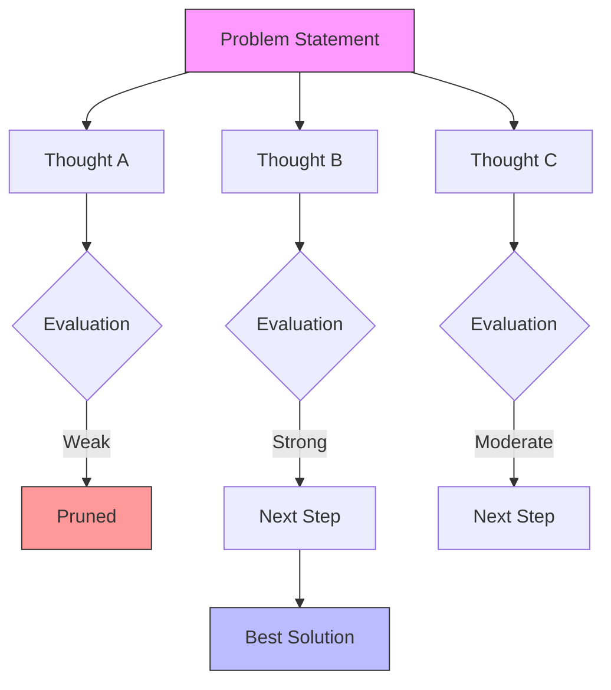

# Tree of Thoughts (ToT)

> **Mentor note:** If Chain-of-Thought is a single "script," Tree of Thoughts is a "brainstorming session." LLMs are "greedy" by nature—they pick the most likely next word without considering the long-term consequences. ToT allows the model to explore multiple "parallel universes" of reasoning, evaluate them, and back up if it hits a dead end. Its the closest we get to "look-ahead" search in pure text.

---

## What You'll Learn

- The limitations of "Greedy Decoding" and linear reasoning
- The ToT Framework: Brainstorming, Evaluation, and Pruning
- How to simulate a "Panel of Experts" within a single prompt
- Implementing ToT for strategic resource allocation and complex algorithm design
- Comparison with Self-Consistency and Monte Carlo Tree Search (MCTS)

---

## Theory & Intuition

### The "Look Before You Leap" Strategy

Standard LLMs move from Token A to Token B in a straight line. Tree of Thoughts introduces branching. 



**Why it matters:** In complex tasks (like planning a $10k budget or solving the "Game of 24"), the first logical step might lead to an impossible dead end. ToT allows the model to "peek" ahead and switch paths.

---

## 💻 Code & Implementation

### Simulating Tree of Thoughts: The "Expert Panel"

In production, you often use multiple API calls to implement ToT (One to generate, one to evaluate). However, you can simulate this in one pass using a structured prompt.

```python
import os
from groq import Groq
from dotenv import load_dotenv

load_dotenv()

def run_tot_demo():
    api_key = os.getenv("GROQ_API_KEY")
    if not api_key:
        print("Error: GROQ_API_KEY not found in .env")
        return

    client = Groq(api_key=api_key)
    model_name = "llama-3.1-8b-instant"

    problem = """
    A startup has $10,000 left in its bank account. 
    It needs to choose between:
    1. Hiring a freelance developer to fix 5 critical bugs.
    2. Investing in a 1-month marketing campaign to get 100 new users.
    3. Buying specialized hardware to speed up data processing by 50%.
    Which choice ensures the startup survives the next 3 months?
    """

    # THE ToT PROMPT: Simulated Expert Discussion
    prompt = f"""
    Solve the following problem using a Tree of Thoughts approach:
    
    1. Imagine three different expert advisors (a CTO, a CMO, and a CFO) each offering one distinct strategy.
    2. For each strategy, have the experts critique each other's ideas and identify one fatal flaw.
    3. Based on the critiques, prune the failing paths and provide the final, most robust strategy.

    Problem: {problem}
    """

    print("Running Tree of Thoughts (ToT) Simulation...")
    
    try:
        response = client.chat.completions.create(
            model=model_name,
            messages=[{"role": "user", "content": prompt}],
            temperature=0.7
        )
        print("-" * 50)
        print(response.choices[0].message.content.strip())
        print("-" * 50)
    except Exception as e:
        print(f"Error during generation: {e}")

if __name__ == "__main__":
    run_tot_demo()
```

---

## When NOT to Use Tree of Thoughts

- **Simple Decisions:** If there's only one logical path, ToT is a waste of tokens.
- **Latency-Critical Apps:** Generating multiple thoughts and evaluations can take 30-60 seconds.
- **Low-Reasoning Models:** Smaller models (like Llama 1B or early GPT-3.5) often fail to provide meaningful critiques, making the "evaluation" phase useless.

---

## Interview Questions & Model Answers

**Q: What is the main difference between Tree of Thoughts (ToT) and Chain-of-Thought (CoT)?**
> **Answer:** CoT is a single, linear path of reasoning. ToT is a branching structure that allows for exploration, evaluation of multiple intermediate steps, and "backtracking" if a certain path is determined to be suboptimal.

**Q: What does "Pruning" mean in the context of ToT?**
> **Answer:** Pruning is the process where a specific branch (thought path) is discarded because an evaluation step (either by the model itself or an external judge) determines it is unlikely to lead to a correct or optimal solution.

**Q: Why is ToT considered a "Cognitive Architecture" rather than just a prompt?**
> **Answer:** Because it mimics the human ability to plan and simulate outcomes before acting. It moves away from "instant prediction" towards a "system 2" thinking process involving deliberate search and judgment.

---

## Quick Reference

| Component | Purpose | Analogy |
|---|---|---|
| **Thought Generation** | Creating potential next steps | Brainstorming |
| **State Evaluation** | Scoring the "fitness" of a path | A Judge/Reviewer |
| **Search Algorithm** | Deciding which path to follow (BFS/DFS) | A Map/Pathfinder |
| **Backtracking** | Returning to a previous node after failure | An "Undo" button |
