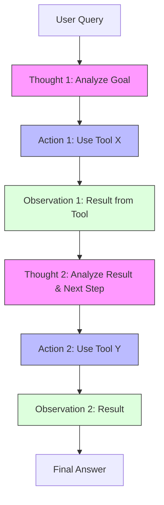

# ReAct (Reason + Act)

> **Mentor note:** ReAct is the foundation of modern AI Agents. Without it, an AI is just a "mouth" that can't "do" anything. By interleaving reasoning steps (Thoughts) with tool calls (Actions), we create a system that can interact with the real world, observe the results, and self-correct on the fly. It turns a static model into a dynamic engine.

---

## What You'll Learn

- The ReAct Loop: Thought, Action, Observation, and Final Answer
- How reasoning prevents "Action Drift" in multi-step workflows
- Implementing ReAct loops to bridge LLMs with external APIs and Databases
- Strategies for handling failed observations or API errors
- Comparison between ReAct and standard Tool Calling (Function Calling)

---

## Theory & Intuition

### The Interleaved Reasoning Loop

ReAct mimics how humans solve complex problems: we think about what we need, we perform an action, we observe the outcome, and we adjust our next thought based on that evidence.



**Why it matters:** Standard Tool Calling (Topic 25) often lacks the "Thought" step, causing the model to get stuck in loops or hallucinatory actions. ReAct provides the logic "glue" that keeps the agent on track.

---

## 💻 Code & Implementation

### A Pure Python ReAct Loop (Simulated)

In a production system, you would stop generation after the `Action:` tag, run your code, and append the `Observation:`.

```python
import os
from groq import Groq
from dotenv import load_dotenv

load_dotenv()

def run_react_simulation():
    api_key = os.getenv("GROQ_API_KEY")
    if not api_key:
        print("Error: GROQ_API_KEY not found in .env")
        return

    client = Groq(api_key=api_key)
    model_name = "llama-3.1-8b-instant"

    problem = "What is the account balance for user@example.com? If it's over $500, suggest a savings plan."

    # THE ReAct TEMPLATE
    prompt = f"""
    Solve the following problem. Use the following format:
    Thought: Explain why you are performing the next action.
    Action: The tool to call (one of [GetUserID, GetBalance, SuggestPlan]).
    Observation: The result of the action (I will provide this).
    ... (Repeat as needed)
    Final Answer: Your final conclusion to the user.

    Constraint: Do not hallucinate data. If you don't have an observation, you haven't done the action yet.

    Problem: {problem}
    """

    print("Running ReAct Agent Simulation...")
    
    try:
        response = client.chat.completions.create(
            model=model_name,
            messages=[{"role": "user", "content": prompt}],
            temperature=0.7
        )
        print("-" * 50)
        print(response.choices[0].message.content.strip())
        print("-" * 50)
    except Exception as e:
        print(f"Error during generation: {e}")

if __name__ == "__main__":
    run_react_simulation()
```

---

## When NOT to Use ReAct

- **Static Information Retrieval:** If the answer is already in the model's training data, ReAct just adds unnecessary delay and cost.
- **Single-Turn Tasks:** For a simple translation or summarization, the "Thought/Action" loop is overhead.
- **Token-Constrained Environments:** ReAct is very "chatty" and can consume thousands of tokens in reasoning before providing a one-sentence answer.

---

## Interview Questions & Model Answers

**Q: What is the primary difference between ReAct and standard Chain-of-Thought (CoT)?**
> **Answer:** CoT is internal; the model only interacts with its own weights to solve a problem. ReAct is external; the model is designed to interact with external tools (APIs, tools, DBs) and update its internal reasoning based on what it discovers from those tools.

**Q: What is "Action Drift" and how does the 'Thought' step prevent it?**
> **Answer:** Action Drift occurs when an agent performs a series of tool calls and gradually forgets the original user intent. By requiring a 'Thought' step before every action, the model is forced to re-justify its next move in the context of the original goal, acting as a logical anchor.

**Q: How do you prevent a ReAct agent from getting into an "Infinite Loop"?**
> **Answer:** You must implement a **Max Iteration Limit** (e.g., 5 or 10 turns) at the application level. Additionally, if the model sees the same 'Observation' twice, the system instruction should tell it to "stop and ask the user for clarification."

---

## Quick Reference

| Term | Role | Developer Rule |
|---|---|---|
| **Thought** | Reasoning | Must precede every action |
| **Action** | Tool Call | Must be from a pre-defined list |
| **Observation** | Reality Check| The tool's output; never hallucinate it |
| **Final Answer** | Conclusion | Terminate the loop |
| **Iteration** | Turn | Cap at 5-10 to prevent cost spikes |
