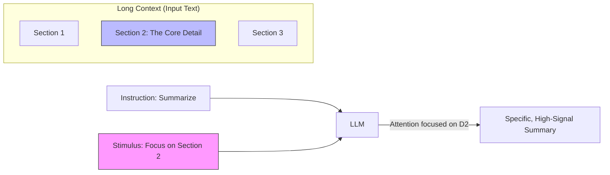

# Directional Stimulus Prompting (DSP)

> **Mentor note:** Generic prompts get generic answers. Directional Stimulus is about providing a "hint" or a "focus anchor" that guides the model's attention mechanism toward specific keywords or sections within a massive block of text. It's the difference between asking for a "summary" and asking to "summarize specifically for a CFO looking for financial risks."

---

## What You'll Learn

- The mechanics of "Attention Steering" in long-context models
- Implementing dynamic "Focus Modes" in AI applications
- How DSP mitigates the "Lost in the Middle" phenomenon
- Using "Stimulus Keywords" to reduce noise and hallucinations
- Automating stimulus generation using small/fast LLMs

---

## Theory & Intuition

### The Spotlight Effect

Imagine a dark room (your 50-page contract) full of information. Directional Stimulus is the spotlight. You aren't changing the room, you're just telling the observer exactly where to look to find what matters right now.



**Why it matters:** Even with huge context windows (1M+ tokens), LLM attention is not uniform. If you don't provide a stimulus, the model often over-weights the beginning and end of the document (Primacy/Recency bias).

---

## 💻 Code & Implementation

### Building a Dynamic Focus-Mode Summarizer

This script demonstrates how providing "stimulus keywords" forces the model to ignore irrelevant sections of a contract and deep-dive into the specific areas you care about.

```python
import os
from groq import Groq
from dotenv import load_dotenv

load_dotenv()

def run_dsp_demo():
    api_key = os.getenv("GROQ_API_KEY")
    if not api_key:
        print("Error: GROQ_API_KEY not found in .env")
        return

    client = Groq(api_key=api_key)
    # Using llama-3.1-8b-instant for fast extraction
    model_name = "llama-3.1-8b-instant"

    contract_text = """
    SECTION 1: PARTIES. This agreement is between AI Corp and User Inc...
    SECTION 2: PAYMENT. User Inc shall pay $500/month on the 1st of every month...
    SECTION 3: LIABILITY. AI Corp is not liable for data loss caused by solar flares...
    SECTION 4: TERMINATION. Either party can cancel with 30 days notice...
    """

    # We can change this 'stimulus' based on which lawyer is using the app
    current_stimulus = "Termination, cancellation, and notice periods"

    # THE DSP PATTERN
    prompt = f"""
    Document: {contract_text}
    
    Directional Stimulus Keywords: {current_stimulus}
    
    Task: Summarize the document above. 
    IMPORTANT: Provide deep detail ONLY for sections related to the stimulus keywords. 
    Ignore all other sections.
    """

    print(f"Summarizing with focus on: {current_stimulus}...")
    
    try:
        response = client.chat.completions.create(
            model=model_name,
            messages=[{"role": "user", "content": prompt}],
            temperature=0.5
        )
        print("-" * 50)
        print(response.choices[0].message.content.strip())
        print("-" * 50)
    except Exception as e:
        print(f"Error during generation: {e}")

if __name__ == "__main__":
    run_dsp_demo()
```

---

## When NOT to Use Directional Stimulus

- **Objective Overviews:** If you need a fair, balanced summary of a whole meeting, a stimulus will introduce bias and cause the model to miss important but "un-spotted" details.
- **Short Texts:** If the input is only 100 words, the model's attention is already focused on everything. A stimulus adds no value and consumes tokens.
- **Exploratory Tasks:** If the user doesn't know what they are looking for yet, "steering" their attention can be counter-productive.

---

## Interview Questions & Model Answers

**Q: Does Directional Stimulus help with the "Lost in the Middle" problem?**
> **Answer:** Yes. Research shows that models struggle to recall information placed in the middle of a long prompt. By providing a Directional Stimulus (specific keywords or section names), you effectively "re-prime" the model's attention to look for those specific patterns within the noise.

**Q: Can you automate the creation of the "Stimulus"?**
> **Answer:** Absolutely. A common production pattern is a "Two-Step Pipeline": Step 1 uses a small, fast model (like Gemini Flash) to extract 5 key themes from a query. Step 2 passes those themes as a "Directional Stimulus" to a larger model for the final, higher-quality reasoning.

**Q: How does DSP differ from standard role-playing?**
> **Answer:** Role-playing changes the **Voice/Tone** of the model. DSP changes the **Focus/Data Retrieval** of the model. You can (and should) use them together: "Act as a CFO (Role) and focus on the payment milestones (Stimulus)."

---

## Quick Reference

| Feature | Standard Prompt | Directional Stimulus |
|---|---|---|
| **Attention** | Distributed evenly (or biased to ends) | Focused on specific keywords |
| **Output Type** | Broad Overview | Deep-dive into specific area |
| **Best For** | General Q&A, Translation | Legal review, Medical charts, long reports |
| **Noise Level** | Higher (includes irrelevant bits) | Lower (filters out fluff) |
| **Implementation** | Static instruction | Dynamic, variable-driven instruction |
