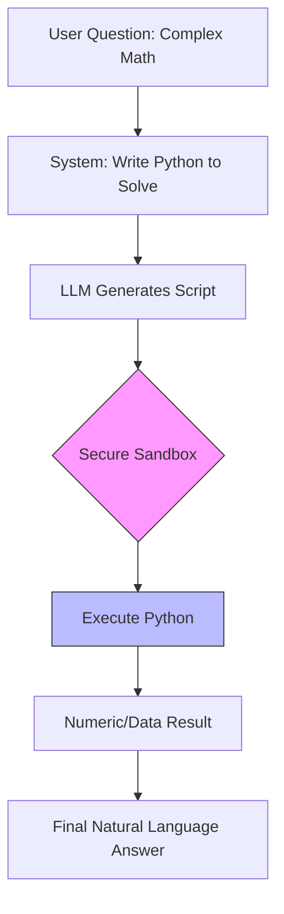

# Program-of-Thoughts (PoT)

> **Mentor note:** LLMs are linguistic engines, not calculators. Asking an LLM to solve complex compound interest or high-end calculus in plain text is like asking a poet to do your taxes—it might sound beautiful, but the numbers will be wrong. Program-of-Thoughts delegates the "Logic" to Code. The AI writes the script, and the CPU executes it. This is the secret to 100% mathematical accuracy.

---

## What You'll Learn

- The limitations of auto-regressive decoding for arithmetic
- The PoT Workflow: Natural Language -> Code -> Execution -> Answer
- Implementing "Code Interpreters" for financial and scientific applications
- Sandboxing and Security: Running AI-generated code safely
- Handling execution errors via Self-Correction loops

---

## Theory & Intuition

### Python as the Reasoning Backbone

In PoT, the AI's "Thought Process" is the code itself. LLMs are statistically better at writing syntactically correct Python (which they've seen billions of times in training) than they are at performing multi-step mental math.



**Why it matters:** Computers are significantly better at running Python than humans (or AIs) are at doing long multiplication. PoT bridges the gap between the LLM's creativity and the CPU's precision.

---

## 💻 Code & Implementation

### Solving Compound Interest with Code-Generation

This script demonstrates how to force the model to solve a financial problem by writing Python code instead of attempting mental math.

```python
import os
from groq import Groq
from dotenv import load_dotenv

load_dotenv()

def run_pot_demo():
    api_key = os.getenv("GROQ_API_KEY")
    if not api_key:
        print("Error: GROQ_API_KEY not found in .env")
        return

    client = Groq(api_key=api_key)
    # Using llama-3.1-8b-instant for robust code generation
    model_name = "llama-3.1-8b-instant"

    problem = """
    A client has $500. They add $50 every month for 5 years at a 5.5% annual interest rate. 
    Exactly how much do they have at the end of 60 months?
    """

    # THE PoT PROMPT: We demand code, not just an answer.
    prompt = f"""
    Solve the financial problem below by writing a Python script. 
    The script should:
    1. Define all variables.
    2. Perform the calculation in a loop or using a formula.
    3. Print the final result.

    Problem: {problem}
    """

    print("Generating Program-of-Thoughts (PoT) Script...")
    
    try:
        response = client.chat.completions.create(
            model=model_name,
            messages=[{"role": "user", "content": prompt}],
            temperature=0.3 # Lower temperature for better code structure
        )
        print("-" * 50)
        print("AI GENERATED CODE:")
        print(response.choices[0].message.content.strip())
        print("-" * 50)
        print("\n[Senior Note] In production, you would pass this string to an exec() "
              "call inside a Docker sandbox to get the numeric answer.")
    except Exception as e:
        print(f"Error during generation: {e}")

if __name__ == "__main__":
    run_pot_demo()
```

> **Senior tip:** Never run `exec()` or `eval()` on AI-generated strings on your local machine. Always use a dedicated sandbox like **E2B**, **Modal**, or a temporary Docker container to prevent the AI from accessing your files or environment metadata.

---

## When NOT to Use Program-of-Thoughts

- **Non-Algorithmic Tasks:** You don't need PoT to "Summarize a story" or "Translate to Spanish."
- **Low-Complexity Arithmetic:** If the question is "What is 15 + 27?", a standard LLM will get it right instantly without the overhead of code execution.
- **Latency-Critical Apps:** The cycle of Generate -> Execute -> Parse adds significant delay. Use standard CoT (Topic 09) if speed is prioritized over 100% precision.

---

## Interview Questions & Model Answers

**Q: What is the primary advantage of Program-of-Thoughts over Chain-of-Thought for math?**
> **Answer:** CoT still relies on the model's internal (and often flawed) arithmetic capabilities. PoT offloads the actual calculation to a deterministic engine (the Python interpreter). This eliminates "rounding errors" and "carryover mistakes" that are common in auto-regressive models.

**Q: How do you secure a production application that uses PoT?**
> **Answer:** You must use **Isolated Execution Environments**. We run the generated code in a stateless, ephemeral container (like Docker) with no network access, limited CPU/Memory, and a strict timeout. We only allow the code to output via `stdout`.

**Q: Can PoT help with data processing?**
> **Answer:** Yes. For example, if a user uploads a 10MB CSV and asks for the "Standard Deviation of Column B," an LLM cannot process that much data in its context. PoT allows the model to write a `pandas` script that processes the file locally on the server, returning only the final answer.

---

## Quick Reference

| Feature | Chain-of-Thought (CoT) | Program-of-Thoughts (PoT) |
|---|---|---|
| **Calculation Engine** | LLM Internal Logic | Python / CPU |
| **Accuracy** | 80-90% (Variable) | 100% (If code is correct) |
| **Complexity** | Simple text chain | Requires Sandbox & Execution |
| **Best For** | Logic puzzles, broad plans | Finance, Engineering, Data Analysis |
| **Primary Risk** | Hallucination | Security (Code Execution) |
