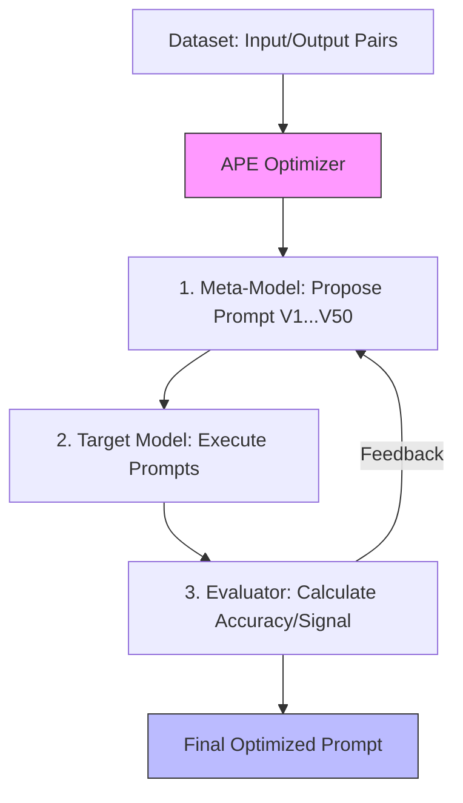

# 16. Automatic Prompt Engineer (APE)

> **Mentor note:** Human-written prompts are biased and exhausting to maintain. As models evolve from Gemini 1.0 to 1.5, a "perfect" human prompt can suddenly lose 10% accuracy. Automatic Prompt Engineering treats instruction-tuning as a search problem—using an LLM to generate, test, and score thousands of prompt variants to find the one that the target model actually "prefers."

---

## What You'll Learn

- The "Prompt Paradox": Why humans are often bad at writing prompt-level instructions
- The APE Workflow: Generation, Execution, Scoring, and Iteration
- The concept of "Prompt-as-Code" and the DSPy framework
- Building Evaluation Sets (Ground Truth) to anchor automated optimization
- Balancing the high API cost of APE against the accuracy gains

---

## Theory & Intuition

### The Optimization Loop

APE treats Prompt Engineering not as a creative task, but as an optimization problem. It uses a "Meta-Model" to propose instructions and a "Target Model" to execute them against a known dataset.



**Why it matters:** AI models often respond to "weird" phrasing—like "Deep breath" or "This is critical for my career"—that a human wouldn't naturally prioritize. APE discovers these hidden probabilistic triggers.

---

## 💻 Code & Implementation

### A Basic APE "Meta-Prompt" Refiner

In a full APE system, you would iterate 100+ times. This script shows the "Refinement Step" where a model critiques and improves a failing prompt.

```python
import os
import google.generativeai as genai
from dotenv import load_dotenv

load_dotenv()

def run_ape_refiner_demo():
    genai.configure(api_key=os.getenv("GEMINI_API_KEY"))
    model = genai.GenerativeModel('gemini-1.5-flash')

    original_prompt = "Summarize this data."
    failure_cases = """
    1. Input: [JSON of 100 items] -> Output: Too short, missed key IDs.
    2. Input: [Medical report] -> Output: Hallucinated a diagnosis.
    """

    # ⭐ THE META-PROMPT (The "Prompt Engineer" Persona)
    meta_prompt = f"""
    You are an Automatic Prompt Engineer.
    
    Current Prompt: "{original_prompt}"
    Failure Cases: {failure_cases}

    Analyze why the current prompt failed and generate 3 NEW prompt variations 
    that are more robust, concise, and explicit about following constraints.
    Inject techniques like Chain-of-Thought or Directional Stimulus if appropriate.
    """

    print("Running APE Refinement Pass...")
    response = model.generate_content(meta_prompt)
    
    print("-" * 50)
    print("OPTIMIZED PROMPT CANDIDATES:")
    print(response.text.strip())
    print("-" * 50)

if __name__ == "__main__":
    run_ape_refiner_demo()
```

> **Senior tip:** Frameworks like **DSPy** completely replace manual prompting with "Signatures" and "Optimizers." Instead of writing words, you write a data-driven program that "compiles" your prompt for a specific model.

---

## When NOT to Use APE

- **Low-Frequency Tasks:** If you only call a prompt 10 times a month, the $50 cost of running an APE sweep outweighs any benefit.
- **Vague Objectives:** If you don't have a clear "Ground Truth" (e.g., "Make the response sound more professional"), the APE optimizer won't know how to score the outputs.
- **One-Sentence Tasks:** For "fix the spelling," a human can reach 99.9% accuracy in 5 seconds without an optimizer.

---

## Interview Questions & Model Answers

**Q: Why can an LLM often write a better prompt for itself than a human can?**
> **Answer:** Humans operate on linguistic intuition and social norms. LLMs operate on token probabilities. A meta-prompting model can rapidly explore thousands of word permutations and "Instructional Triggers" that a human might reject as nonsensical but which statistically improve the target model's attention weighting.

**Q: What is the "Evaluation Set" (Eval Set) in an APE pipeline?**
> **Answer:** It is a curated collection of inputs and their expected "Ground Truth" outputs. APE uses this set to calculate a numeric "Fitness Score" for each prompt candidate. Without a diverse and high-quality Eval Set, an APE system will over-fit to a single scenario and fail in production.

**Q: How does DSPy differ from standard APE?**
> **Answer:** While APE generates "Instruction Strings," DSPy treats the entire LLM interaction as a **compiled program**. It optimizes the "weights" of the prompt (like which few-shot examples to include) based on a training set, essentially back-propagating through the prompt window.

---

## Quick Reference

| Role | Responsibility | Analogy |
|---|---|---|
| **Meta-Model** | Proposing new prompt variations | The Architect |
| **Target Model** | Executing the proposed prompts | The Builder |
| **Dataset** | Providing the test cases | The Material |
| **Evaluator** | Scoring the builder's work | The Inspector |
| **Fitness Score** | Measuring success (Accuracy, Recall) | The Grade |

