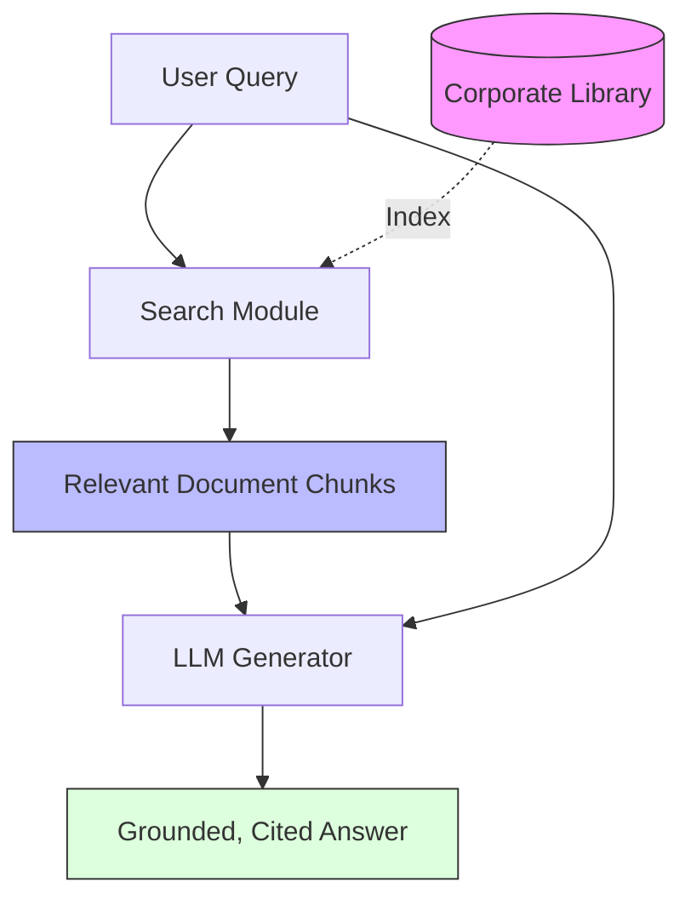

# RAG Fundamentals (Retrieval Augmented Generation)

> **Mentor note:** If an LLM is a brilliant student who graduated last year, RAG is giving them an open-book exam with today's newspaper. You don't need to retrain a model to teach it about your company's new tax strategy or a specific user's medical history. You just need to retrieve the right "context" and stuff it into the prompt. It is the single most important architecture for production AI.

---

## What You'll Learn

- The two-phase cycle: Retrieval (Searching) vs. Generation (Writing)
- "Grounding": How context eliminates "Human-like" hallucinations
- RAG vs. Fine-tuning: Decision matrix for engineering leaders
- The impact of Context Window size on retrieval strategy
- Data Privacy in RAG: Only sending what is necessary

---

## Theory & Intuition

### The Open-Book Exam Analogy

In a traditional LLM call, the model relies on its **internal weights** (cached knowledge). In RAG, the model relies on **external context** provided at runtime.



**Why it matters:** Accuracy isn't the only goal; **Verifiability** is. RAG allows the model to say, "According to Section 4 of your contract, yes, you have 30 days notice." This builds user trust.

---

## 💻 Code & Implementation

### A "Manual" RAG Loop (Concept)

This script demonstrates the core RAG cycle: retrieving relevant data from a "database" and using it to ground the model's response.

```python
import os
from groq import Groq
from dotenv import load_dotenv

load_dotenv()

def run_rag_fundamentals_demo():
    api_key = os.getenv("GROQ_API_KEY")
    if not api_key:
        print("Error: GROQ_API_KEY not found in .env")
        return

    client = Groq(api_key=api_key)
    # Using llama-3.1-8b-instant for fast grounded generation
    model_name = "llama-3.1-8b-instant"

    # Simulation of a "Database"
    my_private_docs = {
        "tax_policy": "Our 2024 policy allows a 10% deduction for home office expenses.",
        "remote_work": "Employees must be in the office on Tuesdays and Thursdays."
    }

    user_query = "What is the policy on home office deductions?"

    # PHASE 1: RETRIEVAL (Simulated)
    # in a real app, this would be a Vector Search (Topic 19)
    retrieved_context = my_private_docs["tax_policy"]

    # PHASE 2: GENERATION (Grounded)
    prompt = f"""
    You are a corporate HR assistant. 
    Use the provided CONTEXT to answer the USER QUERY.
    If the answer is not in the context, say 'I do not know.'
    
    CONTEXT: {retrieved_context}
    USER QUERY: {user_query}
    
    Answer:
    """

    print(f"Querying with RAG grounding...")
    
    try:
        response = client.chat.completions.create(
            model=model_name,
            messages=[{"role": "user", "content": prompt}],
            temperature=0.0 # High precision for RAG
        )
        print("-" * 50)
        print(response.choices[0].message.content.strip())
        print("-" * 50)
    except Exception as e:
        print(f"Error during generation: {e}")

if __name__ == "__main__":
    run_rag_fundamentals_demo()
```

> **Senior tip:** Global context is a trap. Don't try to send 100 documents to the LLM. Most models perform best when given 3-5 high-signal chunks. This is called the "Signal-to-Noise" ratio.

---

## RAG vs. Fine-Tuning

| Feature | RAG | Fine-Tuning |
|---|---|---|
| **Knowledge Type** | Dynamic, Frequently updated | Static, Style-based |
| **Accuracy** | High (with citations) | Moderate (prone to hallucination) |
| **Cost** | Marginal (Context tokens) | High (GPU training time) |
| **Transparency** | High (Can see retrieved context) | Low (Black box weights) |
| **Best For** | Internal Docs, Knowledge Bases | Tone, Specialized Jargon, Coding Style |

---

## Interview Questions & Model Answers

**Q: Why is RAG preferred over Fine-tuning for "Fact-based" applications?**
> **Answer:** RAG allows for real-time updates without retraining (you just update the database). It also provides a "Grounding" mechanism where the model can point to exactly which document it used to generate an answer, making it auditable and easier to debug.

**Q: What is the "Retrieval Gap" in RAG systems?**
> **Answer:** It's the failure where the information exists in the database, but the search system (Phase 1) fails to find it, or retrieves irrelevant chunks. If retrieval fails, the "Generation" phase is doomed to fail as well.

**Q: How do you handle "Hallucinations" in a RAG pipeline?**
> **Answer:** By using **Strict Instruction Framing** (e.g., "Answer ONLY using the provided context") and by implementing **Self-Correction** (Topic 10) where the model reviews its own response against the retrieved source text before showing it to the user.

---

## Quick Reference

| Term | Role |
|---|---|
| **Retrieval** | Finding relevant data (The "Search") |
| **Augmentation** | Combining context with the user query |
| **Generation** | The LLM writing the final response |
| **Grounding** | Ensuring the AI doesn't stray from the provided facts |
| **Source Attribution**| Citing exactly where the information came from |
