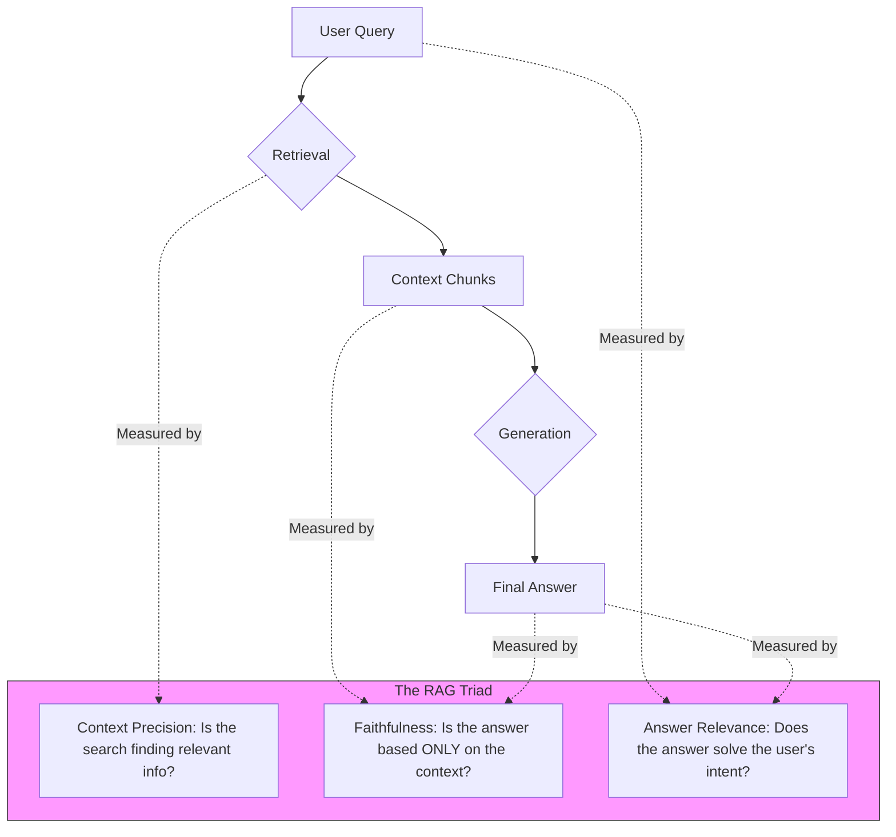

# Evaluation & Grounding

> **Mentor note:** A confident liar is worse than a silent assistant. Grounding is the process of anchoring the AI's response to verifiable facts (the "Context"). Without grounding, a model might tell a user their bank balance is $42,000 based on "vibes" when it's actually $4.20. Evaluation is how we mathematically measure that trust. If you can't measure your RAG system, you can't ship it.

---

## What You'll Learn

- The "RAG Triad": Faithfulness, Answer Relevance, and Context Precision
- Grounding: How to force the model to "Cite its Sources"
- LLM-as-a-Judge: Using GPT-4/Gemini Pro to evaluate smaller models
- Automated frameworks: RAGAS, G-Eval, and DeepEval
- The difference between deterministic metrics (Accuracy) and semantic metrics (Faithfulness)

---

## Theory & Intuition

### The RAG Triad for Reliability

To trust a RAG system, we don't just ask "Is the answer good?" We analyze three distinct vectors:



**Why it matters:** A system can have 100% "Answer Relevance" (it's a great answer) but 0% "Faithfulness" (it's a hallucination based on the AI's training data, not your private PDF). 

---

## 💻 Code & Implementation

### Implementing Basic Grounding & Citations

This script demonstrates how to force the model to provide evidence for its claims by citing specific documents from the retrieved context.

```python
import os
from groq import Groq
from dotenv import load_dotenv

load_dotenv()

def run_grounding_demo():
    api_key = os.getenv("GROQ_API_KEY")
    if not api_key:
        print("Error: GROQ_API_KEY not found in .env")
        return

    client = Groq(api_key=api_key)
    # Using llama-3.1-8b-instant for grounded generation
    model_name = "llama-3.1-8b-instant"

    # Simulation: Retrieved data from a PDF
    retrieved_data = """
    Document 1: The refund policy for standard items is 30 days.
    Document 2: Custom items are non-refundable unless defective.
    Document 3: Customer support hours are 9 AM to 5 PM EST.
    """

    user_query = "Can I return a custom-made t-shirt?"

    # THE GROUNDING PROMPT: Strict Citations
    prompt = f"""
    You are a Customer Support Agent. Answer the question ONLY using the provided context.
    
    CONTEXT:
    {retrieved_data}

    RULES:
    1. If the info isn't in the context, say 'I cannot answer this with the current data.'
    2. Provide a source tag e.g. [Document X] for every claim you make.
    3. Be concise.

    USER QUERY: {user_query}
    
    GROUNDED ANSWER:
    """

    print("Generating Grounded Answer with Citations...")
    
    try:
        response = client.chat.completions.create(
            model=model_name,
            messages=[{"role": "user", "content": prompt}],
            temperature=0.0 # Setting to 0.0 minimizes hallucinations
        )
        print("-" * 50)
        print(response.choices[0].message.content.strip())
        print("-" * 50)
    except Exception as e:
        print(f"Error during generation: {e}")

if __name__ == "__main__":
    run_grounding_demo()
```

---

## Evaluation Frameworks (The "Judge" Tier)

| Tool | Approach | Best For |
|---|---|---|
| **RAGAS** | LLM-based metrics (Faithfulness, etc.) | Automated CI/CD pipelines |
| **LangSmith** | Visual tracing & human annotation | Debugging specific failures |
| **G-Eval** | Weighted judging using 1-5 scales | Researching model performance |
| **Human-in-the-Loop**| Expert manual verification | Final "Sign-off" before launch |

---

## Interview Questions & Model Answers

**Q: What is the difference between "Faithfulness" and "Answer Relevance"?**
> **Answer:** "Faithfulness" measures if the answer is derived strictly from the retrieved context (no hallucinations). "Answer Relevance" measures if the answer actually addresses the user's specific question.

**Q: How does "LLM-as-a-Judge" help in evaluation?**
> **Answer:** Traditional metrics like BLEU or ROUGE are bad at measuring logic. LLM-as-a-Judge uses a superior model to read an answer and a ground truth, then provide a semantic score and reasoning.

**Q: What is "Context Precision"?**
> **Answer:** It's a retrieval metric. It asks: "Of all the documents retrieved, how many were actually relevant to answering the question?"

---

## Quick Reference

| Metric | Measured By | Ideal Score |
|---|---|---|
| **Faithfulness** | Answer vs. Context | 1.0 (No Hallucinations) |
| **Relevance** | Answer vs. Query | High (Answered user intent) |
| **Recall** | Context vs. Query | High (Found all relevant info) |
| **Precision** | Context vs. Query | High (Minimal noise retrieved) |
| **Groundedness**| LLM Judge Check | 1.0 (Strictly sourced) |
