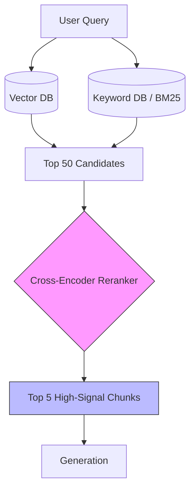

# Advanced RAG & Reranking

> **Mentor note:** Vanilla RAG (Topic 18) rarely meets the "production bar." In a real-world system, your Vector DB might return a chunk that has the right keywords but isn't actually useful. Advanced RAG introduces "Reranking" (a second, smarter pass over retrieval), "HyDE" (simulating a perfect answer before searching), and "Hybrid Search" (combining keyword and vector logic). It is the difference between a prototype and a product.

---

## What You'll Learn

- The "Second Pass": Using Cross-Encoders for high-precision Reranking
- Hybrid Search: Combining BM25 keyword matching with Vector proximity
- HyDE (Hypothetical Document Embeddings): Searching using an AI-generated "Guess"
- Parent-Document Retrieval: Searching small chunks but retrieving full context
- Query Transformation: Multi-query expansion and sub-query decomposition

---

## Theory & Intuition

### The Two-Stage Retrieval Pipeline

Standard RAG stops at "Top K" vector results. Advanced RAG adds a **Reranker**—a specialized model that looks at the top 20 results and the query as a pair, re-ordering them to ensure the absolute most relevant info is at the top.



**Why it matters:** Vector similarity is based on general semantic distance. A Reranker is much "smarter" but slower, which is why we only run it on the top ~50 results instead of the billion-vector database.

---

## 💻 Code & Implementation

### Simulating a Reranking Workflow

This script demonstrates the "Reranking Pass" where an LLM acts as a Cross-Encoder to re-order retrieved documents based on their actual relevance to the user's query.

```python
import os
from groq import Groq
from dotenv import load_dotenv

load_dotenv()

def run_advanced_rag_demo():
    api_key = os.getenv("GROQ_API_KEY")
    if not api_key:
        print("Error: GROQ_API_KEY not found in .env")
        return

    client = Groq(api_key=api_key)
    # Using llama-3.1-8b-instant to act as a fast auditor
    model_name = "llama-3.1-8b-instant"

    query = "What are the rules for returning custom t-shirts?"

    # Simulation of diverse (noisy) retrieval results from a Vector DB
    candidates = [
        "Document A: Refunds for standard items are 30 days.",
        "Document B: Our t-shirts are made of 100% organic cotton.",
        "Document C: Custom items cannot be returned unless the print is defective.", # The winner
        "Document D: We shipping globally from our warehouse in Texas."
    ]

    # THE RERANKING PROMPT (Simulated Cross-Encoder)
    rerank_prompt = f"""
    You are a Reranking Auditor.
    Query: {query}
    Candidates:
    {candidates}

    Task: Re-order these candidates from most relevant to least relevant based 
    on the query. 
    Explain your top choice.
    """

    print("Executing Reranking Pass (Simulated Cross-Encoder)...")
    
    try:
        response = client.chat.completions.create(
            model=model_name,
            messages=[{"role": "user", "content": rerank_prompt}],
            temperature=0.0
        )
        print("-" * 50)
        print(response.choices[0].message.content.strip())
        print("-" * 50)
    except Exception as e:
        print(f"Error during generation: {e}")

if __name__ == "__main__":
    run_advanced_rag_demo()
```

---

## Advanced RAG Techniques Matrix

| Technique | Goal | Analogy |
|---|---|---|
| **Reranking** | Improve precision of top results | A second interview |
| **Hybrid Search** | Combine keyword + vector logic | Looking at both a photo and a description |
| **HyDE** | Fix "sparse" user queries | Asking a friend for a "hint" before searching |
| **Parent-Doc** | Keep chunk small, context large | Looking at a snippet but reading the page |
| **Multi-Query** | Capture different ways to ask | Asking 3 people the same question |

---

## Interview Questions & Model Answers

**Q: Why is "Hybrid Search" often better than pure Vector Search?**
> **Answer:** Vector search is great for meaning but bad at exact names (e.g., "Model X-501"). Keyword search (BM25) is excellent at specific IDs and acronyms. Combining them ensures the system respects technical names while also understanding natural language.

**Q: How does HyDE (Hypothetical Document Embeddings) work?**
> **Answer:** Instead of embedding the user's question, we ask an LLM to "Generate a hypothetical perfect answer." We then embed that answer and search for documents similar to it. This produces a much stronger "signal" in the vector space.

**Q: When should you implement a Reranker?**
> **Answer:** When your Vector DB is returning irrelevant documents in the top 5, or when "faithfulness" is low because the LLM is getting distracted by noisy chunks.

---

## Quick Reference

| Stage | Goal | Tooling |
|---|---|---|
| **Retrieve** | Cast a wide net (Recall) | Pinecone, ChromaDB, BM25 |
| **Prune** | Remove obvious noise | Semantic filtering |
| **Rerank** | Order by high precision | Cohere Rerank, BGE-M3 |
| **Contextualize** | Add surrounding context | Parent-Document Retrieval |
| **Ground** | Generate final answer | Gemini 1.5, GPT-4 |
