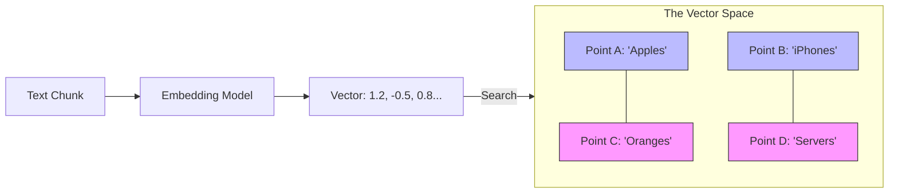

# 19. Vector Databases & Embeddings

> **Mentor note:** Computers don't understand "vibe." They understand numbers. Embeddings are the bridge that turns human semantic meaning (e.g., "Seattle is rainy") into high-dimensional coordinates in a mathematical map. A Vector Database is the highly-optimized "Librarian" that can search this map to find the points closest to your query in milliseconds. It is the "Soul" of retrieval.

---

## What You'll Learn

- The math of meaning: turning words into high-dimensional Vectors
- The role of Embedding Models in the RAG pipeline
- Vector Databases (Pinecone, ChromaDB, Weaviate) vs. Relational DBs
- Similarity Metrics: Cosine Similarity, Dot Product, and Euclidean Distance
- ANN (Approximate Nearest Neighbor) indexing for billion-scale search

---

## Theory & Intuition

### The High-Dimensional Map

Imagine every sentence is a point in a massive room. Sentences with similar meanings (e.g., "AI is powerful" and "ML is transformative") are placed physically close together, while irrelevant ones ("The cat is blue") are placed far away.



**Why it matters:** Standard SQL databases search for **exact matches**. Vector databases search for **proximity**. This is why you can find the "feeling of nostalgia" without ever typing the word "nostalgia."

---

## 💻 Code & Implementation

### Generating Embeddings with Gemini

```python
import os
import google.generativeai as genai
from dotenv import load_dotenv

load_dotenv()

def run_embeddings_demo():
    genai.configure(api_key=os.getenv("GEMINI_API_KEY"))
    
    # ⭐ TIP: Use the latest embedding model ('text-embedding-004')
    text = "Artificial Intelligence is the simulation of human intelligence by machines."
    
    result = genai.embed_content(
        model="models/text-embedding-004",
        content=text,
        task_type="retrieval_document"
    )

    vector = result['embedding']
    
    print(f"Text: {text}")
    print(f"Vector Length: {len(vector)}")
    print(f"First 5 dimensions: {vector[:5]}")
    print("-" * 50)
    print("[Senior Note] These numbers represent the semantic fingerprint of your text.")

if __name__ == "__main__":
    run_embeddings_demo()
```

---

## Similarity Metrics: Which one to choose?

| Metric | How it works | Best For |
|---|---|---|
| **Cosine Similarity** | Measures the *angle* between vectors | Text retrieval (most common) |
| **Dot Product** | Measures both direction and magnitude | Ranking where frequency matters |
| **Euclidean (L2)** | Measures straight-line distance | Physical data, image coordinates |

---

## Interview Questions & Model Answers

**Q: Why can't I just use a regular SQL database with `LIKE %query%` for RAG?**
> **Answer:** Keyword search (SQL) only finds exact character matches. If I search for "How to fix a flat tire," and the document says "Steps for repairing a punctured wheel," SQL finds nothing. A Vector DB understands that those two sentences are semantically adjacent in the high-dimensional space and will retrieve the correct document.

**Q: What is "Approximate Nearest Neighbor" (ANN)?**
> **Answer:** In a database of 1 billion vectors, checking every single point for every query (Brute Force) is O(n) and too slow. ANN algorithms (like HNSW or IVF) create a "search index" that navigates the map more efficiently, sacrificing a tiny bit of precision for massive speed gains.

**Q: Does a Vector Database store the actual text of the PDF?**
> **Answer:** Usually, yes, but it stores it as **Metadata**. The database's primary structure tracks the Vectors (indices). Once the closest vector is found, it looks up the associated "Metadata" string to return the original text to the LLM.

---

## Quick Reference

| Term | Purpose | Analog |
|---|---|---|
| **Embedding** | Converting text to numbers | A Fingerprint |
| **Dimension** | The size of the vector list (e.g., 768) | Level of Nuance |
| **Vector DB** | Optimized storage for similarity search| The Librarian |
| **HNSW** | A popular indexing algorithm for speed | A Map Index |
| **Metadata** | The original text/source info | The Back of the Book |

