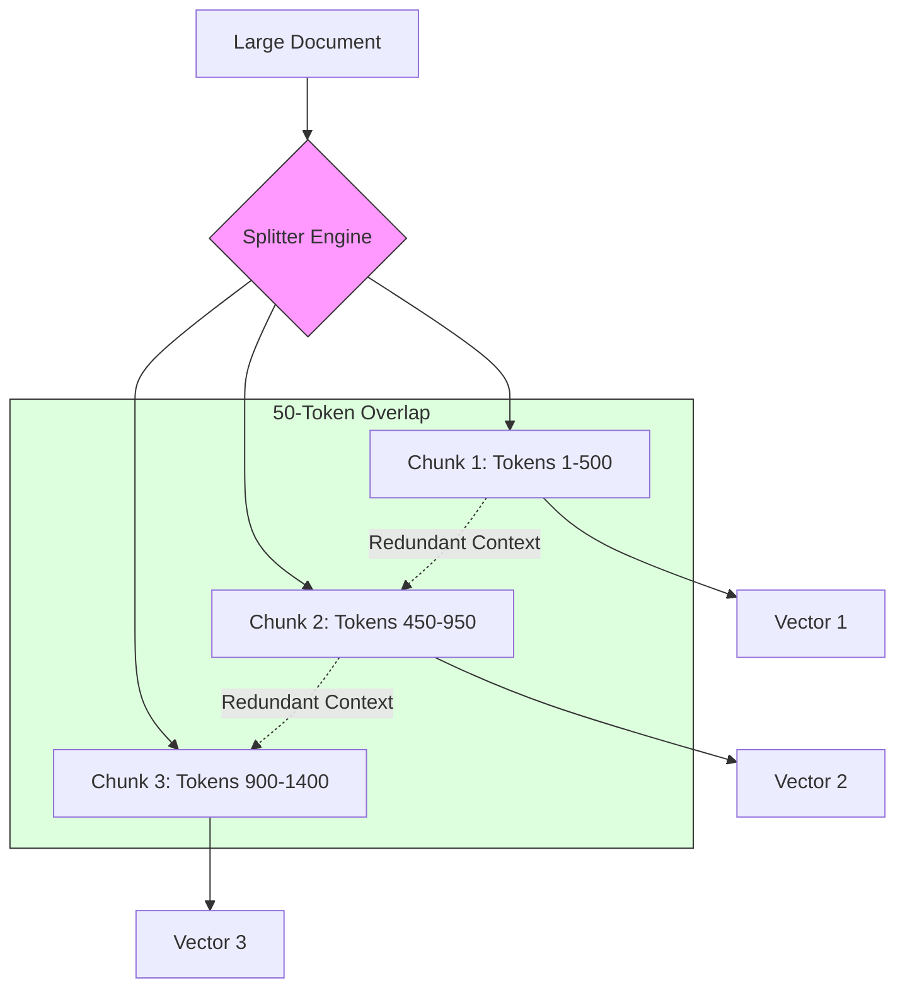

# 20. Chunking Strategies

> **Mentor note:** You can't fit a 500-page novel into a 128k context window without losing focus. Chunking is the process of breaking massive datasets into "digestible" segments. If your chunks are too small, the AI loses the plot (Missing Context). If they are too large, the AI gets distracted by the fluff (Noise). Masterful chunking is the difference between a RAG system that works and one that just "hallucinates with confidence."

---

## What You'll Learn

- The trade-offs between Fixed-Size vs. Recursive Character splitting
- Implementing "Sliding Window" overlap to prevent context loss at boundaries
- Advanced: Semantic Chunking using embedding-based topic detection
- Choosing the right Chunk Size (512 vs. 1024 tokens) and Overlap %
- Document-specific strategies: Markdown, JSON, and Python Code splitting

---

## Theory & Intuition

### The "Missing Context" Problem

Imagine tearing out pages 10-20 of a mystery novel. Page 10 might start mid-sentence: "...and that's when he realized the murderer was actually his..." 
Without the end of Page 9, the data is useless. "Overlap" ensures that the crucial leading/trailing information is preserved in every segment.



**Why it matters:** Recursive splitting (Topic 2.1) ensures we don't break sentences or paragraphs in half, keeping the "meaning" of the chunk intact for the embedding model.

---

## 💻 Code & Implementation

### A Basic Recursive Character Splitter

While libraries like LangChain exist, understanding the logic is key for senior engineers.

```python
import os
from typing import List

def recursive_chunk_text(text: str, chunk_size: int, overlap: int) -> List[str]:
    """
    Simulates a recursive character splitter.
    Prioritizes splitting by Double Newlines, then Newlines, then Spaces.
    """
    chunks = []
    start = 0
    
    while start < len(text):
        end = start + chunk_size
        
        # If we aren't at the end, find a clean break point
        if end < len(text):
            # Prioritize breaking at a newline or space
            break_point = text.rfind('\n', start, end)
            if break_point == -1:
                break_point = text.rfind(' ', start, end)
            
            if break_point != -1:
                end = break_point
        
        chunk = text[start:end].strip()
        chunks.append(chunk)
        
        # The 'Secret Sauce': Move back by the overlap amount
        start = end - overlap
        
        # Infinite loop prevention
        if start < 0: start = 0
        if end >= len(text): break

    return chunks

# Example Usage
my_text = "This is a long document about AI.\n\nIt has multiple paragraphs.\nWe need to split it."
chunks = recursive_chunk_text(my_text, chunk_size=40, overlap=10)

print(f"Generated {len(chunks)} chunks.")
for i, c in enumerate(chunks):
    print(f"[{i}]: {c}")
```

> **Senior tip:** For codebases (Python/JS), use specialized splitters that understand class and function boundaries. A chunk should never start in the middle of an `if` statement.

---

## When NOT to use Large Chunks

- **Fact-Dense Docs:** In a spreadsheet-like CSV, every row is a standalone fact. Use very small chunks (1 row per chunk).
- **Latency-Sensitive Apps:** More tokens in a chunk = more money spent and slower generation times.
- **Reranking Pipelines (Topic 23):** If you use a reranker, smaller chunks often perform better as the reranker can handle the density more effectively than a raw LLM.

---

## Interview Questions & Model Answers

**Q: What is the downside of a "Sliding Window" (Overlap)?**
> **Answer:** It increases storage costs and API costs for embedding. If you have a 20% overlap, you are paying for 20% more vectors and 20% more storage. It also introduces redundancy in search results; you might retrieve two chunks that share the same answer, wasting precious context window space.

**Q: How do you choose the "Optimal" Chunk size?**
> **Answer:** It is an empirical task. Generally, **512 tokens** is the "Goldilocks" zone for most models. However, you must use **A/B Testing** (or an Eval set): test your RAG accuracy with 256, 512, and 1024 sizes and measure which one yields the highest retrieval recall and generation accuracy.

**Q: What is "Semantic Chunking"?**
> **Answer:** Instead of splitting by character count, the system uses an embedding model to calculate the similarity between consecutive sentences. When the "Similarity Score" drops below a threshold, it assumes the topic has changed and creates a new chunk. This ensures high thematic cohesion.

---

## Quick Reference

| Splitter Type | Logic | Best For |
|---|---|---|
| **Fixed-Size** | Every X characters | Simple tests, non-text data |
| **Recursive Char** | Split by \n\n, \n, " " | Standard Documents (Word, PDF) |
| **Markdown** | Split by Headers (#, ##) | Documentation, Wikis |
| **Code** | Split by Class/Def | Software Repositories |
| **Semantic** | Split by Topic Change | Academic papers, dense reports |

