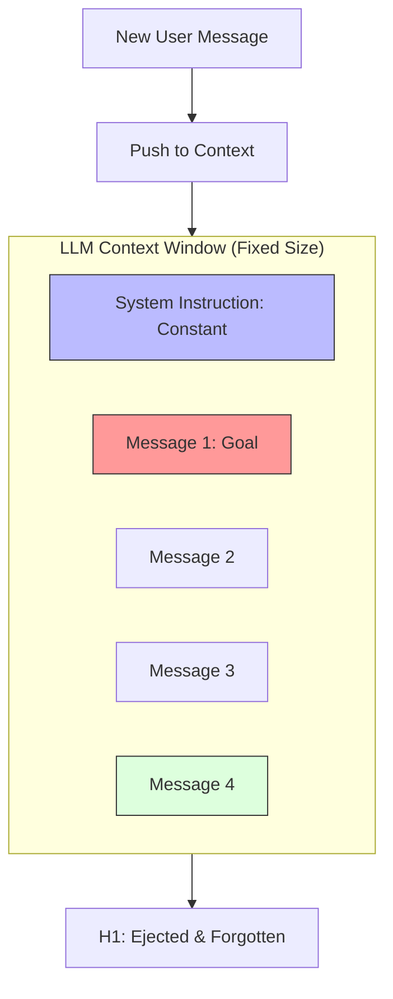

# 21. Context Management

> **Mentor note:** Every LLM has a "hard limit" on its memory (the Context Window). Context Management is the art of curating what the AI "thinks about" right now. Even with 1M+ token windows like Gemini 1.5, sending everything is slow and expensive. Your job as an engineer is to provide the highest signal in the fewest tokens. It's the difference between a "Goldfish Assistant" that forgets its name and a "Sage" that remembers every detail.

---

## What You'll Learn

- The math of tokens: how words are sliced for the model's brain
- Context Window patterns: Sliding Window, Buffer, and Summarization Memory
- The "Lost in the Middle" phenomenon and why position matters
- Token optimization: Pruning, Filtering, and Semantic Ranking
- Managing state in long-running multi-turn conversations

---

## Theory & Intuition

### The "Sieve" Effect

As a conversation progresses, new messages push old ones out of the "working memory." If you don't manage this, the AI will lose track of the original goal.



**Why it matters:** Accuracy depends on relevant history. If the user says "And what about the other guy?" in message 50, but the "other guy" was defined in message 1, a simple sliding window will cause the AI to fail.

---

## 💻 Code & Implementation

### Implementing Sliding Window vs. Summarization Memory

```python
import os
import google.generativeai as genai
from dotenv import load_dotenv

load_dotenv()

def run_context_management_demo():
    genai.configure(api_key=os.getenv("GEMINI_API_KEY"))
    model = genai.GenerativeModel('gemini-1.5-flash')

    # Simulation of a long history
    history = [
        {"role": "user", "content": "I want to plan a trip to Tokyo."},
        {"role": "model", "content": "Great! When are you going?"},
        # ... 50 messages later ...
        {"role": "user", "content": "Also, I am allergic to peanuts."},
        {"role": "model", "content": "Noted. I'll filter for peanut-free restaurants."},
    ]

    # ⭐ PATTERN 1: SLIDING WINDOW (Last 2 messages only)
    short_context = history[-2:]

    # ⭐ PATTERN 2: SUMMARIZATION (Condensing old history)
    # in production, you'd call the LLM to summarize previous messages
    summary = "User is planning a Tokyo trip and has a severe peanut allergy."
    
    current_prompt = f"""
    Summary of Conversation: {summary}
    Recent History: {short_context}
    
    Next User Query: "Suggest a good ramen spot near Shibuya."
    """

    print("Processing with Managed Context...")
    response = model.generate_content(current_prompt)
    
    print("-" * 50)
    print(response.text.strip())
    print("-" * 50)

if __name__ == "__main__":
    run_context_management_demo()
```

> **Senior tip:** Use **tiktoken** or **google-generativeai's `count_tokens`** method to monitor your window in real-time. Never guess how many tokens a prompt is; always measure.

---

## When NOT to use Massive Context

- **Latency-Critical Apps:** Processing 100k tokens can add 5-10 seconds to a response.
- **Cost-Sensitive Pipelines:** Billing is usually per-token. If a 1k context gives the same answer as a 100k context, you are wasting 99% of your budget.
- **Reranking:** If you have 50 documents, it's often better to send all 50 to a cheap Reranker model and only send the top 3 to the LLM.

---

## Interview Questions & Model Answers

**Q: What is the "Lost in the Middle" phenomenon?**
> **Answer:** Peer-reviewed research shows that LLMs are most effective at using information placed at the very beginning and very end of a prompt. Information "buried" in the middle of a long context is significantly more likely to be ignored. As an engineer, I mitigate this by placing the most critical RAG chunks right before the final user instruction.

**Q: How do you handle a conversation that is actually larger than a 1-million-token window?**
> **Answer:** I implement **Vector Memory**. I store all past interactions in a Vector Database (Topic 19). For each new query, I search the history for *relevant* past context and inject only those specific snippets into the current window, rather than sending the entire transcript.

**Q: Does Gemini 1.5's large window eliminate the need for RAG?**
> **Answer:** No. While you *could* put 100 PDFs in the window, it's incredibly expensive and slow for every single query. RAG acts as a pre-filter, ensuring the model only pays attention to and computes tokens for the most statistically relevant data.

---

## Quick Reference

| Strategy | Performance | Cost | Best For |
|---|---|---|---|
| **Full History** | Excellent (Short term) | Infinite | Short support chats |
| **Sliding Window**| Good | Fixed / Low | Fast-paced, low-memory apps |
| **Summarization** | High Context | Moderate | Long-term advisors / companions |
| **Vector Memory** | Highest (Long term) | Moderate (DB costs)| Knowledge bases, Personalized AI |
| **Pruning** | Variable | Lowest | Code review, Data transformation |

