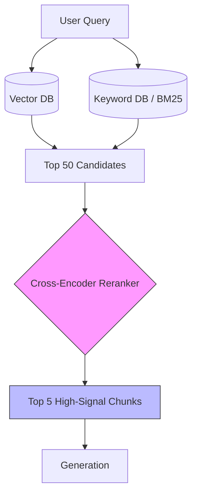

# 23. Advanced RAG & Reranking

> **Mentor note:** Vanilla RAG (Topic 18) rarely meets the "production bar." In a real-world system, your Vector DB might return a chunk that has the right keywords but isn't actually useful. Advanced RAG introduced "Reranking" (a second, smarter pass over retrieval), "HyDE" (simulating a perfect answer before searching), and "Hybrid Search" (combining keyword and vector logic). It is the difference between a prototype and a product.

---

## What You'll Learn

- The "Second Pass": Using Cross-Encoders for high-precision Reranking
- Hybrid Search: Combining BM25 keyword matching with Vector proximity
- HyDE (Hypothetical Document Embeddings): Searching using an AI-generated "Guess"
- Parent-Document Retrieval: Searching small chunks but retrieving full context
- Query Transformation: Multi-query expansion and sub-query decomposition

---

## Theory & Intuition

### The Two-Stage Retrieval Pipeline

Standard RAG stops at "Top K" vector results. Advanced RAG adds a **Reranker**—a specialized model that looks at the top 20 results and the query as a pair, re-ordering them to ensure the absolute most relevant info is at the top.



**Why it matters:** Vector similarity (Topic 19) is based on general semantic distance. A Reranker is much "smarter" but slower, which is why we only run it on the top ~50 results instead of the billion-vector database.

---

## 💻 Code & Implementation

### Simulating a Reranking Workflow

```python
import os
import google.generativeai as genai
from dotenv import load_dotenv

load_dotenv()

def run_advanced_rag_demo():
    genai.configure(api_key=os.getenv("GEMINI_API_KEY"))
    model = genai.GenerativeModel('gemini-1.5-flash')

    query = "What are the rules for returning custom t-shirts?"

    # Simulation of diverse (noisy) retrieval results
    candidates = [
        "Document A: Refunds for standard items are 30 days.",
        "Document B: Our t-shirts are made of 100% organic cotton.",
        "Document C: Custom items cannot be returned unless the print is defective.", # The winner
        "Document D: We shipping globally from our warehouse in Texas."
    ]

    # ⭐ THE RERANKING PROMPT (Acting as a Cross-Encoder)
    rerank_prompt = f"""
    You are a Reranking Auditor.
    Query: {query}
    Candidates:
    {candidates}

    Task: Re-order these candidates from 1 to 4 based on how likely they are 
    to contain the direct answer. Provide ONLY the re-ordered indices.
    """

    print("Executing Reranking Pass (Simulated Cross-Encoder)...")
    response = model.generate_content(rerank_prompt)
    
    print("-" * 50)
    print(f"Original Order: [0, 1, 2, 3]")
    print(f"Reranked Order: {response.text.strip()}")
    print("-" * 50)
    print("[Senior Note] In production, use Cohere Rerank or BGE-Reranker for this step.")

if __name__ == "__main__":
    run_advanced_rag_demo()
```

---

## Advanced RAG Techniques Matrix

| Technique | Goal | Analogy |
|---|---|---|
| **Reranking** | Improve precision of top results | A second interview |
| **Hybrid Search** | Combine keyword + vector logic | Looking at both a photo and a description |
| **HyDE** | Fix "sparse" user queries | Asking a friend for a "hint" before searching |
| **Parent-Doc** | Keep chunk small, context large | Looking at a snippet but reading the page |
| **Multi-Query** | Capture different ways to ask | Asking 3 people the same question |

---

## Interview Questions & Model Answers

**Q: Why is "Hybrid Search" often better than pure Vector Search?**
> **Answer:** Vector search is great for meaning but bad at exact names (e.g., "Model X-501"). Keyword search (BM25) is excellent at specific IDs and acronyms. By combining them (Reciprocal Rank Fusion), you ensure the system respects technical names while also understanding natural language.

**Q: How does HyDE (Hypothetical Document Embeddings) work?**
> **Answer:** Instead of embedding the user's *question* (which is short and sparse), we ask an LLM to "Generate a hypothetical perfect answer." We then embed that *answer* and search for documents similar to it. This produces a much stronger "signal" in the vector space than searching for the question itself.

**Q: When should you implement a Reranker?**
> **Answer:** When your Vector DB is returning irrelevant documents in the top 5, or when "faithfulness" is low because the LLM is getting distracted by noisy chunks. Rerankers are the most effective lever for increasing RAG accuracy after basic chunking is solved.

---

## Quick Reference

| Stage | Goal | Tooling |
|---|---|---|
| **Retrieve** | Cast a wide net (Recall) | Pinecone, ChromaDB, BM25 |
| **Prune** | Remove obvious noise | Semantic filtering |
| **Rerank** | Order by high precision | Cohere Rerank, BGE-M3 |
| **Contextualize** | Add surrounding context | Parent-Document Retrieval |
| **Ground** | Generate final answer | Gemini 1.5, GPT-4 |
