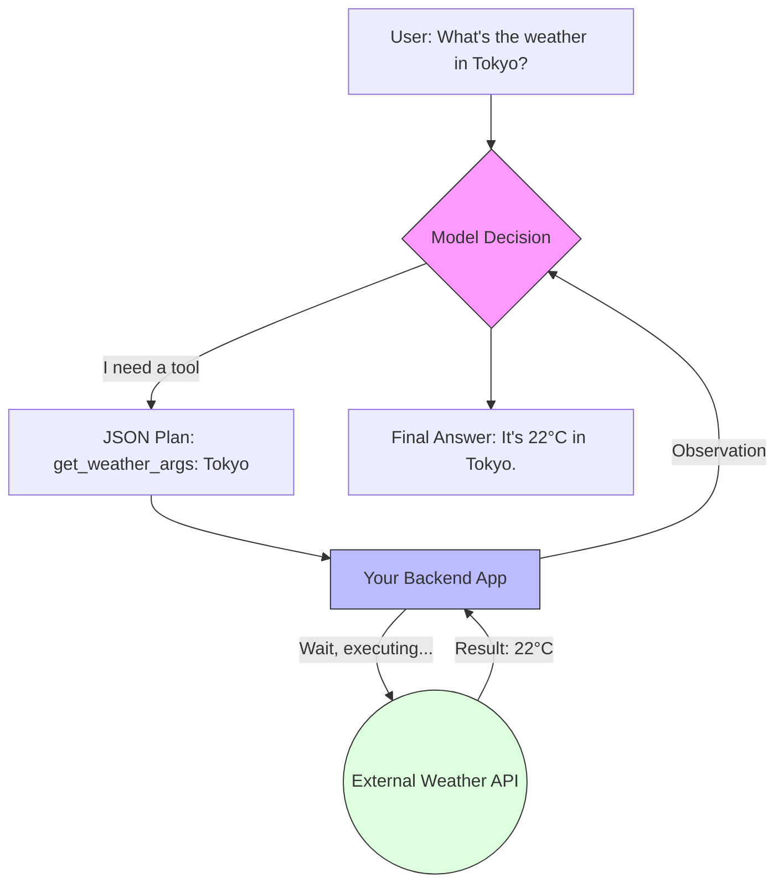

# Tool Calling & Function Binding

> **Mentor note:** If an LLM is a "brain," Tool Calling is its "hands." Without tools, an AI is trapped in its training data (frozen in time). Tool Calling allows the model to interact with the real world—querying live databases, checking current stock prices, or sending an email. It is the bridge between linguistic intelligence and software utility.

---

## What You'll Learn

- The Tool Calling loop: Declaration, Decision, Execution, and Response
- JSON Schemas: How to describe functions so the LLM understands them
- The "Sandwich" architecture: AI generates JSON -> App runs code -> AI summarizes result
- Parallel Tool Calling: Handling multiple requests in a single turn
- Forced vs. Auto tool selection strategies

---

## Theory & Intuition

### The Remote Control Pattern

It is crucial to understand that **the LLM does not execute the code.** The model simply outputs a structured request (JSON). Your application is the "Executor" that performs the work and reports back.



**Why it matters:** Security and Control. Because your code runs the function, you can implement permissions, rate limits, and human-in-the-loop approvals before any sensitive operation is performed.

---

## 💻 Code & Implementation

### Implementing Tool Calling with Groq

This script demonstrates the end-to-end loop: defining a tool, letting the model "call" it, executing the logic in Python, and sending the result back for a final answer.

```python
import os
import json
from groq import Groq
from dotenv import load_dotenv

load_dotenv()

# STEP 1: Define the actual Python function
def get_stock_price(ticker: str):
    """Retrieves the current stock price for a given ticker symbol."""
    data = {"GOOG": "$175.50", "AAPL": "$220.30", "MSFT": "$410.15"}
    return data.get(ticker.upper(), "Ticker not found.")

def run_tool_calling_demo():
    client = Groq(api_key=os.getenv("GROQ_API_KEY"))
    model_name = "llama-3.1-8b-instant"

    # STEP 2: Define the tools for the model
    tools = [
        {
            "type": "function",
            "function": {
                "name": "get_stock_price",
                "description": "Get the current stock price for a given ticker",
                "parameters": {
                    "type": "object",
                    "properties": {
                        "ticker": {"type": "string", "description": "The stock ticker symbol"}
                    },
                    "required": ["ticker"]
                }
            }
        }
    ]

    messages = [{"role": "user", "content": "How is Google doing on the stock market today?"}]

    # STEP 3: Model decides to call the tool
    response = client.chat.completions.create(
        model=model_name,
        messages=messages,
        tools=tools,
        tool_choice="auto"
    )

    response_message = response.choices[0].message
    tool_calls = response_message.tool_calls

    if tool_calls:
        print("Model requested a tool call...")
        messages.append(response_message)

        # STEP 4: Execute the Python logic
        for tool_call in tool_calls:
            function_args = json.loads(tool_call.function.arguments)
            print(f"Executing local function: get_stock_price('{function_args['ticker']}')")
            
            function_response = get_stock_price(function_args["ticker"])
            
            # Add the 'observation' back to the conversation
            messages.append({
                "tool_call_id": tool_call.id,
                "role": "tool",
                "name": "get_stock_price",
                "content": function_response,
            })

        # STEP 5: Model summarizes the result
        final_response = client.chat.completions.create(
            model=model_name,
            messages=messages
        )
        print("-" * 50)
        print(f"AI Summary: {final_response.choices[0].message.content}")
        print("-" * 50)

if __name__ == "__main__":
    run_tool_calling_demo()
```

---

## Tool Selection Strategies

| Strategy | Behavior | Use Case |
|---|---|---|
| **Auto** | Model decides to use 0, 1, or N tools | Standard chatbots, general assistants |
| **None** | Model is forbidden from using tools | Pure conversation / reasoning |
| **Required** | Model MUST pick a tool to proceed | Specialized agents (e.g., "Search-only" bot) |

---

## Interview Questions & Model Answers

**Q: Does the LLM execute the code inside its neural network?**
> **Answer:** No. An LLM's only output is text tokens. When a tool is "called," the model generates a string formatted as JSON. Your application detects this, executes the real logic, and appends the result back to the model's context.

**Q: What is a "Schema Violation" and how do you handle it?**
> **Answer:** It's when the LLM generates arguments that don't match your function's definition. To handle it, your code should catch the error and send a System Message back to the AI explaining the error. The AI will then attempt a "Self-Correction."

**Q: What is "Parallel Tool Calling"?**
> **Answer:** It's the ability of a model to suggest multiple independent tool calls in a single turn. For example, if a user asks to "compare Apple and Microsoft," a capable model will return two JSON blocks simultaneously.

---

## Quick Reference

| Term | Role | Developer Rule |
|---|---|---|
| **Declaration** | Describing the tool | Use clear, descriptive docstrings |
| **JSON Schema** | The tool's "contract" | Define required vs optional fields |
| **Tool Choice** | Execution intent | Use 'required' for specialized agents |
| **Observation** | The tool's result | Never hallucinate; only report reality |
| **Stop Sequence** | SDK signal | Tells the app to pause generation and run code |
