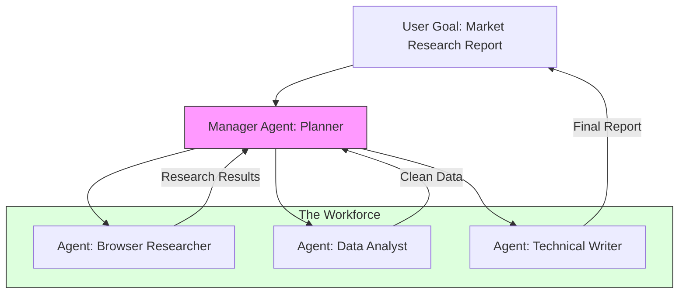

# 24. Multi-Agent Systems (MAS)

> **Mentor note:** A single LLM is a soloist. A Multi-Agent System is an orchestra. When a task is too complex for one prompt (e.g., "Build a full-stack app"), we split it into specialized roles: a Coder, a Reviewer, and a DevOps Engineer. By narrowing the "Persona" and "Context" for each agent, we significantly reduce hallucinations and increase the "ceiling" of what AI can build.

---

## What You'll Learn

- Orchestration Patterns: Sequential, Hierarchical (Manager), and Joint Collaboration
- The "Critic" Pattern: Improving quality via adversarial feedback loops
- Key Frameworks: CrewAI (Roles), AutoGen (Dialogues), and LangGraph (State Machines)
- Managing shared state and "Blackboard" communication between agents
- Handling MAS challenges: Infinite loops, token spikes, and consensus reaching

---

## Theory & Intuition

### The "Specialist" Advantage

In a single-agent setup, one model is expected to be a master of everything simultaneously. In a Multi-Agent setup, we exploit the model's ability to play a **Persona** (Topic 11) to focus its attention on a specific subset of its knowledge.



**Why it matters:** Modularity. If the research fails, the Writer never starts. If the Coder makes a bug, the Reviewer catches it before the user ever sees it. This "Human-in-the-loop" style automation is the state-of-the-art for Generative AI.

---

## 💻 Code & Implementation

### A Basic Hand-off Pattern (Sequential)

This simulation shows a "Writer" agent passing its work to a "Critic" agent for review.

```python
import os
import google.generativeai as genai
from dotenv import load_dotenv

load_dotenv()

def run_mas_demo():
    genai.configure(api_key=os.getenv("GEMINI_API_KEY"))
    model = genai.GenerativeModel('gemini-1.5-flash')

    # ⭐ AGENT 1: THE WRITER
    writer_prompt = "You are a creative writer. Write a 2-sentence story about a robot on Mars."
    story = model.generate_content(writer_prompt).text.strip()
    
    print(f"WRITER OUTPUT:\n{story}\n")

    # ⭐ AGENT 2: THE CRITIC
    # This agent has a different "Mindset"
    critic_prompt = f"""
    You are a Strict Editor. 
    Review the story below for scientific accuracy. 
    If there are errors, provide 1 specific fix.
    
    STORY: {story}
    """
    review = model.generate_content(critic_prompt).text.strip()
    
    print(f"CRITIC REVIEW:\n{review}\n")
    print("-" * 50)
    print("[Senior Note] In a real MAS, Agent 1 would then rewrite the story "
          "based on Agent 2's feedback.")

if __name__ == "__main__":
    run_mas_demo()
```

---

## Multi-Agent Orchestration Patterns

| Pattern | How it works | Best For |
|---|---|---|
| **Sequential** | A -> B -> C | Simple pipelines (e.g., Translate -> Summarize) |
| **Hierarchical** | Manager delegates to workers | Large projects with many sub-tasks |
| **Joint (Peer)** | Agents talk in a group chat | Creative brainstorming, complex debugging |
| **Broadcast** | One-to-many info sharing | Alerting systems, keeping state in sync |

---

## Interview Questions & Model Answers

**Q: When should you use a Multi-Agent System instead of just one very large prompt?**
> **Answer:** Use MAS when the task requires different, sometimes conflicting, "mindsets" or toolsets. For example, a "Security Auditor" agent should be pessimistic and look for flaws, while a "Feature Developer" should be optimistic and focus on functionality. MAS also helps overcome context window limits by splitting a large task into smaller, manageable sub-contexts.

**Q: How do you prevent "Infinite Loops" in a Multi-Agent conversation?**
> **Answer:** You must implement a **Conversation Controller** with a hard "Max Turns" limit (e.g., 10 turns). You also monitor for "Stagnation"—if the last 3 messages have a high semantic similarity, the system should intervene and either ask the user for help or terminate the loop.

**Q: What is the "Manager Agent" pattern and why is it useful?**
> **Answer:** It's a pattern where a central "Orchestrator" agent receives the user's high-level goal, breaks it into a "Plan" (Topic 27), delegates tasks to specialized workers, and verifies their output. This reduces the complexity for the user and ensures a cohesive final result.

---

## Quick Reference

| Term | Role | Framework Example |
|---|---|---|
| **Agent** | A model + A persona + Tools | CrewAI Agent |
| **Orchestrator**| The "Brain" that decides who talks | LangGraph Node |
| **Critic** | An agent that reviews work | Self-Correction Loop |
| **Consensus** | All agents agreeing on an answer | Group Chat |
| **Hand-off** | Passing the "Token" to the next agent| Sequential Chain |

