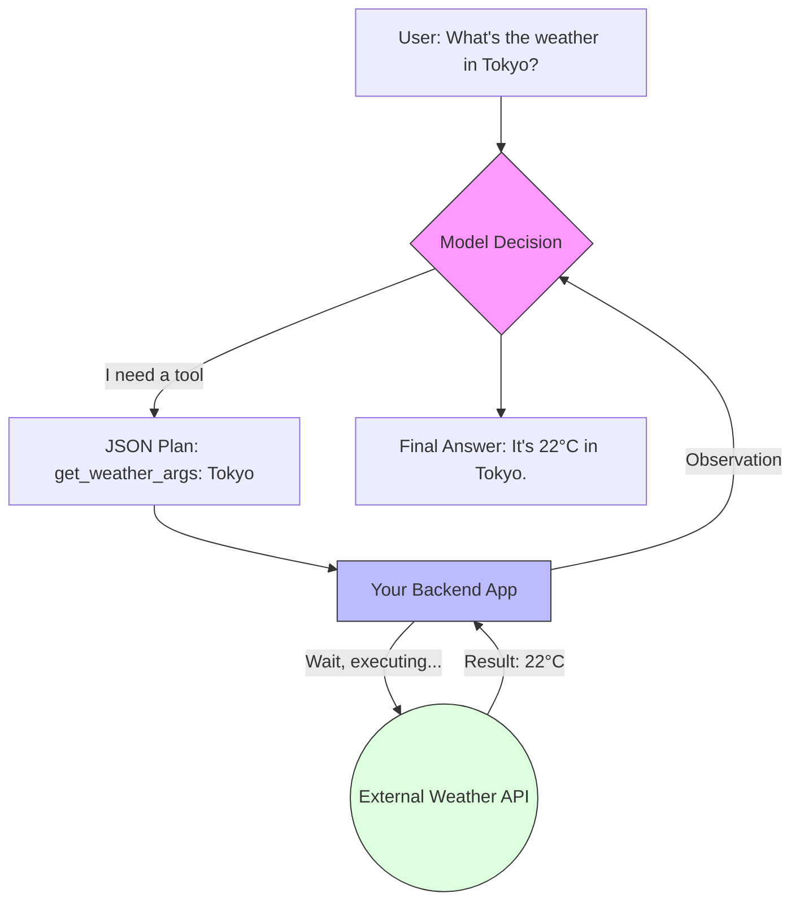

# 25. Tool Calling & Function Binding

> **Mentor note:** If an LLM is a "brain," Tool Calling is its "hands." Without tools, an AI is trapped in its training data (frozen in time). Tool Calling allows the model to interact with the real world—querying live databases, checking current stock prices, or sending an email. It is the bridge between linguistic intelligence and software utility.

---

## What You'll Learn

- The Tool Calling loop: Declaration, Decision, Execution, and Response
- JSON Schemas: How to describe functions so the LLM understands them
- The "Sandwich" architecture: AI generates JSON -> App runs code -> AI summarizes result
- Parallel Tool Calling: Handling multiple requests in a single turn
- Forced vs. Auto tool selection strategies

---

## Theory & Intuition

### The Remote Control Pattern

It is crucial to understand that **the LLM does not execute the code.** The model simply outputs a structured request (JSON). Your application is the "Executor" that performs the work and reports back.



**Why it matters:** Security and Control. Because your code runs the function, you can implement permissions, rate limits, and human-in-the-loop approvals before any sensitive operation is performed.

---

## 💻 Code & Implementation

### Implementing Tool Calling with Gemini 1.5

```python
import os
import google.generativeai as genai
from dotenv import load_dotenv

load_dotenv()

# ⭐ STEP 1: Define the actual Python function
def get_stock_price(ticker: str):
    """Retrieves the current stock price for a given ticker symbol."""
    # Simulation: In reality, you'd call a Finance API
    data = {"GOOG": "$175.50", "AAPL": "$220.30", "MSFT": "$410.15"}
    return data.get(ticker.upper(), "Ticker not found.")

def run_tool_calling_demo():
    genai.configure(api_key=os.getenv("GEMINI_API_KEY"))
    
    # ⭐ STEP 2: Pass the function definition to the model
    model = genai.GenerativeModel(
        model_name='gemini-1.5-flash',
        tools=[get_stock_price]
    )

    chat = model.start_chat(enable_automatic_function_calling=True)

    query = "How is Google doing on the stock market today?"
    print(f"User: {query}")
    
    response = chat.send_message(query)
    
    print("-" * 50)
    print(f"AI: {response.text.strip()}")
    print("-" * 50)
    print("[Senior Note] The 'enable_automatic_function_calling' flag in the "
          "SDK handles the loop of calling your Python function and "
          "returning the result to the AI automatically.")

if __name__ == "__main__":
    run_tool_calling_demo()
```

---

## Tool Selection Strategies

| Strategy | Behavior | Use Case |
|---|---|---|
| **Auto** | Model decides to use 0, 1, or N tools | Standard chatbots, general assistants |
| **None** | Model is forbidden from using tools | Pure conversation / reasoning |
| **Any / Required** | Model MUST pick a tool to proceed | Specialized agents (e.g., "Search-only" bot) |
| **Specific** | Model must use a *specific* named tool | Debugging or strict routing workflows |

---

## Interview Questions & Model Answers

**Q: Does the LLM execute the code inside its neural network?**
> **Answer:** No. An LLM's only output is text tokens. When a tool is "called," the model generates a string formatted as JSON. The calling application (Python/JS) detects this, executes the real logic, and appends the result back to the model's context for a final summary.

**Q: What is a "Schema Violation" and how do you handle it?**
> **Answer:** It's when the LLM generates arguments that don't match your function's definition (e.g., passing a string when you expect an integer). To handle it, your code should catch the error and send a **System Message** back to the AI explaining the error: "Error: parameter 'shares' must be a number, not a string." The AI will then attempt a "Self-Correction" (Topic 10).

**Q: What is "Parallel Tool Calling"?**
> **Answer:** It's the ability of a modern model to suggest multiple independent tool calls in a single turn. For example, if a user asks to "compare the stock prices of Apple and Microsoft," a capable model will return two JSON blocks simultaneously, allowing the app to run the requests in parallel for faster performance.

---

## Quick Reference

| Term | Role | Developer Rule |
|---|---|---|
| **Declaration** | Describing the tool | Use clear, descriptive docstrings |
| **JSON Schema** | The tool's "contract" | Define required vs optional fields |
| **Tool Choice** | Execution intent | Use 'required' for specialized agents |
| **Observation** | The tool's result | Never hallucinate; only report reality |
| **Stop Sequence** | SDK signal | Tells the app to pause generation and run code |

