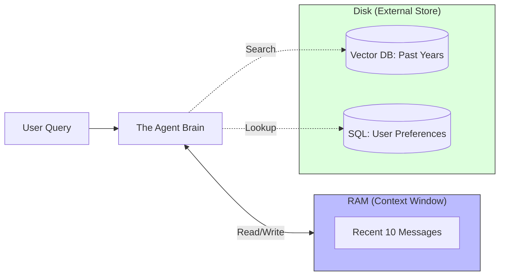

# 26. Memory Management (Agentic)

> **Mentor note:** A stateless AI is a chatbot; a stateful AI is an Agent. While Topic 21 focused on the mechanics of the "Context Window," this topic covers the persistent identity of an agent. How does an agent remember your preferences from three months ago? How does it maintain a "World State" during a 4-hour task? Masterful memory management is what turns a one-off prompt into a truly intelligent partner.

---

## What You'll Learn

- The Memory Hierarchy: Short-term (RAM) vs. Long-term (Disk) analogies
- Semantic Memory: Using Vector DBs to recall past interactions
- Procedural Memory: Helping agents remember *how* to perform tasks
- "MemGPT" concepts: Paging and swapping context in/out of the window
- Privacy & Policy: Implementing GDPR-compliant "Right to be Forgotten" in AI systems

---

## Theory & Intuition

### The RAM vs. Disk Analogy

In agentic architecture, we treat the **Context Window** as RAM (fast, expensive, limited) and the **Vector Database/SQL** as the Hard Drive (slow, cheap, infinite).



**Why it matters:** Accuracy and Personalization. If the user said "I am allergic to peanuts" in January, the agent should retrieve that specific memory when suggesting a recipe in June, without having to keep that sentence in the expensive "RAM" the whole time.

---

## 💻 Code & Implementation

### Implementing a "Persistent Preference" Memory

```python
import os
import google.generativeai as genai
from dotenv import load_dotenv

load_dotenv()

# Simulation of a persistent database
USER_DATABASE = {
    "user_123": {"name": "Alice", "preference": "loves dark mode", "diet": "vegan"}
}

def run_agentic_memory_demo():
    genai.configure(api_key=os.getenv("GEMINI_API_KEY"))
    model = genai.GenerativeModel('gemini-1.5-flash')

    user_id = "user_123"
    
    # ⭐ STEP 1: Memory Retrieval (The "Long-term" lookup)
    user_facts = USER_DATABASE.get(user_id, {})
    
    # ⭐ STEP 2: Context Augmentation
    prompt = f"""
    You are a personalized assistant. 
    User Facts: {user_facts}
    
    Recent Chat Context:
    User: "Suggest a dinner recipe for my party."
    
    Assistant:
    """

    print(f"Generating personalized response for {user_facts.get('name')}...")
    response = model.generate_content(prompt)
    
    print("-" * 50)
    print(response.text.strip())
    print("-" * 50)
    print("[Senior Note] The agent now 'remembers' the vegan diet without "
          "the user having to repeat it in the current turn.")

if __name__ == "__main__":
    run_agentic_memory_demo()
```

---

## The Memory Spectrum

| Type | Persistance | Storage | Best For |
|---|---|---|---|
| **Chat Buffer** | Volatile (Current session) | RAM / Context | Keeping track of the current topic |
| **Semantic** | Permanent | Vector Database | Recalling "vibes" or related past chats |
| **Episodic** | Permanent | Timelined Logs | Remembering specific past events (e.g., "The bug on Tuesday") |
| **Declarative**| Permanent | SQL / Key-Value | Hard facts (e.g., Date of birth, API keys) |

---

## Interview Questions & Model Answers

**Q: What is "Semantic Memory" in the context of an AI Agent?**
> **Answer:** It's the use of embeddings to store every interaction. When a user asks a question, the system searches the history for "concepts" related to the current query. This allows an agent to have "long-term associations" without needing to fit the entire history into the context window.

**Q: How do you handle "Conflicting Memories" (e.g., User liked Paris on Monday, but hated it on Friday)?**
> **Answer:** This is a "State Conflict" problem. I implement **Temporal Weighting**, where more recent memories are given higher priority in the prompt. I also use **Summarization Agents** to periodically "reconcile" the memory, keeping the most current state as the primary "Truth."

**Q: What is the "Right to be Forgotten" for an AI agent?**
> **Answer:** It's a compliance requirement (like GDPR) where a user can request that the AI "forgets" them. Technically, this means deleting their specific vectors from the Vector DB and their rows from the SQL state. An engineer must build a "Hard Delete" tool that ensures no "residual context" remains in the system's long-term retrieval indices.

---

## Quick Reference

| Term | Role |
|---|---|
| **Short-term** | What the AI is literally looking at right now |
| **Long-term** | What the AI can go look up in the library |
| **Fact Extraction**| The task of converting chat text into "Declarative" SQL data |
| **MemGPT** | An architecture where an AI manages its own memory paging |
| **State Drift** | When the AI's "Internal world model" no longer matches reality |

