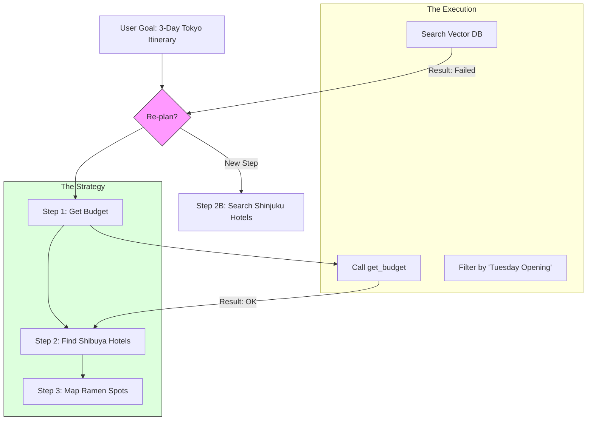

# 27. Planning & Plan Execution

> **Mentor note:** Most AI failures happen because the model is too "impulsive." It starts writing code or calling tools before it has a strategy. Planning is the "Think-Before-You-Speak" layer of an agent. By forcing the model to decompose a high-level goal (e.g., "Build a full-stack app") into atomized, executable steps, we significantly increase the reliability and logic of the system.

---

## What You'll Learn

- Task Decomposition: Breaking complex goals into linear and hierarchical plans
- The ReAct Loop: Combining Reasoning and Action for dynamic problem solving
- Plan-and-Execute vs. Tree of Thoughts (ToT) strategies
- Self-Reflection: Building agents that review and "Self-Correct" their own plans
- Handling "Plan Drift": What to do when an execution step fails

---

## Theory & Intuition

### The Architect vs. The Builder

In professional agent design, we separate the **Planner** (the Architect) from the **Executor** (the Builder). The Planner creates a high-level roadmap, and the Executor performs each step, reporting back if a step becomes impossible.



**Why it matters:** Reliability. If an agent tries to "wings it," it will inevitably forget a constraint (e.g., "Must be open on Tuesdays"). A formal plan acts as a checklist that the agent cannot ignore.

---

## 💻 Code & Implementation

### A Basic Plan-and-Execute Loop

```python
import os
import google.generativeai as genai
from dotenv import load_dotenv

load_dotenv()

def run_planning_demo():
    genai.configure(api_key=os.getenv("GEMINI_API_KEY"))
    model = genai.GenerativeModel('gemini-1.5-flash')

    user_goal = "Plan a 3-day trip to Tokyo, find a hotel near Shibuya, and check ramen spots."

    # ⭐ PHASE 1: PLANNING
    planning_prompt = f"""
    You are a Strategic Planner Agent. 
    Break the user's goal into a numbered list of executable steps.
    Each step should be 1 simple action.
    
    GOAL: {user_goal}
    
    PLAN:
    """
    plan = model.generate_content(planning_prompt).text.strip()
    
    print("--- GENERATED PLAN ---")
    print(plan)
    print("-" * 50)

    # ⭐ PHASE 2: EXECUTION (Simulating the first step)
    # In a real system, you would iterate through the list and call tools
    execution_step = "Step 1: Identifying user preferences and budget."
    print(f"Executing: {execution_step}...")
    
    # [Logic to call tools would go here]
    
    print("-" * 50)
    print("[Senior Note] If an execution step fails, the Planner should receive "
          "the error and 'Re-Plan' the remaining steps.")

if __name__ == "__main__":
    run_planning_demo()
```

---

## Planning Frameworks Matrix

| Method | Logic | Best For |
|---|---|---|
| **Linear** | Generated all at once (Step 1, 2, 3) | Predictable, repeatable tasks |
| **ReAct** | Reason -> Act -> Observe (Recursive) | Dynamic tasks requiring live feedback |
| **Tree of Thoughts**| Explores multiple paths simultaneously | Highly complex logic / Math |
| **Self-Reflect** | Execute -> Critique -> Re-execute | Code generation, Creative writing |

---

## Interview Questions & Model Answers

**Q: What is "Task Decomposition" in LLM agents?**
> **Answer:** It's the ability to take a "Fuzzy" user request (e.g., "Build me an e-commerce site") and break it into "Atomized" tasks (e.g., "Draft DB schema," "Write Login route," "Test Auth"). This keeps the LLM's focus narrow and reduces the chance of it getting "Lost in the Middle" of a massive project.

**Q: How do you handle "Plan Drift" (when an agent gets distracted)?**
> **Answer:** I implement a **Consistency Manager**. After every 3-5 sub-tasks, the agent is shown its original "Goal" and its "Current Progress" and asked: "Does your next step still align with the goal?" This grounding prevents the AI from moving into irrelevant rabbit holes.

**Q: Why use "Plan-and-Execute" instead of just "ReAct"?**
> **Answer:** ReAct is great for discovery (dynamic), but it's expensive and slow because the model writes its thoughts for every single turn. "Plan-and-Execute" creates a roadmap first, which is often more token-efficient for structured tasks where the steps are known in advance.

---

## Quick Reference

| Term | Role |
|---|---|
| **Planner** | The logical architect (Strategy) |
| **Executor** | The tool-using worker (Action) |
| **Task Atomization**| Breaking a big job into 1-minute jobs |
| **State Machine** | Using code logic to force steps (LangGraph) |
| **Trajectory** | The history of an agent's thoughts and actions |

