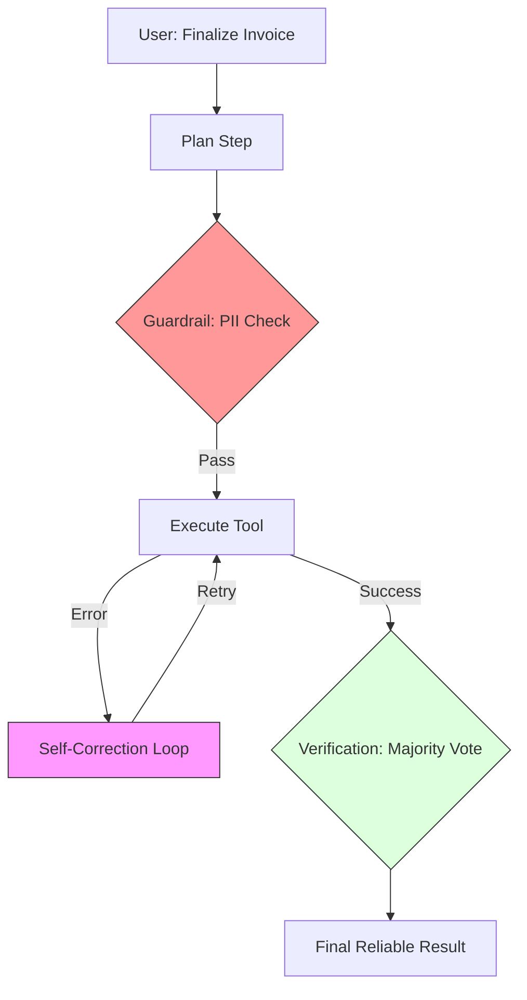

# 28. Agent Reliability & Self-Consistency

> **Mentor note:** A prototype agent works 80% of the time; a production agent works 99.9% of the time. The gap between them is "Reliability." Because LLMs are probabilistic, they are prone to random failures, infinite loops, and "State Drift." Building for reliability means implementing guardrails, majority voting, and rigorous observability. Every agent you build should have a "Plan B" by default.

---

## What You'll Learn

- Self-Consistency: Reducing randomness via Majority Voting over multiple paths
- The "Guardrail" Pattern: Validating agent actions before execution
- Loop Detection: Preventing infinite "Thought-Action" cycles
- Graceful Degradation: Handling tool failures without crashing the system
- Determinism vs. Stochasticity: Managing `temperature` and `top_p` in agentic loops

---

## Theory & Intuition

### The Swiss Cheese Model of Reliability

No single reliability technique is perfect. Instead, we layer multiple "slices" of defense. If a hallucination passes through one slice, the next guardrail (e.g., self-correction) should catch it.



**Why it matters:** In a business environment, a single "impulsive" error (like deleting the wrong record) is catastrophic. Majority voting (Topic 28.1) ensures that the "consensus" of three independent reasoning paths is used, which statistically eliminates the most common "random" LLM errors.

---

## 💻 Code & Implementation

### Implementing Majority Voting for Logic

```python
import os
import google.generativeai as genai
from collections import Counter
from dotenv import load_dotenv

load_dotenv()

def run_reliability_demo():
    genai.configure(api_key=os.getenv("GEMINI_API_KEY"))
    model = genai.GenerativeModel('gemini-1.5-flash')

    # The Logic Task: A complex math or logic problem
    task = "A train leaves at 3pm traveling 60mph. Another at 4pm at 90mph. When do they meet?"

    # ⭐ STRATEGY: Self-Consistency (Run N=3 times)
    results = []
    print(f"Running 3 independent trials for reliability...")
    
    for i in range(3):
        # We use a slight temperature to allow for diverse reasoning paths
        response = model.generate_content(task, generation_config={"temperature": 0.7})
        results.append(response.text.strip())
        print(f"Trial {i+1} completed.")

    # ⭐ STEP: Consensus / Majority Voting
    # In a real app, you'd extract the final answer (e.g. '6pm') using Regex or JSON
    # Here we simply count the most frequent response
    occurence_count = Counter(results)
    final_consensus = occurence_count.most_common(1)[0][0]

    print("-" * 50)
    print(f"Consensus Answer: {final_consensus[:100]}...")
    print("-" * 50)

if __name__ == "__main__":
    run_reliability_demo()
```

---

## Reliability Defense Layers

| Layer | Technique | Goal |
|---|---|---|
| **Pre-Action** | Input Sanitization | Block malicious or nonsensical queries |
| **Intra-Action**| Loop Detection | Stop the agent if it's "spinning its wheels" |
| **Post-Action** | Output Verification | Ensure the JSON matches the expected schema |
| **Cross-Model** | Judge Agent | Use a larger model (Pro) to grade a smaller model (Flash) |

---

## Interview Questions & Model Answers

**Q: What is "Self-Consistency" and how does it differ from standard CoT?**
> **Answer:** Chain-of-Thought (CoT) provides a single path of reasoning. Self-Consistency generates *multiple* independent CoT paths and takes the majority vote of the final answers. This is highly effective at catching "calculation slips" where the model understands the logic but makes a small mistake in a single turn.

**Q: How do you handle an agent that enters an "Infinite Loop"?**
> **Answer:** I implement two triggers: 1. A global `max_turns` limit (e.g., 10 turns). 2. A **Repetition Detector** that hashes the last 3 tool calls; if the hashes are identical, the system assumes the agent is stuck and forces a "Plan Reset" or asks for human intervention.

**Q: Why is "Graceful Degradation" important for enterprise AI?**
> **Answer:** Enterprise systems often depend on flaky external APIs. If a tool call fails, the agent must not hallucinate a fake result. It should follow a pre-defined path: 1. Retry with an exponential backoff. 2. If it still fails, report the specific error to the user and ask for further instructions instead of "guessing."

---

## Quick Reference

| Term | Role |
|---|---|
| **Guardrails** | Rules that block unsafe or invalid actions |
| **Majority Vote** | Using multiple runs to find the "Truth" |
| **Non-Deterministic**| AI potentially giving different answers every time |
| **Self-Correction** | The model fixing its own error after a feedback loop |
| **Backoff** | Waiting before retrying a failed tool call |

