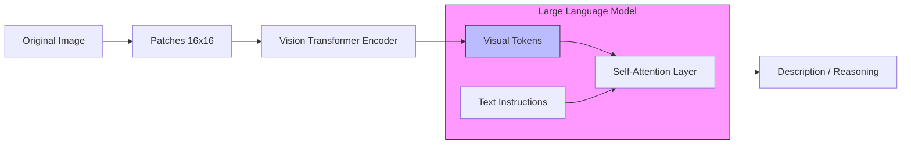

# Vision-Language Models (VLM)

> **Mentor note:** LLMs are no longer just "text-in, text-out." Vision-Language Models (VLMs) like Gemini 1.5 and GPT-4o have unified architectures where images are treated as "visual tokens." This allows the model to "see" a chart, a surgical video, or a satellite image and reason about it with the same logic it applies to text. For an engineer, this means you can now build RAG systems that search over images and AI agents that can "navigate" a web UI visually.

---

## What You'll Learn

- The Unified Transformer: How images are converted into "Visual Tokens"
- Zero-shot image reasoning and classification
- OCR-free document understanding: Analyzing PDFs and charts directly
- Vision-Language grounding: Citing specific pixels or regions in an image
- Use cases: Medical imaging, autonomous navigation, and visual QA

---

## Theory & Intuition

### From Pixels to Tokens

In older systems (CNNs), vision was a separate classification task. In modern VLMs, an image is passed through a **Visual Encoder** (like a Vision Transformer or ViT) which slices the image into patches and converts them into embeddings that the LLM already understands.



**Why it matters:** Because images and text share the same high-dimensional space, the model can follow instructions like "Find the error in this circuit diagram" as naturally as "Find the error in this Python code."

---

## 💻 Code & Implementation

### Visual Reasoning with Gemini 1.5

This script demonstrates how to pass an image and a text prompt to Gemini to perform "Visual Reasoning."

```python
import os
import google.generativeai as genai
import PIL.Image
from dotenv import load_dotenv

load_dotenv()

def run_vlm_demo():
    # Setup Gemini
    api_key = os.getenv("GOOGLE_API_KEY")
    if not api_key:
        print("Error: GOOGLE_API_KEY not found in .env")
        return
        
    genai.configure(api_key=api_key)
    # Gemini 1.5 Flash is highly optimized for multimodal tasks
    model = genai.GenerativeModel('gemini-1.5-flash')

    # Path to the image file
    image_path = 'vision_sample.jpg'
    
    if not os.path.exists(image_path):
        print(f"Error: {image_path} not found. Please ensure the image exists.")
        return

    print(f"Opening image: {image_path}...")
    img = PIL.Image.open(image_path)

    prompt = """
    Analyze this image and provide:
    1. A concise description of the scene.
    2. Any text or numerical data visible.
    3. An assessment of the mood or atmosphere.
    """

    print("Running Visual Reasoning task with Gemini...")
    
    try:
        # We pass both the text and the image object in a list
        response = model.generate_content([prompt, img])
        
        print("-" * 50)
        print("GEMINI VISION OUTPUT:")
        print("-" * 25)
        print(response.text.strip())
        print("-" * 50)
    except Exception as e:
        print(f"Error during vision generation: {e}")

if __name__ == "__main__":
    run_vlm_demo()
```

---

## VLM vs. Traditional OCR

| Feature | Traditional OCR (Tesseract) | VLM (Gemini/GPT-4o) |
|---|---|---|
| **Text Extraction** | High precision (Raw text) | Context-aware (Structured) |
| **Logic** | None (Just strings) | High (Reasoning about data) |
| **Layout** | Often broken | Preserved (Spatial understanding)|
| **Format** | Plain Text | JSON / Markdown / Tables |

---

## Interview Questions & Model Answers

**Q: How does a VLM represent an image internally?**
> **Answer:** It uses a "Vision Encoder" (like a ViT) to map the image into the same embedding space as the text. The image is flattened into a sequence of "visual tokens." To the Transformer, these tokens are just another part of the input sequence.

**Q: What is "Hallucination" in a VLM context?**
> **Answer:** It's when the AI "sees" things that aren't there—for example, reading a "9" on a blurry label as an "8." This is often caused by the model's text-based priors overpowering the visual signal.

**Q: Why is "Multimodal RAG" becoming important?**
> **Answer:** Most enterprise data is in PDFs with charts and screenshots. Multimodal RAG allows us to embed both text and images into a shared vector space, enabling users to search for "The chart showing Q3 revenue growth."

---

## Quick Reference

| Term | Role |
|---|---|
| **Visual Token** | The fundamental unit of image data for an LLM |
| **ViT** | Vision Transformer (The common encoder) |
| **OCR-free** | Direct understanding of documents without raw text extraction |
| **Grounding** | Linking AI claims to specific coordinates in an image |
| **Multimodal** | The ability to process text, image, audio, and video concurrently |
