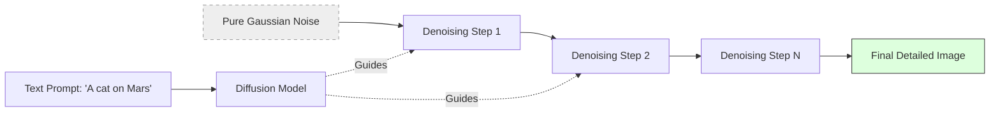

# Image Generation (Stable Diffusion & DALL-E)

> **Mentor note:** Image generation is the "Creative" side of Generative AI. While LLMs predict the next word, Diffusion models predict the next state of a "Noisy" image. This technology has evolved from simple pixel-pushing to sophisticated tools like ControlNet and LoRA that allow for professional-grade design control. For engineers, the challenge isn't just "prompting" but "fine-tuning" and "guiding" these models for consistent brand output.

---

## What You'll Learn

- The Diffusion Process: How models turn "Static" into "Art"
- DALL-E 3 vs. Stable Diffusion: Closed-source ease vs. Open-source control
- Text-to-Image vs. Image-to-Image (Inpainting & Outpainting)
- Advanced Control: ControlNet (Structure) and LoRA (Style)
- Technical challenges: Prompt adherence, anatomical errors, and safety filtering

---

## Theory & Intuition

### The Diffusion Loop

Imagine taking a clear photograph and slowly adding colored static (noise) until it's completely unrecognizable. **Forward Diffusion** is the process of adding noise. **Reverse Diffusion** is the "Magic"—the model learns to remove that noise step-by-step, guided by your text prompt, until a new image emerges from the grain.



**Why it matters:** Because the model works by "sculpting" noise, it has infinite creative flexibility. However, it also means it can struggle with strict constraints (like "six fingers" on a hand) unless guided by structures like ControlNet.

---

## 💻 Code & Implementation

### Generating Images with Stable Diffusion (Hugging Face)

This script uses the Hugging Face Inference API to generate a high-quality image using the Stable Diffusion XL model.

```python
import os
import io
from PIL import Image
from huggingface_hub import InferenceClient
from dotenv import load_dotenv

load_dotenv()

def run_image_gen_demo():
    # Setup HF Client
    hf_token = os.getenv("HUGGING_FACE_API_KEY")
    if not hf_token:
        print("Error: HUGGING_FACE_API_KEY not found in .env")
        return
        
    client = InferenceClient(api_key=hf_token)

    prompt = "A futuristic cyberpunk city with neon lights and flying cars, digital art style, highly detailed."

    print(f"Requesting image generation for prompt: '{prompt}'...")
    
    try:
        # Using Stable Diffusion XL via Inference API
        # This returns a PIL.Image object
        image = client.text_to_image(
            prompt,
            model="stabilityai/stable-diffusion-xl-base-1.0"
        )
        
        # Save the image locally
        output_path = "generated_city.png"
        image.save(output_path)
        
        print("-" * 50)
        print(f"Image generated and saved to: {output_path}")
        print("-" * 50)
    except Exception as e:
        print(f"Error during image generation: {e}")

if __name__ == "__main__":
    run_image_gen_demo()
```

---

## Proprietary vs. Open-Source

| Feature | DALL-E 3 (OpenAI) | Stable Diffusion (Local/HF) |
|---|---|---|
| **Ease of Use** | Extremely High (Chat-based) | Moderate (Requires setup) |
| **Control** | Low (Black box) | Extremely High (ControlNet, LoRA) |
| **Cost** | Per-image fee | Free (if you have GPUs) |
| **Safety** | Rigid Built-in Filters | User-defined |
| **Best For** | Casual creative ideas | Custom workflows, branding, video |

---

## Interview Questions & Model Answers

**Q: What is "Inpainting" and "Outpainting"?**
> **Answer:** "Inpainting" is the process of replacing a specific part of an existing image (e.g., changing a person's shirt color). "Outpainting" is "extending" the image beyond its original boundaries.

**Q: What are "Negative Prompts"?**
> **Answer:** These are instructions telling the model what *not* to include. Common negative prompts include "blurry, low quality, distorted hands." They help nudge the diffusion process away from failure patterns.

**Q: How does ControlNet improve image generation?**
> **Answer:** Standard text-to-image models struggle with precise positioning. ControlNet adds an extra "structural" input—like a sketch or a pose—that forces the AI to follow a specific shape while it denoises.

---

## Quick Reference

| Term | Role |
|---|---|
| **Diffusion** | The core math of removing noise to find pixels |
| **Latent Space** | The "shorthand" mathematical space where art is born |
| **LoRA** | A "Style-Patch" that teaches the model a specific look |
| **Steps** | How many iterations the model takes to denoise |
| **Guidance Scale (CFG)**| How strictly the AI should follow the prompt |
