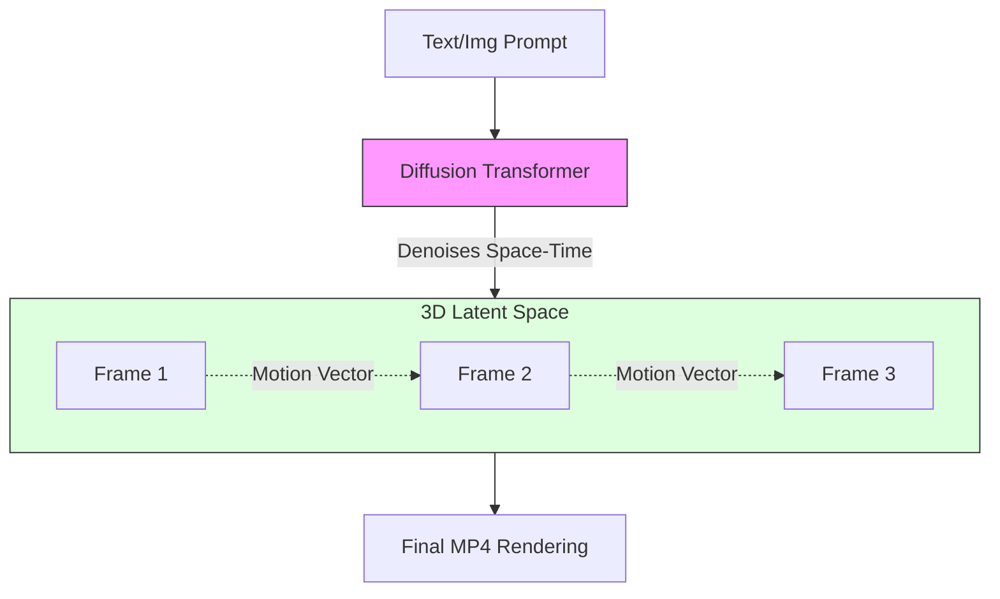

# Video Generation Fundamentals

> **Mentor note:** If image generation is a single snapshot, video generation is a "Consistency Challenge." A video isn't just 30 images per second; it's 30 images that share a coherent "Temporal Physics." Models like OpenAI Sora and Runway Gen-3 are moving toward "World Simulators"—models that understand how gravity, light, and motion flow over time. It is the most computationally demanding frontier of Generative AI.

---

## What You'll Learn

- Temporal Consistency: Maintaining characters and physics across frames
- Diffusion Transformers (DiT): The architecture behind Sora
- Video-to-Video vs. Text-to-Video vs. Image-to-Video
- Controllability: Using Camera Motion and Regional Prompts
- Technical bottlenecks: Rendering time, "Morphing" artifacts, and compute costs

---

## Theory & Intuition

### The 3D Latent Cube

While image diffusion works on a 2D plane of pixels, video diffusion works on a **3D Latent Cube** (Height x Width x Time). The model must predict not only the pixels in Frame 1 but also how they logically evolve in Frame 10.



**Why it matters:** In early video AI, a person's face would "melt" between frames. Modern architectures use **Cross-Frame Attention** to ensure that pixels in Frame 1 stay consistent in Frame 2, rather than regenerating a new face every time.

---

## 💻 Code & Implementation

### Simulating a Video Rendering Job

This script demonstrates the asynchronous nature of professional Video APIs (like Runway or Luma) and simulates the challenges of maintaining consistency between frames.

```python
import time
import os
from dotenv import load_dotenv

load_dotenv()

def run_video_gen_demo():
    print("-" * 50)
    print("SUBMITTING VIDEO RENDERING JOB TO CLOUD GPU FARM")
    print("-" * 50)

    prompt = "A drone shot descending into a volcanic crater in Iceland."
    print(f"Goal: {prompt}")

    # PHASE 1: LATENT INITIALIZATION
    # Video models initialize a 3D noise cube (H x W x Time)
    print("Status: Initializing 3D Latent Space...")
    time.sleep(1)

    # PHASE 2: TEMPORAL CONSISTENCY CHECK
    # This is where the model ensures Frame 2 looks like Frame 1
    print("Status: Applying Cross-Frame Attention (Ensuring consistency)...")
    time.sleep(1.5)

    # PHASE 3: RENDERING
    # Rendering video takes ~30x more compute than a single image
    for progress in range(0, 101, 25):
        print(f"Status: Denoising Time-Space Cube ({progress}%)...")
        time.sleep(1)

    print("-" * 50)
    print("SUCCESS: Video Rendered and Compressed (H.264)")
    print("File: volcano_crater_01.mp4")
    print("-" * 50)
    
    print("INSIGHT:")
    print("Native video generation is slow because the model must process")
    print("temporal relationships. If Frame 1 has a red car, Frame 24")
    print("must also have that exact red car in a logically moved position.")
    print("-" * 50)

if __name__ == "__main__":
    run_video_gen_demo()
```

---

## Leading Video AI Tools

| Model | Owner | Focus |
|---|---|---|
| **Sora** | OpenAI | High cinematic quality + long duration |
| **Gen-3 Alpha** | Runway | Professional filmmaking & physics control |
| **Dream Machine**| Luma AI | Rapid prototyping & image-to-video |
| **Kling / Vidu** | Kuaishou | Extreme biological and motion accuracy |

---

## Interview Questions & Model Answers

**Q: What is "Temporal Consistency" in video AI?**
> **Answer:** It's the ability of the model to maintain the appearance and structure of objects across time. Without it, a character might have different features in every frame. Modern models use 3D attention to "bind" features across the temporal axis.

**Q: Why is Sora called a "World Simulator"?**
> **Answer:** Because it appears to have learned internal representations of physics. It understands that if an object is dropped, it should fall, and if a light moves, the shadows must update dynamically.

**Q: What is the "Redteaming" concern with video AI?**
> **Answer:** Deepfakes. High-fidelity video makes it possible to generate fake news or misinformation. Engineers must implement digital signatures (C2PA) and content filtering to prevent abuse.

---

## Quick Reference

| Term | Role |
|---|---|
| **Latent Space** | The compressed math space where frames are calculated |
| **DiT** | Diffusion Transformer (Replaces UNet for video) |
| **FPS** | Frames Per Second |
| **Inpainting** | Fixing a specific object in a video |
| **Interpolation** | Generating missing frames between two keyframes |
