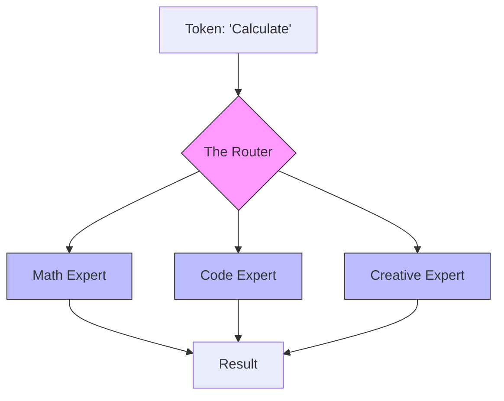

# Specialized Architectures (MoE & State Space)

> **Mentor note:** Not all large models are created equal. As a production engineer, you need to understand *why* some models are fast and cheap while others are slow and powerful. **Mixture of Experts (MoE)** is the trick behind GPT-4 and Mistral that allows for "Sparse Learning," while **State Space Models (SSM)** like Mamba are the potential "Transformer-Killers" that can process infinite context without the quadratic cost of self-attention.

---

## What You'll Learn

- Mixture of Experts (MoE): Gating networks and "Sparse" activation
- State Space Models (SSM): Linear time complexity (O(N)) for long context
- Mamba & Jamba: The practical implementation of SSMs
- Hybrid Models: Combining Transformer Attention with SSM Logic
- Performance: Speed vs. Quality trade-offs in specialized architectures

---

## Theory & Intuition

### Mixture of Experts (MoE)

Instead of one giant "brain," an MoE model consists of a team of "specialists" (Experts). When a word like "Equation" comes in, a **Router** (Gating Network) sends it to the "Math Expert." This means even if the model has 1 Trillion parameters, only a small fraction are "active" for any given token.



**Why it matters:** Efficiency. MoE allows you to have the intelligence of a giant model with the speed and cost of a much smaller one.

---

### State Space Models (SSM)

Transformers suffer from "Quadratic Scurvy"—as the context gets longer, the computation cost grows exponentially (N²). SSMs (like **Mamba**) use a structured recurrence (similar to RNNs but better) that allows for **Linear Scaling (O(N))**. In theory, an SSM could read an entire library of books in one go without crashing.

---

## Specialized Models Table

| Paradigm | Example | Pro | Con |
|---|---|---|---|
| **Dense** | Llama-3 | High consistency / Simple | Slow at extreme scale |
| **MoE** | Mixtral 8x7B | Expert-level logic/Speed | High VRAM (Total model size) |
| **SSM** | Mamba-2 | Extreme context/Fast | Newer ecosystem |
| **Hybrid**| Jamba | Best of both worlds | Complex to serve |

---

## 💻 Code & Implementation

### Simulating an MoE Router (The 'Sparse' Logic)

This script demonstrates how an MoE architecture handles incoming queries by "routing" them to specialized logic paths, rather than activating the entire network for every task.

```python
import os
from groq import Groq
from dotenv import load_dotenv

load_dotenv()

def run_moe_simulation():
    client = Groq(api_key=os.getenv("GROQ_API_KEY"))
    model = "llama-3.1-8b-instant"

    query = "Write a Python function to calculate the Fibonacci sequence."

    print("-" * 50)
    print(f"QUERY: {query}")
    print("-" * 50)

    # STEP 1: ROUTING (The Gating Network)
    # The Router determines which 'Expert' is best for the token.
    routing_prompt = f"Analyze this query and output ONLY one word: MATH, CODE, or CREATIVE.\n\nQuery: {query}"
    
    print("ROUTING: Identifying the specialist...")
    router_response = client.chat.completions.create(
        model=model,
        messages=[{"role": "user", "content": routing_prompt}],
        temperature=0
    ).choices[0].message.content.strip()
    
    print(f"ROUTER DECISION: Sent to '{router_response}' Expert.")
    print("-" * 50)

    # STEP 2: EXPERT ACTIVATION (Sparse Inference)
    # In a real MoE, only the selected expert's weights would fire.
    expert_prompts = {
        "CODE": "You are a Senior Software Engineer. Provide the most efficient code.",
        "MATH": "You are a Mathematician. Focus on formal proofs and accuracy.",
        "CREATIVE": "You are a Poet. Use metaphor and vivid language."
    }

    expert_system_prompt = expert_prompts.get(router_response, "You are a general assistant.")

    print(f"EXPERT OUTPUT ({router_response}):")
    response = client.chat.completions.create(
        model=model,
        messages=[
            {"role": "system", "content": expert_system_prompt},
            {"role": "user", "content": query}
        ]
    ).choices[0].message.content.strip()
    
    print(response)
    print("-" * 50)

if __name__ == "__main__":
    run_moe_simulation()
```

---

## Interview Questions & Model Answers

**Q: Why is MoE called "Sparse Activation"?**
> **Answer:** Because for every token the model processes, only a subset of its total weights (the "Experts") are actually used. This allows the model to have a "Large Capacity" while maintaining "Small Model" latency.

**Q: What is the "Quadratic Bottleneck" of Transformers?**
> **Answer:** In standard Self-Attention, every token must look at every other token. If you double the text, you quadruple the computation. This makes processing very long documents (e.g., >100k tokens) extremely expensive.

---

## Quick Reference

| Term | Role |
|---|---|
| **Routing** | The process of picking the right "Expert" |
| **Token-Dropping** | When the router is overloaded |
| **Linear Scaling** | Computation cost scales 1:1 with input length |
| **Mamba** | The leading State Space Model architecture |
| **Hybrid** | A model that uses both Attention and Recurrence |
