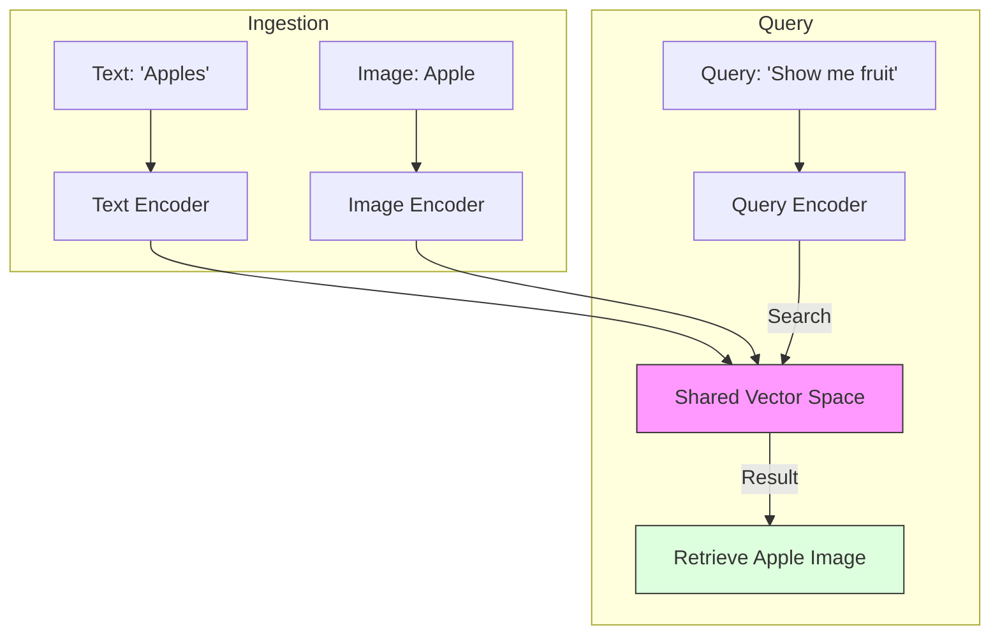

# Multimodal RAG & Vision Search

> **Mentor note:** Most enterprise data isn't just plain text—it's slide decks, surgical videos, scanned receipts, and technical diagrams. **Multimodal RAG** is the evolution of search where we index both text and visual features into a shared vector space. This allows a user to ask, "Show me the chart where revenue dips," and the system retrieves the exact pixel region of a PDF. This is the ultimate "Grounding" mechanism for the real world.

---

## What You'll Learn

- Video-RAG vs. Image-RAG vs. Document-RAG
- Cross-Modal Embeddings: CLIP and SigLIP architectures
- Indexing Visual Data: Summarization-based vs. Native Vector indexing
- ColPali: The state-of-the-art for fast document vision retrieval
- Use Cases: Visual product search, automated video editing, and medical scan retrieval

---

## Theory & Intuition

### The Shared Semantic Space

The core "magic" of Multimodal RAG is the ability to place an image of a "Golden Retriever" and the text string "Golden Retriever" at the exact same coordinates in a vector space. This is achieved using models like **CLIP** (Contrastive Language-Image Pre-training).



**Why it matters:** Standard RAG fails if a PDF has a chart but no text caption. Multimodal RAG "sees" the chart's trend lines and can retrieve it based on the visual "meaning" of a downward slope.

---

## 💻 Code & Implementation

### A Basic Visual Search Loop (Multimodal Retrieval)

This script demonstrates how to ground a user's natural language search ("High Sodium Product") into a visual asset (a nutrition label) using Gemini's native vision capabilities.

```python
import os
import google.generativeai as genai
from PIL import Image
from dotenv import load_dotenv

load_dotenv()

def run_multimodal_rag_demo():
    # Setup Gemini
    api_key = os.getenv("GOOGLE_API_KEY")
    if not api_key:
        print("Error: GOOGLE_API_KEY not found.")
        return
        
    genai.configure(api_key=api_key)
    model = genai.GenerativeModel('gemini-1.5-flash')

    # 1. RETRIEVAL STEP (Simulated)
    # In a real RAG system, we would use a Vector DB to find this image.
    image_path = "vision_sample.png"
    if not os.path.exists(image_path):
        print(f"File {image_path} not found. Run Topic 29 first.")
        return
        
    img = Image.open(image_path)

    # 2. THE MULTIMODAL QUERY
    query = "Does this product match a search for 'Heart-Healthy / Low Sodium' options?"

    prompt = f"""
    You are a Multimodal Search Assistant.
    I have retrieved this image from our warehouse based on the query: '{query}'
    
    TASK: 
    1. Extract the Sodium content from the image.
    2. Determine if it satisfies the user's intent (Heart-Healthy).
    3. Provide a 'Match Score' from 0-100.
    """

    print("-" * 50)
    print(f"USER QUERY: {query}")
    print("AI is performing Visual Grounding on the retrieved asset...")
    print("-" * 50)

    try:
        response = model.generate_content([prompt, img])
        print(response.text)
    except Exception as e:
        print(f"Error during Multimodal RAG: {e}")

if __name__ == "__main__":
    run_multimodal_rag_demo()
```

---

## Multimodal Indexing Strategies

| Strategy | Logic | Best For |
|---|---|---|
| **Text-Summary RAG** | LLM describes image -> Encode text | Simple charts, clear photos |
| **Native Multi-Vector**| Encode patches of images directly | Complex diagrams, technical PDFs |
| **CLIP-style Search** | Text and Image in a shared space | Product catalogs, stock photos |
| **Video-Context RAG** | Encode temporal chunks (5s clips) | Movies, security footage, webinars |

---

## Interview Questions & Model Answers

**Q: What is a "Contrastive Loss" model like CLIP?**
> **Answer:** CLIP is trained on millions of (image, text) pairs. Its goal is to bring the embedding of an image and its corresponding caption closer together in a vector space while pushing unrelated pairs further apart.

**Q: How do you handle RAG for a 2-hour long video?**
> **Answer:** I would split the video into 30-second segments. For each segment, I'd generate a **Temporal Embedding** or a text summary. When a user queries, I perform a Vector Search on those segments and pass the results to a multimodal model.

**Q: What is the "ColPali" architecture?**
> **Answer:** ColPali embeds entire document pages as a grid of visual tokens. This allows it to retrieve pages based on their visual structure (e.g., tables or charts) far better than traditional text-based RAG.

---

## Quick Reference

| Term | Role |
|---|---|
| **Cross-Modal** | Aligning different data types (Text/Img) in one space |
| **CLIP** | The classic model for multi-modal alignment |
| **Video Chunking** | Breaking video into logical, searchable scenes |
| **Visual Grounding** | Pointing the AI to specific pixel regions |
| **ColPali** | Document retrieval using vision instead of OCR |
