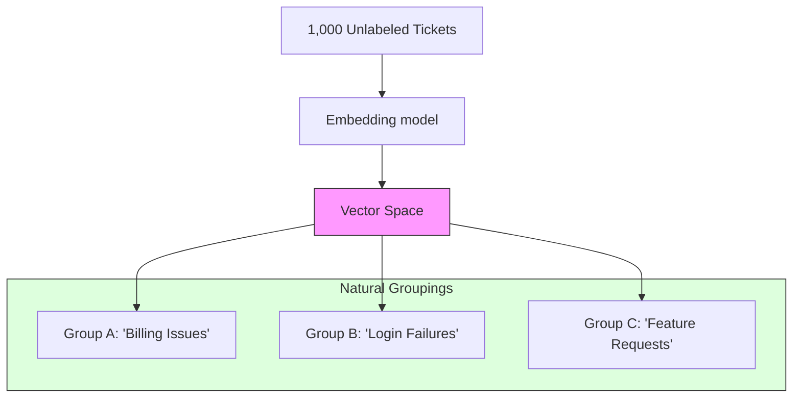

# Embeddings for Retrieval, Clustering & Classification

> **Mentor note:** Embeddings are the most versatile "Swiss Army Knife" in the AI engineer's toolkit. While we've seen them used for RAG (Topic 19), their true power lies in **Semantic Analytics**. You can use them to cluster millions of customer support tickets automatically, detect anomalies in log data, or build a "zero-shot" classifier that categorizes documents into labels it wasn't even trained on. Understanding embeddings beyond RAG is what separates a developer from an AI Architect.

---

## What You'll Learn

- The math of Clustering: K-Means and HDBSCAN on high-dimensional vectors
- Zero-shot Classification: Using embeddings as "Categorization Anchors"
- Anomaly Detection: Identifying "The odd one out" in the vector space
- Visualization: Reducing 768 dimensions to 2D using UMAP or t-SNE
- Semantic Deduping: Cleaning massive datasets by identifying near-identical vectors

---

## Theory & Intuition

### Clustering: Let the Data Speak

In traditional programming, you define rules (e.g., `if "refund" in text: category = "billing"`). With embeddings, you don't define rules. You simply plot the points and see where they naturally group.



**Why it matters:** This allows you to discover "Hidden Trends." You might find a cluster of 50 people complaining about a specific UI button that you didn't even have a keyword for.

---

## 💻 Code & Implementation

### Simple Zero-Shot Classification

Instead of training a model for years, we can classify text by comparing its embedding to the embedding of our label names.

```python
import os
import google.generativeai as genai
import numpy as np
from dotenv import load_dotenv

load_dotenv()

def cosine_similarity(a, b):
    return np.dot(a, b) / (np.linalg.norm(a) * np.linalg.norm(b))

def run_embedding_analytics_demo():
    genai.configure(api_key=os.getenv("GOOGLE_API_KEY"))

    # The Input to classify
    input_text = "My order was supposed to arrive yesterday but it is still missing."
    
    # Potential Labels
    labels = ["Billing", "Shipping", "Technical Support"]

    # STEP 1: Embed everything
    input_vec = genai.embed_content(model="models/text-embedding-004", content=input_text)['embedding']
    label_vecs = {label: genai.embed_content(model="models/text-embedding-004", content=label)['embedding'] for label in labels}

    # STEP 2: Compare proximity
    print(f"Input: '{input_text}'")
    for label, vec in label_vecs.items():
        score = cosine_similarity(input_vec, vec)
        print(f"Similarity to '{label}': {score:.4f}")

    print("-" * 50)
    print("[Senior Note] This is 'Zero-shot' because the model was "
          "never specifically 'trained' on your Shipping label.")

if __name__ == "__main__":
    run_embedding_analytics_demo()
```

---

## Use Case Scenarios

| Task | How it works | Outcome |
|---|---|---|
| **Semantic Deduplication**| Find vectors with similarity > 0.98 | Remove 30% of redundant data |
| **Topic Modeling** | Run K-Means on a week's chat logs | Automatically generate a report of trends |
| **Recommendation** | "Users who liked Vector A also liked B" | Amazon-style recommendation engine |
| **Anomalous Detection**| Flag points with low similarity to all others | Detect bot attacks or fraudulent entries |

---

## Interview Questions & Model Answers

**Q: What is the difference between K-Means and Semantic Search?**
> **Answer:** Semantic search is a "1-to-N" comparison. Clustering is an "N-to-N" analysis where you look at the entire dataset at once to find global patterns without any specific query.

**Q: Why do we need UMAP or t-SNE?**
> **Answer:** Humans cannot visualize 768 dimensions. Dimensionality Reduction projects those dimensions down to 2D or 3D while preserving the "Proximity" of the points.

---

## Quick Reference

| Term | Role |
|---|---|
| **Centroid** | The "middle point" of a cluster |
| **Cosine Similarity**| The default comparison math for text |
| **HDBSCAN** | An algorithm that finds clusters of varying density |
| **UMAP** | The modern standard for visualizing high-dimensional data |
| **Ranking** | Ordering items by their semantic distance to a query |
