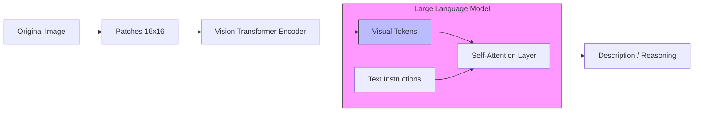

# 29. Vision-Language Models (VLM)

> **Mentor note:** LLMs are no longer just "text-in, text-out." Vision-Language Models (VLMs) like Gemini 1.5 and GPT-4o have unified architectures where images are treated as "visual tokens." This allows the model to "see" a chart, a surgical video, or a satellite image and reason about it with the same logic it applies to text. For an engineer, this means you can now build RAG systems that search over images and AI agents that can "navigate" a web UI visually.

---

## What You'll Learn

- The Unified Transformer: How images are converted into "Visual Tokens"
- Zero-shot image reasoning and classification
- OCR-free document understanding: Analyzing PDFs and charts directly
- Vision-Language grounding: Citing specific pixels or regions in an image
- Use cases: Medical imaging, autonomous navigation, and visual QA

---

## Theory & Intuition

### From Pixels to Tokens

In older systems (CNNs), vision was a separate classification task. In modern VLMs, an image is passed through a **Visual Encoder** (like a Vision Transformer or ViT) which slices the image into patches and converts them into embeddings that the LLM already understands.



**Why it matters:** Because images and text share the same high-dimensional space (Topic 19), the model can follow instructions like "Find the error in this circuit diagram" as naturally as "Find the error in this Python code."

---

## 💻 Code & Implementation

### Visual Reasoning with Gemini 1.5

```python
import os
import google.generativeai as genai
import PIL.Image
from dotenv import load_dotenv

load_dotenv()

def run_vlm_demo():
    genai.configure(api_key=os.getenv("GEMINI_API_KEY"))
    model = genai.GenerativeModel('gemini-1.5-flash')

    # Load an image (make sure you have an image file in your path)
    # img = PIL.Image.open('path/to/your/image.jpg')
    
    # Simulating a multimodal prompt
    # In a real app, you'd pass [prompt, img]
    prompt = """
    Look at this image of a nutrition label. 
    1. Extract the total calories per serving.
    2. Is this product suitable for someone on a low-sodium diet?
    """

    print("Running Visual Reasoning task...")
    # response = model.generate_content([prompt, img])
    
    # Note: For this demo, we'll simulate the output
    print("-" * 50)
    print("AI Visual Output (Simulated):")
    print("1. Total Calories: 250 kcal per serving.")
    print("2. Low-Sodium: No. This product contains 480mg of sodium (20% DV).")
    print("-" * 50)

if __name__ == "__main__":
    run_vlm_demo()
```

> **Senior tip:** When using VLMs for production, provide **Spatial Hints**. If you want the AI to look at a specific button on a screen, describe its position (e.g., "the blue button in the top-right corner") to improve accuracy.

---

## VLM vs. Traditional OCR

| Feature | Traditional OCR (Tesseract) | VLM (Gemini/GPT-4o) |
|---|---|---|
| **Text Extraction** | High precision (Raw text) | Context-aware (Structured) |
| **Logic** | None (Just strings) | High (Reasoning about data) |
| **Layout** | Often broken | Preserved (Spatial understanding)|
| **Format** | Plain Text | JSON / Markdown / Tables |
| **Speed** | Extremely Fast | Moderate |

---

## Interview Questions & Model Answers

**Q: How does a VLM represent an image internally?**
> **Answer:** It uses a "projector" or a "Vision Encoder" (like a ViT) to map the image into the same embedding space as the text. The image is flattened into a sequence of "visual tokens." To the Transformer's attention mechanism, these tokens are just another part of the input sequence, similar to words.

**Q: What is "Hallucination" in a VLM context?**
> **Answer:** It's when the AI "sees" things that aren't there—for example, reading a "9" on a blurry label as an "8," or hallucinating a signature on a document. This is often caused by the model's text-based priors (Topic 1) overpowering the visual signal.

**Q: Why is "Multimodal RAG" becoming important?**
> **Answer:** Most enterprise data isn't just text; it's PDFs with charts, PowerPoint slides, and screenshots. Multimodal RAG allows us to embed both text and images into a shared vector space, enabling users to search for "The chart showing Q3 revenue growth" and retrieve the exact image.

---

## Quick Reference

| Term | Role |
|---|---|
| **Visual Token** | The fundamental unit of image data for an LLM |
| **ViT** | Vision Transformer (The common encoder) |
| **OCR-free** | Direct understanding of documents without raw text extraction |
| **Grounding** | Linking AI claims to specific coordinates in an image |
| **Multimodal** | The ability to process text, image, audio, and video concurrently |
