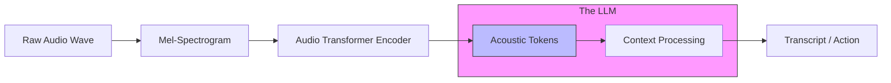

# 31. Audio Synthesis & STT (Speech-to-Text)

> **Mentor note:** Audio is the "Conversation" layer of AI. We have moved from robotic, monotone text-to-speech to models that can clone your voice with 3 seconds of audio and understand emotional nuance in speech. For engineers, the challenge is **Latency**. Real-time voice interaction requires a tight orchestration between Speech-to-Text (Ear), the LLM (Brain), and Text-to-Speech (Mouth).

---

## What You'll Learn

- Speech-to-Text (STT): How Whisper and Gemini process raw audio waves
- Text-to-Speech (TTS): Vocoders, Mel-spectrograms, and emotional prosody
- Voice Cloning: Zero-shot vs. Few-shot training (ElevenLabs style)
- Real-time Audio Streaming: Handling WebSocket buffers for low-latency chat
- Specialized tasks: Audio Translation, Diarization (who spoke when), and Sound Effect generation

---

## Theory & Intuition

### The Audio-to-Token Pipeline

Audio is a continuous wave of vibrations. To understand it, AI "samples" the wave thousands of times per second (e.g., 16kHz) and converts it into a **Mel-Spectrogram**—a visual map of frequencies over time. This spectrogram is then tokenized just like an image or text.



**Why it matters:** Because modern models (Gemini 1.5) are "Native Multimodal," they don't just read a transcript; they "hear" the tone. If you sound angry, the AI can detect the emotion in the audio tokens before it even processes the words.

---

## 💻 Code & Implementation

### Transcribing Audio with Whisper (OpenAI SDK)

```python
import os
from openai import OpenAI
from dotenv import load_dotenv

load_dotenv()

def run_stt_demo():
    client = OpenAI(api_key=os.getenv("OPENAI_API_KEY"))

    # path_to_audio = "path/to/meeting_recording.mp3"
    
    print("Simulating Speech-to-Text transcription...")
    
    # In a real app:
    # audio_file = open(path_to_audio, "rb")
    # transcript = client.audio.transcriptions.create(
    #     model="whisper-1", 
    #     file=audio_file
    # )
    
    print("-" * 50)
    print("Transcript (Simulated):")
    print("'Hello everyone, let's start the sync. Today we are refactoring our RAG pipeline.'")
    print("-" * 50)
    print("[Senior Note] Whisper v3's diarization can identify multiple "
          "speakers, which is critical for meeting summaries.")

if __name__ == "__main__":
    run_stt_demo()
```

---

## Audio Models Comparison

| Tool | Focus | Best For |
|---|---|---|
| **ElevenLabs** | Voice Cloning & TTS | Podcasts, narration, brand voice |
| **Whisper (OpenAI)**| Speech-to-Text (STT) | Meeting notes, captioning, commands |
| **Gemini 1.5 Flash** | Native Audio Input | Reasoning about tone, long audio files |
| **Suno / Udio** | Music Generation | Background tracks, creative jingles |
| **Deepgram** | Enterprise STT | High-concurrency call center analytics |

---

## Interview Questions & Model Answers

**Q: What is "Speaker Diarization"?**
> **Answer:** It's the process of partitioning an audio stream into segments according to "who" is speaking. It allows the AI to output a transcript like "Speaker 1: Hello" and "Speaker 2: Hi there," which is essential for accurate meeting summaries and legal transcripts.

**Q: Why is "Voice Cloning" a security risk?**
> **Answer:** Modern TTS models only need a few seconds of a person's voice to generate highly convincing fake audio (Deepfakes). As engineers, we must implement watermarking or liveness detection when building customer-facing audio portals to prevent social-engineering attacks.

**Q: How do you optimize for "Zero-Latency" Voice AI?**
> **Answer:** By using a **Voice Activity Detection (VAD)** engine on the edge. Instead of waiting for the user to finish speaking, the VAD detects pauses and sends audio "chunks" via WebSockets to the server. We also use "Flash" models and "Streaming TTS" so the AI begins speaking the first word before it has even finished thinking about the second.

---

## Quick Reference

| Term | Role |
|---|---|
| **Spectrogram** | A visual representative of sound frequencies |
| **Prosody** | The patterns and rhythm of speech (emotion) |
| **VAD** | Voice Activity Detection (knowing when to listen) |
| **Diarization** | Identifying "who spoke when" |
| **Zero-Shot TTS** | Cloning a voice never seen in training |
