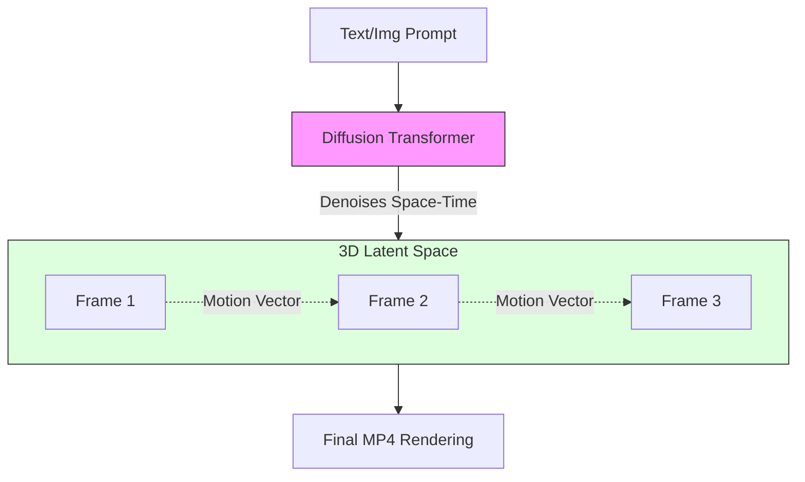

# 32. Video Generation Fundamentals

> **Mentor note:** If image generation (Topic 30) is a single snapshot, video generation is a "Consistency Challenge." A video isn't just 30 images per second; it's 30 images that share a coherent "Temporal Physics." Models like OpenAI Sora and Runway Gen-3 are moving toward "World Simulators"—models that understand how gravity, light, and motion flow over time. It is the most computationally demanding frontier of Generative AI.

---

## What You'll Learn

- Temporal Consistency: Maintaining characters and physics across frames
- Diffusion Transformers (DiT): The architecture behind Sora
- Video-to-Video vs. Text-to-Video vs. Image-to-Video
- Controllability: Using Camera Motion and Regional Prompts
- Technical bottlenecks: Rendering time, "Morphing" artifacts, and compute costs

---

## Theory & Intuition

### The 3D Latent Cube

While image diffusion works on a 2D plane of pixels, video diffusion works on a **3D Latent Cube** (Height x Width x Time). The model must predict not only the pixels in Frame 1 but also how they logically evolve in Frame 10.



**Why it matters:** In early video AI (2022), a person's face would "melt" between frames. Modern architectures use **Cross-Frame Attention** to ensure that "Pixel A" in Frame 1 stays "Pixel A" in Frame 2, rather than regenerating a new face every time.

---

## 💻 Code & Implementation

### Generating Video with Runway / Luma (API Concept)

```python
import os
import requests
import time
from dotenv import load_dotenv

load_dotenv()

def run_video_gen_demo():
    # Simulation: Most video APIs are asynchronous due to long render times
    API_URL = "https://api.runwayml.com/v1/generate_video"
    HEADERS = {"Authorization": f"Bearer {os.getenv('RUNWAY_API_KEY')}"}

    payload = {
        "prompt": "A drone shot descending into a volcanic crater in Iceland.",
        "model": "gen-3-alpha",
        "ratio": "16:9"
    }

    print("Submitting Video Generation job to the cloud GPU farm...")
    # job_id = requests.post(API_URL, json=payload, headers=HEADERS).json()['id']
    
    # Simulating the Wait
    print("Status: Rendering Frames (45% complete)...")
    time.sleep(2)
    print("Status: Finalizing Video (100% complete)...")
    
    print("-" * 50)
    print("Video Rendered!")
    print("URL: https://cdn.ai-video.com/火山/volcano_32.mp4")
    print("-" * 50)
    print("[Senior Note] Native video generation takes significantly longer "
          "than image generation because the model must process 30x the data.")

if __name__ == "__main__":
    run_video_gen_demo()
```

---

## Leading Video AI Tools

| Model | Owner | Focus |
|---|---|---|
| **Sora** | OpenAI | High cinematic quality + long duration |
| **Gen-3 Alpha** | Runway | Professional filmmaking & physics control |
| **Dream Machine**| Luma AI | Rapid prototyping & image-to-video |
| **Kling / Vidu** | China (Kuaishou)| Extreme biological and motion accuracy |
| **Pika** | Pika Labs | Creative lip-sync and "Crush" effects |

---

## Interview Questions & Model Answers

**Q: What is "Temporal Consistency" in video AI?**
> **Answer:** It's the ability of the model to maintain the appearance and structure of objects across time. Without it, a character might have glasses in one frame and not the next, or a car might change its license plate mid-drive. Modern models use 3D attention mechanisms to "bind" features across the temporal axis.

**Q: Why is Sora called a "World Simulator" rather than just a video generator?**
> **Answer:** Because it is believed to have learned internal representations of physics. It doesn't just "predict pixels"; it understands that if a ball is dropped, it should move downward, and if a light source moves, the shadows on the ground should update dynamically.

**Q: What is the "Redteaming" concern with video AI?**
> **Answer:** Deepfakes. High-fidelity video makes it possible to generate fake news, non-consensual imagery, and misinformation (e.g., a politician saying something they never did). Engineers must implement **C2PA Metadata** (digital signatures) and rigorous content filtering to prevent abuse.

---

## Quick Reference

| Term | Role |
|---|---|
| **Latent Space** | The compressed math space where frames are calculated |
| **DiT** | Diffusion Transformer (Replaces UNet for video) |
| **FPS** | Frames Per Second (Usually 24 or 30 for AI) |
| **Inpainting** | Fixing a specific object in a video |
| **Interpolation** | Generating missing frames between two keyframes |
