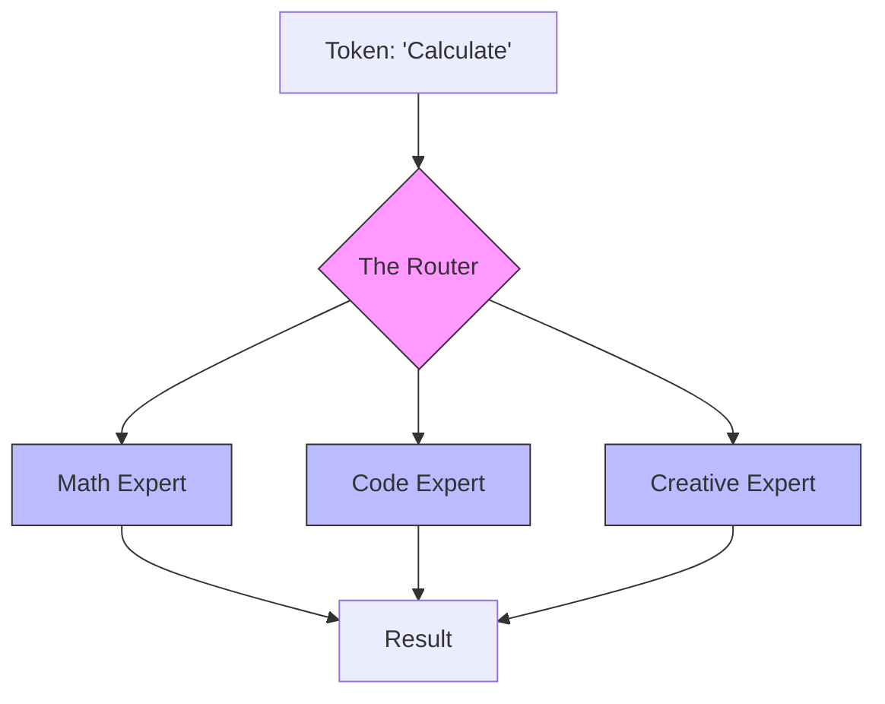

# 33. Specialized Architectures (MoE & State Space)

> **Mentor note:** Not all large models are created equal. As a production engineer, you need to understand *why* some models are fast and cheap while others are slow and powerful. **Mixture of Experts (MoE)** is the trick behind GPT-4 and Mistral that allows for "Sparse Learning," while **State Space Models (SSM)** like Mamba are the potential "Transformer-Killers" that can process infinite context without the quadratic cost of self-attention.

---

## What You'll Learn

- Mixture of Experts (MoE): Gating networks and "Sparse" activation
- State Space Models (SSM): Linear time complexity (O(N)) for long context
- Mamba & Jamba: The practical implementation of SSMs
- Hybrid Models: Combining Transformer Attention with SSM Logic
- Performance: Speed vs. Quality trade-offs in specialized architectures

---

## Theory & Intuition

### Mixture of Experts (MoE)

Instead of one giant "brain," an MoE model consists of a team of "specialists" (Experts). When a word like "Equation" comes in, a **Router** (Gating Network) sends it to the "Math Expert." This means even if the model has 1 Trillion parameters, only a small fraction are "active" for any given token.

**Why it matters:** Efficiency. MoE allows you to have the intelligence of a giant model with the speed and cost of a much smaller one.

---

### State Space Models (SSM)

Transformers suffer from "Quadratic Scurvy"—as the context gets longer, the computation cost grows exponentially (N²). SSMs (like **Mamba**) use a structured recurrence (similar to RNNs but better) that allows for **Linear Scaling (O(N))**. In theory, an SSM could read an entire library of books in one go without crashing.

---

## Specialized Models Table

| Paradigm | Example | Pro | Con |
|---|---|---|---|
| **Dense** | Llama-2 | High consistency / Simple | Slow at high scale |
| **MoE** | GPT-4, Mixtral | Expert-level logic/Speed | High VRAM (needs the whole model loaded) |
| **SSM** | Mamba, Jamba | Extreme context/Fast inference | New ecosystem, less "knowledge" |
| **MoE-Hybrid**| Jamba | Best of both worlds | Highly complex to serve |

---

## Interview Questions & Model Answers

**Q: Why is MoE called "Sparse Activation"?**
> **Answer:** Because for every token the model processes, only a subset of its total weights (the "Experts") are actually used. For example, Mixtral-8x7B has ~47B parameters, but only ~13B are active per token. This allows the model to have a "Large Capacity" while maintaining "Small Model" latency.

**Q: What is the "Quadratic Bottleneck" of Transformers?**
> **Answer:** In standard Self-Attention, every token must look at every other token in the sequence. If you double the text, you quadruple the computation. This makes processing very long documents (e.g., >100k tokens) extremely expensive and slow.

**Q: How does Mamba solve the context window problem?**
> **Answer:** Mamba uses a State Space architecture that compresses the input history into a fixed-size internal "state." Because it doesn't need to re-read the entire history for every new word (unlike Transformers), it can maintain a "rolling memory" that scales linearly with the input length.

---

## Quick Reference

| Term | Role |
|---|---|
| **Routing** | The process of picking the right "Expert" |
| **Token-Dropping** | When the router is overloaded (Common failure in MoE) |
| **Linear Scaling** | Computation cost scales 1:1 with input length |
| **Mamba** | The leading State Space Model architecture |
| **Hybrid** | A model that uses both Attention and Recurrence |
