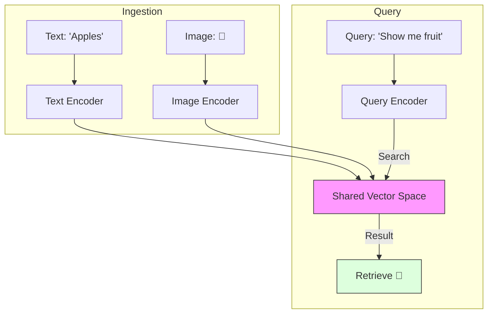

# 34. Multimodal RAG & Vision Search

> **Mentor note:** Most enterprise data isn't just plain text—it's slide decks, surgical videos, scanned receipts, and technical diagrams. **Multimodal RAG** is the evolution of search where we index both text and visual features into a shared vector space. This allows a user to ask, "Show me the chart where revenue dips," and the system retrieves the exact pixel region of a PDF. This is the ultimate "Grounding" mechanism for the real world.

---

## What You'll Learn

- Video-RAG vs. Image-RAG vs. Document-RAG
- Cross-Modal Embeddings: CLIP and SigLIP architectures
- Indexing Visual Data: Summarization-based vs. Native Vector indexing
- ColPali: The state-of-the-art for fast document vision retrieval
- Use Cases: Visual product search, automated video editing, and medical scan retrieval

---

## Theory & Intuition

### The Shared Semantic Space

The core "magic" of Multimodal RAG is the ability to place an image of a "Golden Retriever" and the text string "Golden Retriever" at the exact same coordinates in a vector space. This is achieved using models like **CLIP** (Contrastive Language-Image Pre-training).



**Why it matters:** Standard RAG fails if a PDF has a chart but no text caption. Multimodal RAG "sees" the chart's trend lines and can retrieve it based on the visual "meaning" of a downward slope.

---

## 💻 Code & Implementation

### A Basic Visual Search Loop (Concept)

```python
import os
import google.generativeai as genai
from dotenv import load_dotenv

load_dotenv()

def run_multimodal_rag_demo():
    genai.configure(api_key=os.getenv("GEMINI_API_KEY"))
    model = genai.GenerativeModel('gemini-1.5-flash')

    # Simulation: Indexing a Video or Image
    # 1. We would use an embedding model (like CLIP or Gemini Embeddings)
    # 2. We store the visual tokens in a Vector DB (Topic 19)

    query = "Find the moment in the security footage where a black car enters."

    # ⭐ THE MULTIMODAL RETRIEVAL PROMPT
    # In a real app, this would be a Vector Search followed by LLM Reasoning
    prompt = f"""
    You are an AI Video Auditor.
    I have retrieved a 10-second clip from the security camera.
    
    TASK: Does this clip contain a black car? 
    If yes, provide the timestamp.
    
    VIDEO_META: [Frame 0-300: Empty street, Frame 301-450: Black sedan enters]
    """

    print("Gemini is 'watching' the retrieved video segment...")
    response = model.generate_content(prompt)
    
    print("-" * 50)
    print(f"AI Response: {response.text.strip()}")
    print("-" * 50)

if __name__ == "__main__":
    run_multimodal_rag_demo()
```

> **Senior tip:** For long videos, don't embed every frame. Use **Keyframe Extraction** or **Temporal Summarization** to create 1 embedding every 2-5 seconds. This reduces your Vector DB costs by 90% while maintaining search accuracy.

---

## Multimodal Indexing Strategies

| Strategy | Logic | Best For |
|---|---|---|
| **Text-Summary RAG** | LLM describes image -> Encode text | Simple charts, clear photos |
| **Native Multi-Vector**| Encode patches of images directly | Complex diagrams, technical PDFs |
| **CLIP-style Search** | Text and Image in a shared space | Product catalogs, stock photos |
| **Video-Context RAG** | Encode temporal chunks (5s clips) | Movies, security footage, webinars |

---

## Interview Questions & Model Answers

**Q: What is a "Contrastive Loss" model like CLIP?**
> **Answer:** CLIP is trained on millions of (image, text) pairs. Its goal is to bring the embedding of an image and its corresponding caption closer together while pushing unrelated text/image pairs further apart. This creates a "Shared Space" where text and visual meaning are aligned.

**Q: How do you handle RAG for a 2-hour long video?**
> **Answer:** I would split the video into "Events" or 30-second segments. For each segment, I'd generate a **Temporal Embedding** or a text summary. When a user queries, I perform a Vector Search on those segments and pass the top 3-5 clips to a multimodal model like Gemini 1.5 Pro to write the final grounded answer.

**Q: What is the "ColPali" architecture?**
> **Answer:** ColPali (Collaborative PaliGemma) is a state-of-the-art method that avoids OCR. It embeds entire document pages as a grid of visual tokens. This allows it to retrieve pages based on their visual structure (e.g., "Find the page with the large table") far better than traditional text-based RAG.

---

## Quick Reference

| Term | Role |
|---|---|
| **Cross-Modal** | Aligning different data types (Text/Img) in one space |
| **CLIP** | The classic model for multi-modal alignment |
| **Video Chunking** | Breaking video into logical, searchable scenes |
| **Visual Grounding** | Pointing the AI to specific pixel regions |
| **Embedding Projection**| Mapping one model's output to another's space |
