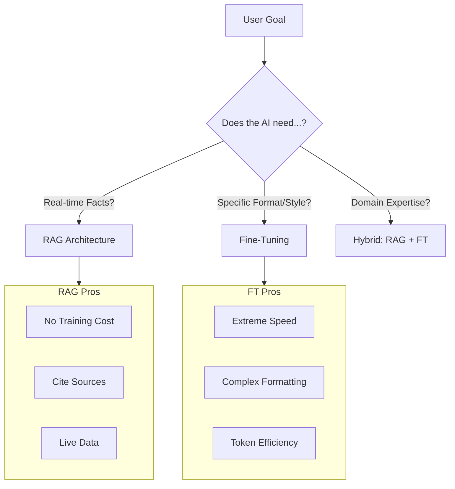

# Fine-Tuning vs. RAG: When to use which?

> **Mentor note:** This is the most common architectural question in Generative AI. RAG provides the model with "new eyes" to see fresh data, while Fine-Tuning gives the model a "new brain" to learn a specific style or vocabulary. If you need to fix a hallucination about a current fact, use RAG. If you need the model to talk like a professional medical coder or output valid 1990s-style COBOL, use Fine-Tuning.

---

## What You'll Learn

- The "External Knowledge" (RAG) vs. "Internal Weights" (Fine-Tuning) trade-off
- Data Requirements: Hundreds (RAG) vs. Thousands (Fine-Tuning) of examples
- Cost & Latency: Retrieval overhead vs. Infrastructure training costs
- Hybrid Approaches: Using RAG to ground a Fine-Tuned specialized model
- Evaluation metrics for comparing RAG and FT performance

---

## Theory & Intuition

### The Library vs. The Exam

Imagine an LLM as a student.
- **RAG** is an **Open-Book Exam**. The student has access to a library (Vector DB) and can look up facts. It's great for accuracy but slow.
- **Fine-Tuning** is **Studying for the Exam**. The student internalizes the information. It's fast and stylistic, but if the information changes, the student is "stuck" with old knowledge.



---

## Technical Comparison Matrix

| Feature | RAG (Retrieval) | Fine-Tuning (Weights) |
|---|---|---|
| **Knowledge Type** | Dynamic (News, Docs) | Static (Style, Logic) |
| **Grounding** | High (Can show source) | Low (Likely to hallucinate) |
| **Dataset Size** | 0 - Infinite | 100s - 10,000s |
| **Setup Cost** | Low (Vector DB) | High (Compute/GPU time) |
| **Latency** | Higher (Search time) | Lower (Immediate response) |

---

## 💻 Code & Implementation

### RAG vs. Fine-Tuning Decision Logic

This script simulates an architectural "Decision Engine" that analyzes project requirements and recommends the optimal AI pattern (RAG, FT, or Hybrid).

```python
import os
from groq import Groq
from dotenv import load_dotenv

load_dotenv()

def analyze_ai_architecture(scenario):
    client = Groq(api_key=os.getenv("GROQ_API_KEY"))
    model = "llama-3.1-8b-instant"

    prompt = f"""
    Analyze this project scenario and determine if RAG, Fine-Tuning, or a Hybrid approach is best.
    
    SCENARIO: {scenario}
    
    Output your decision in the following format:
    1. RECOMMENDED PATTERN: [RAG/FT/HYBRID]
    2. RATIONALE: Why?
    3. KEY BOTTLENECK: What to watch out for?
    """

    print("-" * 50)
    print("ARCHITECTURAL DECISION ENGINE")
    print("-" * 50)
    
    response = client.chat.completions.create(
        model=model,
        messages=[{"role": "user", "content": prompt}]
    ).choices[0].message.content.strip()
    
    print(response)
    print("-" * 50)

if __name__ == "__main__":
    scenario = "I need an AI that can answer questions about our company's daily stock prices and internal memos."
    analyze_ai_architecture(scenario)
```

---

## Interview Questions & Model Answers

**Q: Can Fine-Tuning be used to 'update' an LLM's knowledge on current events?**
> **Answer:** Technically yes, but practically no. Fine-tuning to add facts is inefficient and subject to "Catastrophic Forgetting." For current events, RAG is the industry standard.

**Q: When is Fine-Tuning cheaper than RAG?**
> **Answer:** At massive scale. If RAG adds 500 "context tokens" to every prompt, those costs add up. Fine-tuning allows for shorter prompts (lower inference cost) even if the initial training cost is high.

---

## Quick Reference

| Term | Role |
|---|---|
| **Open-Book** | Analogy for RAG |
| **Studied** | Analogy for Fine-Tuned |
| **Drift** | When the world changes but the FT model stays the same |
| **Hallucination**| More common in FT because there is no source to check |
| **Scaling** | RAG scales with DB size; FT scales with complexity |
