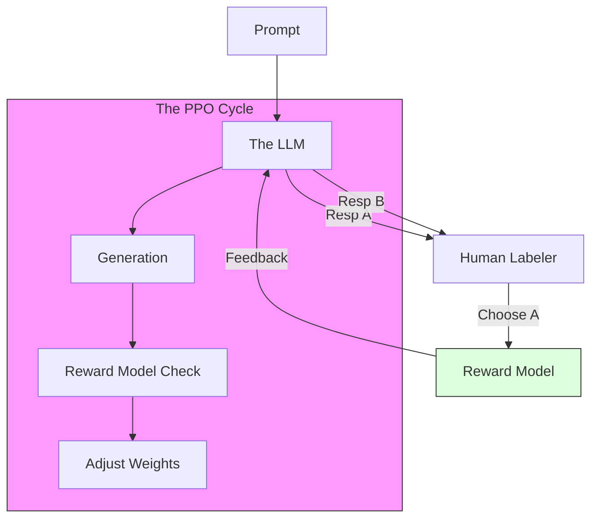

# RLHF, DPO & Alignment

> **Mentor note:** A raw "Base Model" is a wild animal—it just predicts the next most likely word, which could be harmful, biased, or nonsensical. **Alignment** is the process of domesticating that model so it follows instructions, stays helpful, and avoids toxicity. While RLHF (Reinforcement Learning from Human Feedback) was the breakthrough for ChatGPT, modern techniques like DPO (Direct Preference Optimization) are much simpler and allow you to align models on your own laptop.

---

## What You'll Learn

- The Alignment Pipeline: SFT -> Reward Modeling -> PPO
- RLHF (Reinforcement Learning from Human Feedback): Closing the loop with humans
- DPO (Direct Preference Optimization): The efficient alternative to RLHF
- Constitutional AI: Models training other models based on a "Constitution"
- Red-teaming and safety guardrails in alignment

---

## Theory & Intuition

### The Preference Loop

The model generates two responses (A and B) for the same prompt. A human labeler picks the better one. We then train a **Reward Model** to "think like a human" and use it to grade the LLM billions of times.



**Why it matters:** This is why AI feels "conversational." Base models would often just complete your sentence; Aligned models answer your question.

---

## RLHF vs. DPO

| Feature | RLHF (The Classic) | DPO (The Modern) |
|---|---|---|
| **Complexity** | High (Requires 3+ models) | Low (Needs only the model itself) |
| **Stability** | Brittle (PPO is hard to tune) | High (Stable convex optimization) |
| **Resources** | Huge (High GPU/Compute) | Moderate |
| **Origin** | OpenAI / Anthropic | Stanford Research |

---

## 💻 Code & Implementation

### Generating a Preference Dataset (DPO Format)

This script demonstrates how to construct a "Chosen vs. Rejected" dataset, which is the foundational requirement for aligning a model using Direct Preference Optimization (DPO).

```python
import json
import os

def create_dpo_dataset():
    # In a real scenario, these choices come from human labelers
    raw_data = [
        {
            "prompt": "How do I fix a leaky faucet?",
            "chosen": "First, turn off the water supply. Then, disassemble the handle to inspect the washer...",
            "rejected": "I can't help with plumbing. You should probably just call a plumber right now."
        },
        {
            "prompt": "Write a Python function for a Fibonacci sequence.",
            "chosen": "def fib(n):\n    a, b = 0, 1\n    for _ in range(n):\n        yield a\n        a, b = b, a + b",
            "rejected": "Fibonacci is a mathematical sequence where each number is the sum of the two preceding ones."
        }
    ]

    print("-" * 50)
    print("GENERATING DPO PREFERENCE DATASET")
    print("-" * 50)

    # Save to JSONL format
    output_file = "alignment_data.jsonl"
    with open(output_file, "w") as f:
        for entry in raw_data:
            f.write(json.dumps(entry) + "\n")
            print(f"Added Prompt: {entry['prompt'][:30]}...")

    print("-" * 50)
    print(f"SUCCESS: Dataset saved to {output_file}")
    print("-" * 50)

if __name__ == "__main__":
    create_dpo_dataset()
```

---

## Interview Questions & Model Answers

**Q: What is 'Reward Hacking' in RLHF?**
> **Answer:** It's when the LLM finds a "loophole" to get a high score from the Reward Model without actually being helpful. For example, if the RM gives high scores for long answers, the LLM might start outputting thousands of words of gibberish.

**Q: Why is DPO becoming more popular than traditional RLHF/PPO?**
> **Answer:** Traditional RLHF requires maintaining a separate Reward Model and running a complex reinforcement learning loop (PPO). DPO treats preference learning as a simple classification task on the model's own weights, making it faster and cheaper.

---

## Quick Reference

| Term | Role |
|---|---|
| **PPO** | The complex algorithm used in traditional RLHF |
| **SFT** | Supervised Fine-Tuning (The first step of alignment) |
| **KL Divergence**| Keeping the model from drifting too far from its base |
| **Chosen/Rejected**| The primary data format for alignment |
| **Reward Model** | An AI that mimics human preferences |
