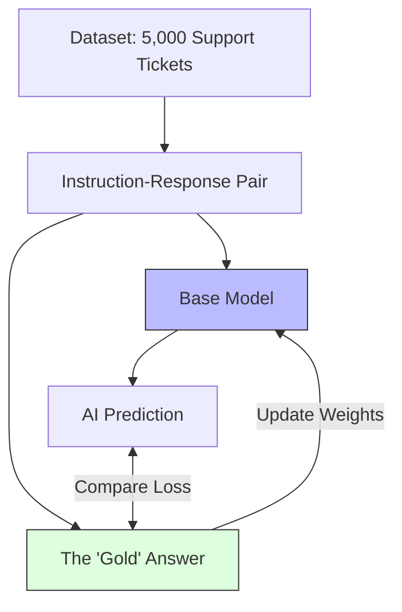

# Supervised Fine-Tuning (SFT)

> **Mentor note:** If alignment is about "Vibes," Supervised Fine-Tuning (SFT) is about "Content." This is the mandatory first step in any customization project. You provide the model with a clear dataset of Questions and Answers, and the model learns to map the pattern. It is the most reliable way to teach a model a new skill (e.g., "Always output JSON" or "Speak like a 1920s detective").

---

## What You'll Learn

- The mechanics of Backpropagation in Fine-Tuning
- Instruction-Tuning: Turning a Base model into a Chat model
- Data Formatting: Alpaca, ShareGPT, and ChatML schemas
- Loss curves: How to tell if your model is "learning" or just "memorizing"
- Overfitting: Why too much training makes your model a bad generalist

---

## Theory & Intuition

### Learning the Pattern

Supervised Fine-Tuning is simply "Training with an Answer Key." Unlike base models that just complete text, SFT models are shown thousands of examples of `Instruction + Input + Response`.



**Why it matters:** SFT is highly predictable. If you show the model enough examples of a specific format, it *will* learn to replicate that format. It is the foundation upon which RLHF and DPO are built.

---

## Data Formats Matrix

| Format | Structure | Used By |
|---|---|---|
| **Alpaca** | Instruction, Input, Output | Early Meta/Llama models |
| **ChatML** | Role: System, User, Assistant | OpenAI / Standard industry |
| **ShareGPT** | Conversations: History | Mistral / Multi-turn training |
| **Prompt-Response**| Raw text completion | Basic domain adaptation |

---

## 💻 Code & Implementation

### SFT Data Preparation (ChatML)

This script demonstrates how to transform raw domain knowledge into a **ChatML-formatted JSONL** file, including a training/validation split for model performance monitoring.

```python
import json
import random

def prepare_sft_dataset():
    # Raw knowledge base (e.g., from your company wiki)
    raw_data = [
        {"q": "What is our company refund policy?", "a": "Refunds are processed within 5-7 business days if the request is made within 30 days of purchase."},
        {"q": "How do I contact HR?", "a": "You can reach HR at hr@company.com or via the internal Slack channel #hr-help."},
        {"q": "Where is the main office?", "a": "Our main office is located at 123 Tech Lane, San Francisco."}
    ]

    print("-" * 50)
    print("SFT DATA PREPARATION (ChatML Format)")
    print("-" * 50)

    formatted_data = []
    for entry in raw_data:
        # Convert to ChatML structure
        chat_msg = {
            "messages": [
                {"role": "system", "content": "You are a helpful company assistant."},
                {"role": "user", "content": entry["q"]},
                {"role": "assistant", "content": entry["a"]}
            ]
        }
        formatted_data.append(chat_msg)

    # 1. Split into Training and Validation (80/20 split)
    random.shuffle(formatted_data)
    split_idx = int(len(formatted_data) * 0.8)
    
    # In this tiny demo, we'll just show the saving logic
    with open("sft_train.jsonl", "w") as f:
        for entry in formatted_data:
            f.write(json.dumps(entry) + "\n")
            
    print(f"SUCCESS: Generated {len(formatted_data)} ChatML training samples.")
    print("-" * 50)

if __name__ == "__main__":
    prepare_sft_dataset()
```

---

## Interview Questions & Model Answers

**Q: What is the difference between a 'Base Model' and an 'Instruct Model'?**
> **Answer:** A Base Model is trained to predict the next word. An Instruct Model has undergone SFT to understand that when it sees a question, it should provide an answer.

**Q: What is 'Catastrophic Forgetting'?**
> **Answer:** It's a risk where the model becomes so specialized in one task (e.g., SQL) that it "forgets" general skills. We prevent this by mixing general-purpose data into our training set.

---

## Quick Reference

| Term | Role |
|---|---|
| **Epoch** | One full pass through the entire dataset |
| **Learning Rate** | How much the model changes its weights each step |
| **Instruction Tuning**| Fine-tuning to follow commands |
| **Overfitting** | Learning the noise, not the signal |
| **Prompt Masking** | Only calculating loss on the AI's answer, not the prompt |
