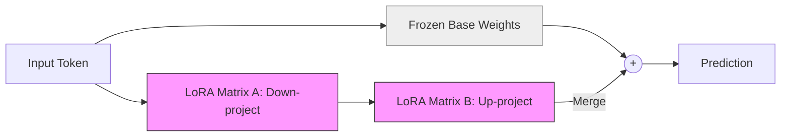

# Parameter Efficient Fine-Tuning (PEFT, LoRA)

> **Mentor note:** Fine-tuning a 70 Billion parameter model usually requires a supercomputer. **PEFT (Parameter-Efficient Fine-Tuning)** is the revolutionary "hack" that allows you to do it on a single gaming laptop. Instead of updating billions of weights, models like **LoRA (Low-Rank Adaptation)** add tiny "patch" layers (Rank matrices) to the model. You get 99% of the performance by only training 1% of the parameters. This is how the open-source community "caught up" to Big Tech.

---

## What You'll Learn

- Full Fine-Tuning vs. PEFT: The VRAM and Compute gap
- LoRA (Low-Rank Adaptation): The math of A and B matrices
- QLoRA: Fine-tuning quantized 4-bit models for extreme efficiency
- Merging Adapters: How to swap "Brain patches" on the fly
- Other PEFT methods: Prefix Tuning, Prompt Tuning, and IA3

---

## Theory & Intuition

### The "Adapter" Concept

Imagine a model is a massive library of books. **Full Fine-Tuning** is like rewriting every page of every book to update a few facts. **LoRA** is like adding a tiny "Post-it Note" to the cover of every book. The AI reads the original book, looks at your Post-it Note, and combines them to give a better answer.



**Why it matters:** The "Base" weights never change (they are frozen). You only save and share the tiny "Adapter" file (usually <100MB instead of 140GB). This makes fine-tuning accessible to everyone.

---

## Technical Comparison

| Method | Weights Updated | Storage Size | Hardware |
|---|---|---|---|
| **Full FT** | 100% | 140 GB+ | 8x A100 GPUs |
| **LoRA** | 0.5% - 2% | 50 - 200 MB | 1x Consumer GPU (24GB) |
| **QLoRA** | ~1% | 100 MB | 1x Old GPU (12GB) |
| **Prefix Tuning**| < 0.1% | < 10 MB | Very Low |

---

## 💻 Code & Implementation

### LoRA Parameter Efficiency Calculator

This script calculates the massive difference in trainable parameters between a standard 7 Billion parameter model and a LoRA-equipped version.

```python
def calculate_lora_efficiency(base_params_billion, rank, target_layers):
    """
    Calculates the number of trainable parameters in a LoRA setup.
    Formula: TrainableParams = Rank * HiddenDim * 2 * NumLayers
    """
    hidden_dim = 4096 # Standard for Llama 7B
    
    # Each LoRA adapter has 2 matrices: A (Dim x Rank) and B (Rank x Dim)
    params_per_layer = rank * hidden_dim * 2
    total_trainable = params_per_layer * target_layers
    
    base_params = base_params_billion * 1_000_000_000
    percentage = (total_trainable / base_params) * 100

    print("-" * 50)
    print(f"Llama-3 7B (Full FT): {base_params:,} parameters")
    print(f"Llama-3 7B (LoRA R={rank}): {total_trainable:,} parameters")
    print("-" * 50)
    print(f"EFFICIENCY: You are only training {percentage:.4f}% of the model!")
    print("-" * 50)

if __name__ == "__main__":
    calculate_lora_efficiency(7, rank=8, target_layers=32)
```

---

## Interview Questions & Model Answers

**Q: What is the 'Rank' (r) in LoRA?**
> **Answer:** Rank defines the complexity of the adapter. A Rank of 8 means we are compressing a massive weight matrix into a tiny 8-dimension bottleneck. Lower ranks save more memory but might not capture complex new knowledge.

**Q: What is QLoRA?**
> **Answer:** QLoRA takes a base model and compresses it to 4-bits. It then attaches a 16-bit LoRA adapter on top. This allows you to fine-tune a model that originally needed 40GB of VRAM on a card with only 12GB.

---

## Quick Reference

| Term | Role |
|---|---|
| **Freezing** | Not updating specific model layers |
| **Rank** | The width of the LoRA matrices |
| **Alpha** | A scaling parameter for the adapter's influence |
| **A/B Matrices** | The two low-rank matrices that make up a LoRA |
| **Quantization** | Reducing weight precision (4-bit) to save memory |
