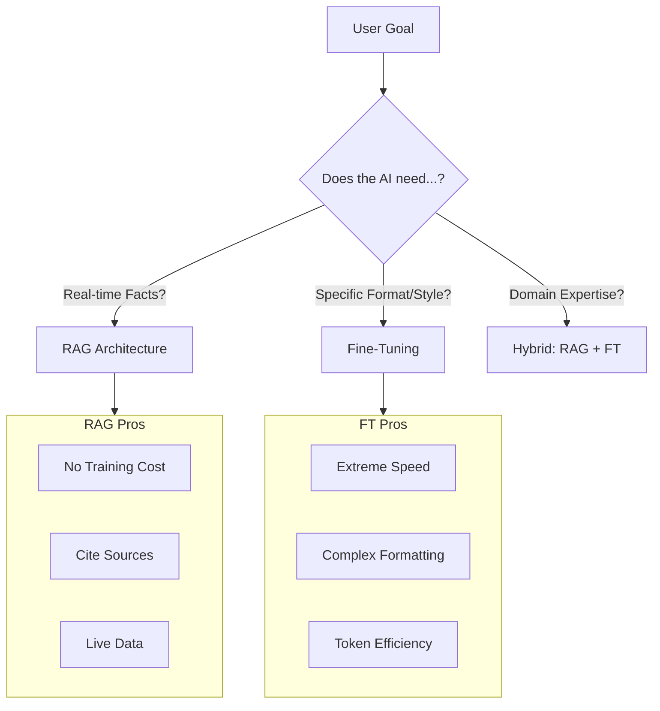

# 36. Fine-Tuning vs. RAG: When to use which?

> **Mentor note:** This is the most common architectural question in Generative AI. RAG provides the model with "new eyes" to see fresh data, while Fine-Tuning gives the model a "new brain" to learn a specific style or vocabulary. If you need to fix a hallucination about a current fact, use RAG. If you need the model to talk like a professional medical coder or output valid 1990s-style COBOL, use Fine-Tuning.

---

## What You'll Learn

- The "External Knowledge" (RAG) vs. "Internal Weights" (Fine-Tuning) trade-off
- Data Requirements: Hundreds (RAG) vs. Thousands (Fine-Tuning) of examples
- Cost & Latency: Retrieval overhead vs. Infrastructure training costs
- Hybrid Approaches: Using RAG to ground a Fine-Tuned specialized model
- Evaluation metrics for comparing RAG and FT performance

---

## Theory & Intuition

### The Library vs. The Exam

Imagine an LLM as a student.
- **RAG** is an **Open-Book Exam**. The student has access to a library (Vector DB) and can look up facts. It's great for accuracy but slow.
- **Fine-Tuning** is **Studying for the Exam**. The student internalizes the information. It's fast and stylistic, but if the information changes, the student is "stuck" with old knowledge.

---

## Technical Comparison Matrix

| Feature | RAG (Retrieval) | Fine-Tuning (Weights) |
|---|---|---|
| **Knowledge Type** | Dynamic (News, Docs) | Static (Style, Logic) |
| **Grounding** | High (Can show source) | Low (Likely to hallucinate) |
| **Dataset Size** | 0 - Infinite | 100s - 10,000s |
| **Setup Cost** | Low (Vector DB) | High (Compute/GPU time) |
| **Latency** | Higher (Search time) | Lower (Immediate response) |
| **Model Size** | Standard (Llama, GPT) | Becomes specialized |

---

## Case Study: The Medical Assistant

- **Scenario A:** The assistant needs to look up a patient's specific lab results from yesterday.
  - **Winner:** **RAG**. You cannot fine-tune a model every time a patient gets a blood test.
- **Scenario B:** The assistant needs to always output notes in the strict ISO-9001 medical coding format.
  - **Winner:** **Fine-Tuning**. It's much cheaper and more reliable to teach the model the "Vibe" and "Structure" of ISO coding once than to include 10 examples in every single prompt.

---

## Interview Questions & Model Answers

**Q: Can Fine-Tuning be used to 'update' an LLM's knowledge on current events?**
> **Answer:** Technically yes, but practically no. Fine-tuning to add facts is inefficient (requires many examples) and subject to "Catastrophic Forgetting," where the model loses general intelligence. For current events, RAG is the industry standard.

**Q: What is a 'Hybrid' approach?**
> **Answer:** It's using a Fine-Tuned model (e.g., a model fine-tuned on legal terminology) as the core "Reasoning Brain" and feeding it "Retrieved Context" (e.g., specific case law) via RAG. This provides the best of both worlds: specialized vocabulary + factual grounding.

**Q: When is Fine-Tuning cheaper than RAG?**
> **Answer:** At massive scale. If you are serving millions of requests and RAG adds 500 "context tokens" to every prompt, those tokens add up to huge costs. If you fine-tune the model to understand the context implicitly, your prompt becomes shorter, saving significantly on inference costs over time.

---

## Quick Reference

| Term | Role |
|---|---|
| **Open-Book** | Analogy for RAG |
| **Studied** | Analogy for Fine-Tuned |
| **Drift** | When the world changes but the FT model stays the same |
| **Hallucination**| More common in FT because there is no source to check |
| **Scaling** | RAG scales with DB size; FT scales with complexity |
