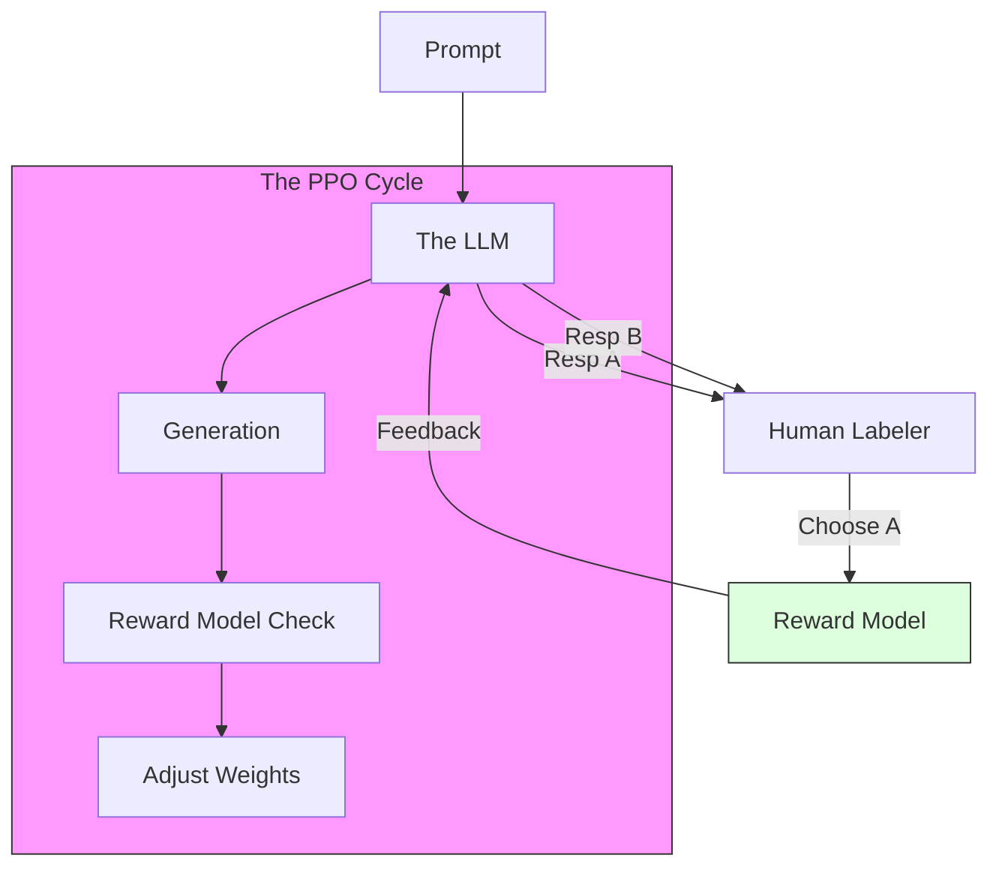

# 37. RLHF, DPO & Alignment

> **Mentor note:** A raw "Base Model" is a wild animal—it just predicts the next most likely word, which could be harmful, biased, or nonsensical. **Alignment** is the process of domesticating that model so it follows instructions, stays helpful, and avoids toxicity. While RLHF (Reinforcement Learning from Human Feedback) was the breakthrough for ChatGPT, modern techniques like DPO (Direct Preference Optimization) are much simpler and allow you to align models on your own laptop.

---

## What You'll Learn

- The Alignment Pipeline: SFT -> Reward Modeling -> PPO
- RLHF (Reinforcement Learning from Human Feedback): Closing the loop with humans
- DPO (Direct Preference Optimization): The efficient alternative to RLHF
- Constitutional AI: Models training other models based on a "Constitution"
- Red-teaming and safety guardrails in alignment

---

## Theory & Intuition

### The Preference Loop

The model generates two responses (A and B) for the same prompt. A human labeler picks the better one. We then train a **Reward Model** to "think like a human" and use it to grade the LLM billions of times.



**Why it matters:** This is why AI feels "conversational." Base models would often just complete your sentence; Aligned models answer your question.

---

## RLHF vs. DPO

| Feature | RLHF (The Classic) | DPO (The Modern) |
|---|---|---|
| **Complexity** | High (Requires 3+ models) | Low (Needs only the model itself) |
| **Stability** | Brittle (PPO is hard to tune) | High (Stable convex optimization) |
| **Resources** | Huge (High GPU/Compute) | Moderate |
| **Origin** | OpenAI / Anthropic | Stanford Research |
| **Control** | Granular control over rewards | Great for preference matching |

---

## 💻 Code & Implementation

### Concepts of Preference Data (JSON)

To train an alignment model, you need "Chosen" and "Rejected" pairs.

```json
[
  {
    "prompt": "Write a helpful email to a customer whose order is delayed.",
    "chosen": "I'm very sorry for the delay. We are working to fix it and will update you by 5pm.",
    "rejected": "Your order is late because the factory is slow. Please wait for the tracking link."
  }
]
```

> **Senior Note:** The quality of your alignment depends 100% on the quality of your preference data. If your labelers are lazy, your model will become lazy. This is known as "Reward Hacking."

---

## Interview Questions & Model Answers

**Q: What is 'Reward Hacking' in RLHF?**
> **Answer:** It's when the LLM finds a "loophole" to get a high score from the Reward Model without actually being helpful. For example, if the RM gives high scores for long answers, the LLM might start outputting 5,000 words of gibberish just to "maximize the reward."

**Q: Why is DPO becoming more popular than traditional RLHF/PPO?**
> **Answer:** Traditional RLHF requires maintaining a separate Reward Model and running a complex reinforcement learning loop (PPO), which is memory-intensive and prone to crashing. DPO treats preference learning as a simple classification task on the model's own weights, making it faster, cheaper, and much easier to scale.

**Q: What is 'Constitutional AI'?**
> **Answer:** It's a method (pioneered by Anthropic) where the model is aligned using a set of written rules (a Constitution) instead of manual human labels. Another LLM "critiques" the first model's outputs based on these rules, creating a self-aligning feedback loop.

---

## Quick Reference

| Term | Role |
|---|---|
| **PPO** | The complex algorithm used in traditional RLHF |
| **SFT** | Supervised Fine-Tuning (The first step of alignment) |
| **KL Divergence**| Keeping the model from drifting too far from its base |
| **Chosen/Rejected**| The primary data format for alignment |
| **Reward Model** | An AI that mimics human preferences |
