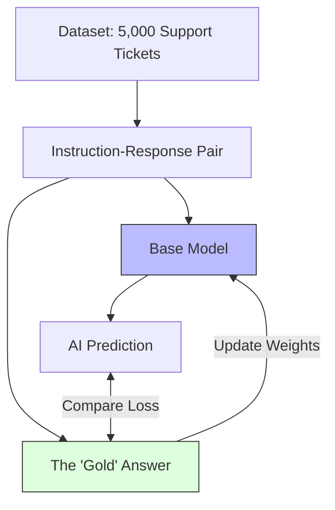

# 38. Supervised Fine-Tuning (SFT)

> **Mentor note:** If alignment is about "Vibes," Supervised Fine-Tuning (SFT) is about "Content." This is the mandatory first step in any customization project. You provide the model with a clear dataset of Questions and Answers, and the model learns to map the pattern. It is the most reliable way to teach a model a new skill (e.g., "Always output JSON" or "Speak like a 1920s detective").

---

## What You'll Learn

- The mechanics of Backpropagation in Fine-Tuning
- Instruction-Tuning: Turning a Base model into a Chat model
- Data Formatting: Alpaca, ShareGPT, and ChatML schemas
- Loss curves: How to tell if your model is "learning" or just "memorizing"
- Overfitting: Why too much training makes your model a bad generalist

---

## Theory & Intuition

### Learning the Pattern

Supervised Fine-Tuning is simply "Training with an Answer Key." Unlike base models that just complete text, SFT models are shown thousands of examples of `Instruction + Input + Response`.



**Why it matters:** SFT is highly predictable. If you show the model enough examples of a specific format, it *will* learn to replicate that format. It is the foundation upon which RLHF and DPO are built.

---

## Data Formats Matrix

| Format | Structure | Used By |
|---|---|---|
| **Alpaca** | Instruction, Input, Output | Early Meta/Llama models |
| **ChatML** | Role: System, User, Assistant | OpenAI / Standard industry |
| **ShareGPT** | Conversations: History | Mistral / Multi-turn training |
| **Prompt-Response**| Raw text completion | Basic domain adaptation |

---

## 💻 Code & Implementation

### A Training Sample (JSONL)

To run SFT, you typically feed the model a `.jsonl` file.

```json
{"messages": [{"role": "system", "content": "You are a legal assistant."}, {"role": "user", "content": "What is a 'Torts' issue?"}, {"role": "assistant", "content": "A tort is a civil wrong that causes a claimant to suffer loss or harm..."}]}
{"messages": [{"role": "system", "content": "You are a legal assistant."}, {"role": "user", "content": "Define 'Habeas Corpus'."}, {"role": "assistant", "content": "Habeas corpus is a recourse in law through which a person can report an unlawful detention..."}]}
```

> **Senior tip:** For SFT, **Quality > Quantity**. Training on 500 "perfect" examples is often better than training on 50,000 "mediocre" examples. Always manually review your training data.

---

## Interview Questions & Model Answers

**Q: What is the difference between a 'Base Model' and an 'Instruct Model'?**
> **Answer:** A Base Model is trained on the raw internet to predict the next word (e.g., if you type 'How to make a cake', it might show you a cake shop menu). An Instruct Model has undergone SFT to understand that when it sees a question, it should provide an answer.

**Q: What is 'Catastrophic Forgetting'?**
> **Answer:** It's a risk during SFT where the model becomes so specialized in one task (e.g., writing SQL) that it "forgets" how to do other things (e.g., writing a polite email). We prevent this by mixing some general-purpose data into our specialized training set.

**Q: How do you know when to stop training during SFT?**
> **Answer:** We monitor the **Validation Loss**. If the loss on the training data keeps going down, but the loss on the "held-out" validation data starts going up, the model is **Overfitting**—it's just memorizing the examples instead of learning the logic. That is the signal to stop.

---

## Quick Reference

| Term | Role |
|---|---|
| **Epoch** | One full pass through the entire dataset |
| **Learning Rate** | How much the model changes its weights each step |
| **Instruction Tuning**| Fine-tuning to follow commands |
| **Overfitting** | Learning the noise, not the signal |
| **Prompt Masking** | Only calculating loss on the AI's answer, not the prompt |
