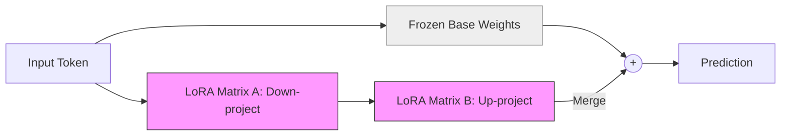

# 39. Parameter Efficient Fine-Tuning (PEFT, LoRA)

> **Mentor note:** Fine-tuning a 70 Billion parameter model usually requires a supercomputer. **PEFT (Parameter-Efficient Fine-Tuning)** is the revolutionary "hack" that allows you to do it on a single gaming laptop. Instead of updating billions of weights, models like **LoRA (Low-Rank Adaptation)** add tiny "patch" layers (Rank matrices) to the model. You get 99% of the performance by only training 1% of the parameters. This is how the open-source community "caught up" to Big Tech.

---

## What You'll Learn

- Full Fine-Tuning vs. PEFT: The VRAM and Compute gap
- LoRA (Low-Rank Adaptation): The math of A and B matrices
- QLoRA: Fine-tuning quantized 4-bit models for extreme efficiency
- Merging Adapters: How to swap "Brain patches" on the fly
- Other PEFT methods: Prefix Tuning, Prompt Tuning, and IA3

---

## Theory & Intuition

### The "Adapter" Concept

Imagine a model is a massive library of books. **Full Fine-Tuning** is like rewriting every page of every book to update a few facts. **LoRA** is like adding a tiny "Post-it Note" to the cover of every book. The AI reads the original book, looks at your Post-it Note, and combines them to give a better answer.



**Why it matters:** The "Base" weights never change (they are frozen). You only save and share the tiny "Adapter" file (usually <100MB instead of 140GB). This makes fine-tuning accessible to everyone.

---

## Technical Comparison

| Method | Weights Updated | Storage Size | Hardware |
|---|---|---|---|
| **Full FT** | 100% | 140 GB+ | 8x A100 GPUs |
| **LoRA** | 0.5% - 2% | 50 - 200 MB | 1x Consumer GPU (24GB) |
| **QLoRA** | ~1% | 100 MB | 1x Old GPU (12GB) |
| **Prefix Tuning**| < 0.1% | < 10 MB | Very Low |

---

## 💻 Code & Implementation

### Concept: Training a LoRA Adapter (Python/PEFT)

```python
# Concept using the Hugging Face PEFT library
# from peft import LoraConfig, get_peft_model

def run_peft_setup():
    # ⭐ STEP 1: Define the LoRA Configuration
    lora_config = {
        "r": 8,           # The 'Rank' (size of the Post-it Note)
        "lora_alpha": 32, # The 'Scaling' factor
        "target_modules": ["q_proj", "v_proj"], # Which 'Attention' layers to patch
        "lora_dropout": 0.05,
        "task_type": "CAUSAL_LM"
    }

    print("Configuring LoRA Adapter for a 7B model...")
    print(f"Rank R={lora_config['r']} chosen for efficiency.")
    
    # ⭐ STEP 2: Wrap the base model
    # model = get_peft_model(base_model, lora_config)
    
    print("-" * 50)
    print("PEFT Model Ready! Only 4.2 Million parameters are trainable.")
    print("Original Model: 7,000 Million parameters (Frozen).")
    print("-" * 50)
    print("[Senior Note] By freezing the base, we use 70% less memory!")

if __name__ == "__main__":
    run_peft_setup()
```

---

## Interview Questions & Model Answers

**Q: What is the 'Rank' (r) in LoRA?**
> **Answer:** Rank defines the complexity/expressiveness of the adapter. A Rank of 8 means we are compressing a massive weight matrix into a tiny 8-dimension bottleneck. Lower ranks save more memory but might not capture very complex new knowledge. Ranks of 8, 16, or 32 are standard for most tasks.

**Q: What is QLoRA?**
> **Answer:** QLoRA (Quantized LoRA) takes a base model and compresses it to 4-bits (Topic 44). It then attaches a 16-bit LoRA adapter on top. This allows you to fine-tune a model that originally needed 40GB of VRAM on a card with only 8GB or 12GB. It is the gold standard for "budget" fine-tuning.

**Q: Can you 'stack' multiple LoRA adapters?**
> **Answer:** Yes! This is a powerful modular architecture. You can have one adapter for "SQL Writing" and another for "Pirate Speak." You can load the base model once and hot-swap adapters in milliseconds depending on which user is speaking.

---

## Quick Reference

| Term | Role |
|---|---|
| **Freezing** | Not updating specific model layers |
| **Rank** | The width of the LoRA matrices |
| **Alpha** | A scaling parameter for the adapter's influence |
| **A/B Matrices** | The two low-rank matrices that make up a LoRA |
| **Quantization** | Reducing the precision of weights to save memory (4-bit, 8-bit) |
