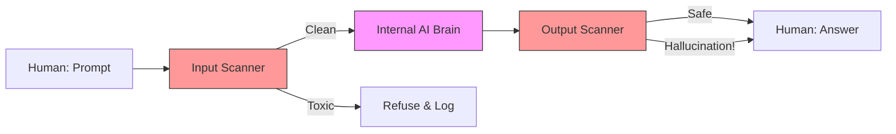

# 42. Guardrails & Content Safety

> **Mentor note:** A model's "Alignment" (Topic 37) is its internal moral compass, but **Guardrails** are the external "Security Guards" that stand between the model and the user. Even if a model is fine-tuned to be safe, high-stakes applications (banking, healthcare) need an independent check. Guardrails monitor the input (to prevent injections) and the output (to prevent hallucinations or data leaks) in real-time.

---

## What You'll Learn

- The Guardrail Architecture: Input, Output, and Retrieval scanning
- Llama Guard & NeMo Guardrails: Industry standard frameworks
- PII Detection: Automatically redacting credit cards and social security numbers
- Hallucination Checks: Cross-checking the AI output against the retrieved context
- Semantic Routing: Blocking topics like "Politics" or "Competitors" at the door

---

## Theory & Intuition

### The Two-Pass Filter

In a professional system, we don't just send the prompt to the AI. We wrap the AI call in a **Security Sandbox**.



**Why it matters:** Accuracy and Compliance. If the AI accidentally generates a response containing a real user's private address (Pll), the Output Guardrail should catch it and redact it before the user ever sees it—preventing a massive legal liability.

---

## 💻 Code & Implementation

### A Basic PII Scrubber (Concept)

```python
import re

def content_safety_guardrail(text: str):
    """
    Simulates a rule-based guardrail to detect PII.
    """
    # Simple regex for a Credit Card number
    cc_pattern = r'\b\d{4}[- ]?\d{4}[- ]?\d{4}[- ]?\d{4}\b'
    
    if re.search(cc_pattern, text):
        print("[GUARDRAIL ALERT] Sensitive information detected!")
        return "[REDACTED]"
    
    return text

def run_guardrail_demo():
    raw_ai_output = "I have successfully processed the payment for card 4111 2222 3333 4444."
    
    print(f"RAW OUTPUT: {raw_ai_output}")
    
    safe_output = content_safety_guardrail(raw_ai_output)
    
    print("-" * 50)
    print(f"SAFE OUTPUT: {safe_output}")
    print("-" * 50)
    print("[Senior Note] Modern frameworks like NeMo Guardrails use "
          "mini-LLMs to check for 'Tone' and 'Intent' rather than just Regex.")

if __name__ == "__main__":
    run_guardrail_demo()
```

---

## Leading Guardrail Frameworks

| Framework | Logic | Best For |
|---|---|---|
| **Llama Guard** | Specialized Fine-Tuned Model | High-accuracy toxicity/safety checks |
| **NeMo Guardrails**| "Colang" logic scripts | Complex enterprise steering |
| **Guardrails AI** | Pydantic / Validation based | Structured output (JSON) validation |
| **Lakera** | External Safety API | Zero-effort integration |

---

## Interview Questions & Model Answers

**Q: What is the difference between Model Alignment and a Guardrail?**
> **Answer:** Alignment is baked into the model's weights during training (e.g., RLHF). A Guardrail is an external system that runs *separate* from the model. Alignment is the model "trying to be good"; Guardrails are "proving the model is being good" and intervening if it fails.

**Q: How do you prevent 'Injection' using guardrails?**
> **Answer:** I implement an **Input Guardrail** that checks for common injection patterns (e.g., "Ignore all previous instructions"). I also use a mini-LLM to "summarize" the user's intent—if the detected intent doesn't match the allowed intent, the request is blocked.

**Q: Why is 'Self-Correction' better than just blocking?**
> **Answer:** If the output guardrail finds a mistake (e.g., "You forgot to format this as JSON"), instead of just showing an error to the human, it can send a message back to the AI: "Your output failed the guardrail validation. Please re-format it."

---

## Quick Reference

| Term | Role |
|---|---|
| **PII** | Personally Identifiable Information (Privacy risk) |
| **Colang** | A language used specifically for writing AI guardrails |
| **Redacting** | Removing sensitive info from text |
| **False Positive**| When a safe prompt is accidentally blocked |
| **Hallucination Check**| Verifying the AI output against a ground truth |
