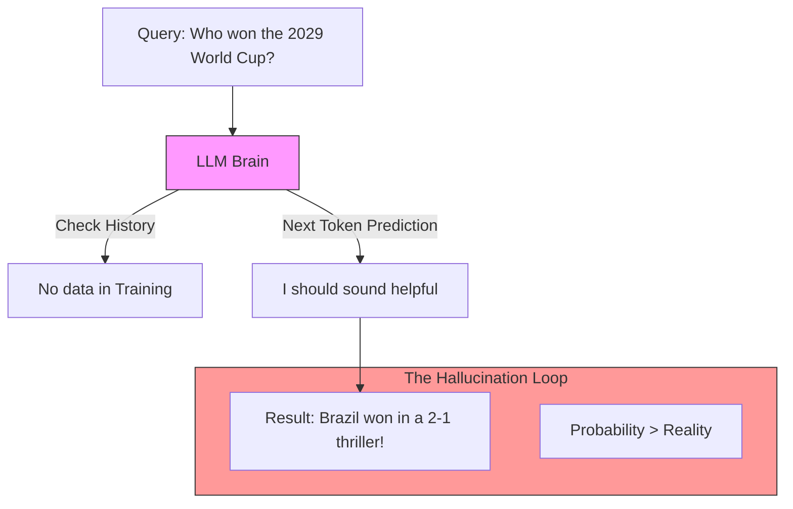

# 43. Bias, Fairness & Hallucination

> **Mentor note:** AI models are mirrors of the internet—which means they inherit all of humanity's beautiful logic and all of its ugly biases. As an engineer, "Bias" isn't just a social issue; it's a **Technical Bug**. If your model assumes all doctors are male or all engineers are from certain regions, it is failing at "Accuracy." Hallucination is the final stage of this failure—where the model's internal "priors" are so strong they overwrite reality.

---

## What You'll Learn

- Types of Bias: Training data bias, Algorithmic bias, and Societal bias
- Hallucination: Why models lie with confidence (The "Smooth Talker" effect)
- Mitigation: Debiasing prompts and diversity-sampling
- Evaluation: Metrics for fairness and parity across demographics
- Grounding: Using RAG to fight hallucinations at the source

---

## Theory & Intuition

### The Hallucination Engine

LLMs do not have a "Truth" database. They have a "Probability" table. If a prompt is ambiguous, the model will pick the most "likely" words even if they are factually wrong.



**Why it matters:** Hallucination is a natural byproduct of how LLMs work (predicting the next word). You cannot "fix" it entirely; you can only "manage" it through grounding and verification.

---

## Bias vs. Hallucination

| Feature | Bias | Hallucination |
|---|---|---|
| **Source** | Training Data / Humans | Statistical Probability Logic |
| **Example** | Assuming a nurse is female | Saying "Abraham Lincoln used an iPhone" |
| **Impact** | Unfairness / Discrimination | Misinformation / System Failure |
| **Fix** | Diverse Data / Alignment | RAG / Citations / Low Temp |

---

## 💻 Code & Implementation

### Fighting Hallucinations with "Citation Verification"

A common technique is to ask the model to provide a quote from the context and verify its existence.

```python
import os
from google import genai
from dotenv import load_dotenv

load_dotenv()

def run_grounding_verification_demo():
    client = genai.Client(api_key=os.getenv("GOOGLE_API_KEY"))

    context = "The company revenue in 2023 was $4.5 Million, a 10% increase from 2022."
    
    # ⭐ THE GROUNDED PROMPT
    prompt = f"""
    Answer the following question ONLY using the context provided.
    If the answer is not in the context, say 'Information not found.'
    
    CONTEXT: {context}
    QUESTION: What was the revenue in 2021?
    
    ANSWER:
    """

    print("Gemini is checking the data for factual grounding...")
    response = client.models.generate_content(
        model="gemini-1.5-flash",
        contents=prompt
    )
    
    print("-" * 50)
    print(f"AI Response: {response.text.strip()}")
    print("-" * 50)
    print("[Senior Note] By providing a 'Negative Constraint', "
          "we successfully prevented the model from 'Guiding' an answer "
          "about 2021.")

if __name__ == "__main__":
    run_grounding_verification_demo()
```

---

## Interview Questions & Model Answers

**Q: Why do LLMs hallucinate more at high 'Temperature'?**
> **Answer:** At high temperature, the model moves away from the most probable "True" tokens and begins picking lower-probability tokens to be more creative. This increases the chance that it will pick tokens that sound good but are factually incorrect.

**Q: How do you measure 'Bias' in a production model?**
> **Answer:** I use **Counterfactual Probing**. I take a prompt and swap the demographics (e.g. gender/name). If the model's tone or output changes significantly based on those variables, we have identified a bias bug.

**Q: What is 'Self-Correction' in the context of hallucination?**
> **Answer:** It's an agentic pattern where the model writes an answer, and then is immediately asked in a second turn: "Read your previous answer. Check it against the context for any lies. If you find one, rewrite it correctly."

---

## Quick Reference

| Term | Role |
|---|---|
| **Prior** | The model's "instinct" based on training data |
| **Stochastic**| Random behavior inherent in the model |
| **Grounded** | An answer directly tied to a verifiable source |
| **Confabulation**| Another technical term for hallucination |
| **Refusal** | When the model says "I can't answer that" (A safety win) |
