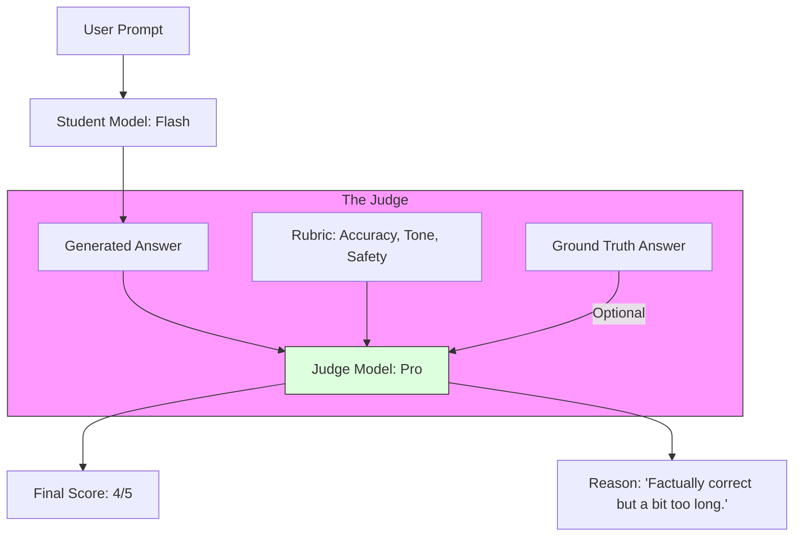

# 40. LLM-as-a-Judge (Self-Evaluation)

> **Mentor note:** How do you test a model that generates creative text? You can't use simple string matching (Topic 4). If the AI says "The sky is azure" and the ground truth is "The sky is blue," a computer says it's 0% correct, but a human says it's 100% correct. **LLM-as-a-Judge** is the pattern where we use a larger, more capable model (like Gemini 1.5 Pro) to act as a "Professor" and grade the responses of smaller models (like Flash). It is the only way to scale evaluation for Generative AI.

---

## What You'll Learn

- The Evaluator Pattern: Reference-based vs. Reference-free grading
- Scoring Rubrics: Creating clear "Grading Criteria" for the Judge
- Pairwise Comparison: Asking the Judge to pick the better of two outputs
- Frameworks: Ragas (for RAG), DeepEval, and LangSmith
- Mitigation: Handling "Position Bias" and "Verbosity Bias" in Judges

---

## Theory & Intuition

### The Grading Loop

Instead of binary "Right/Wrong," the Judge model provides a **Likert Scale** (1-5) and a **Justification**.



**Why it matters:** It allows for **Continuous Integration (CI)**. Every time you change your prompt (Topic 16), the Judge automatically re-grades 100 test cases, ensuring your "fix" didn't break something else.

---

## 💻 Code & Implementation

### Implementing a Basic Judge

```python
import os
import google.generativeai as genai
from dotenv import load_dotenv

load_dotenv()

def run_judge_demo():
    genai.configure(api_key=os.getenv("GEMINI_API_KEY"))
    
    # ⭐ The "Professor" (High capability)
    judge_model = genai.GenerativeModel('gemini-1.5-pro')

    student_answer = "The capital of France is Paris, which is known for the Eiffel Tower."
    reference_answer = "Paris is the capital of France."

    # ⭐ THE JUDGE PROMPT (The Rubric)
    judge_prompt = f"""
    You are an expert Evaluator. 
    Grade the STUDENT ANSWER below based on the REFERENCE ANSWER.
    
    CRITERIA:
    1. Accuracy: Is the fact correct? (Scale 1-5)
    2. Conciseness: Is it brief and to the point? (Scale 1-5)
    
    STUDENT ANSWER: {student_answer}
    REFERENCE ANSWER: {reference_answer}
    
    Return your response as JSON: {{"accuracy": x, "conciseness": y, "reasoning": "..."}}
    """

    print("Submitting answer to the Judge...")
    response = judge_model.generate_content(judge_prompt)
    
    print("-" * 50)
    print(f"Judge Output:\n{response.text.strip()}")
    print("-" * 50)

if __name__ == "__main__":
    run_judge_demo()
```

---

## Judge Bias Checklist

| Bias | Problem | Solution |
|---|---|---|
| **Position Bias** | Judge favors the first answer it sees | Swap order and run evaluation twice |
| **Verbosity Bias** | Judge favors longer, wordier answers | Hard constraint on length in rubric |
| **Self-Preference**| Judge favors its own writing style | Use a different provider for the Judge |
| **Numeric Bias** | Judge hates giving "1" or "5" | Use a 3-point scale or binary Pass/Fail |

---

## Interview Questions & Model Answers

**Q: Why use LLM-as-a-Judge instead of BLEU or ROUGE scores?**
> **Answer:** BLEU and ROUGE are based on N-gram overlaps (word matching). They can't understand synonyms or semantic meaning. An LLM-as-a-Judge can understand that "Happy" and "Joyful" mean the same thing, whereas word-overlap metrics would penalize the model for not using the exact same word as the reference.

**Q: What is 'Reference-Free' Evaluation?**
> **Answer:** It's when the Judge grades a response based only on the prompt and the answer, without knowing the "Correct" answer. This is useful for creative writing or open-ended reasoning where there is no single "Golden" answer.

**Q: How do you know if your Judge is 'good'?**
> **Answer:** I calculate the **Human-Judge Correlation**. I have a human grade 50 examples, and I compare them to the LLM's grades. If the correlation is high (e.g., Cohen's Kappa > 0.7), the Judge is reliable enough for automated testing.

---

## Quick Reference

| Term | Role |
|---|---|
| **Rubric** | The specific rules the Judge must follow |
| **Golden Set** | A curated table of "Perfect" Q&A pairs |
| **RAGAS** | A framework specifically for grading RAG pipelines |
| **Deterministic**| Traditional code-based tests (Topic 4) |
| **Probabilistic**| LLM-based testing (Topic 40) |
| **Hallucination Rate**| How many times the Judge flags a factual error |
