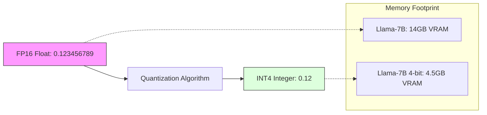

# 44. Quantization & Deployment

> **Mentor note:** A raw "fp16" model is like an uncompressed 8K video—it's beautiful, but it's too big to fit anywhere. **Quantization** is the "Compression" technology for AI. By reducing the precision of the model's weights from 16-bit to 4-bit, we can fit a 70 Billion parameter model on a consumer graphics card with almost no loss in intelligence. This is how we move LLMs from massive data centers to local devices (Edge AI).

---

## What You'll Learn

- Bit-Precision (FP16, INT8, INT4): The trade-off between memory and accuracy
- Quantization Formats: GGUF (for CPU/Local) and AWQ/GPTQ (for GPU)
- VRAM Calculation: Estimating how many GPUs you need for a specific model
- Hosting Engines: vLLM (through-put optimization) vs. Ollama (local ease)
- Edge Deployment: Running models on Mac (MLX) and Mobile

---

## Theory & Intuition

### The Compression Squeeze

Imagine each number (weight) in a model is stored with 16 decimals of precision. Quantization is the process of "Rounding" those numbers. While rounding might seem risky, LLMs are surprisingly robust; even with 4-bit "rounding," the model retains 95%+ of its original reasoning power.



**Why it matters:** 4-bit quantization allows a model that originally required $5,000 worth of GPUs to run on a $500 laptop. This is the foundation of the "Local LLM" revolution.

---

## Data Precisions Comparison

| Precision | Bits | Bytes / Param | Best For |
|---|---|---|---|
| **FP32** | 32-bit | 4 bytes | Training (High stability) |
| **FP16 / BF16** | 16-bit | 2 bytes | Standard Inference / Cloud |
| **INT8** | 8-bit | 1 byte | Early quantization (Legacy) |
| **4-bit (AWQ)** | 4-bit | 0.5 bytes | **Production Standard** (GPU) |
| **GGUF (K-Quants)**| Variable | ~0.4 bytes | **Local Standard** (CPU + GPU) |

---

## 💻 Code & Implementation

### Estimating VRAM for Quantized Models

This script calculates the theoretical memory required to load and run an LLM based on its parameter count and quantization level.

```python
def calculate_vram_usage(params_billions: float, bits: int):
    """
    Calculates theoretical VRAM usage.
    params_billions: Model size in B (e.g. 7, 70)
    bits: Precision (4, 8, 16)
    """
    # Bytes per parameter
    bytes_per_param = bits / 8
    
    # Base model size
    model_size_gb = params_billions * bytes_per_param
    
    # 25% overhead for KV Cache and Context
    total_vram_gb = model_size_gb * 1.25
    
    return model_size_gb, total_vram_gb

if __name__ == "__main__":
    p = 70  # Llama-70B
    b = 4   # 4-bit
    base, total = calculate_vram_usage(p, b)
    print(f"Model: {p}B Parameters at {b}-bit")
    print(f"Base Weights: {base:.2f} GB")
    print(f"Total VRAM (incl. Cache): {total:.2f} GB")
```

---

## Interview Questions & Model Answers

**Q: Does Quantization make the model faster or just smaller?**
> **Answer:** Both. It makes it smaller (fitting more parameters into VRAM) and faster (since moving 4-bit data across the memory bus is much quicker than 16-bit data). However, very low quantization (e.g., 2-bit) can lead to a "Perplexity Explosion" where the model becomes nonsensical.

**Q: What is the difference between GGUF and AWQ?**
> **Answer:** **GGUF** is designed for the CPU (via the llama.cpp library). It is the format you use for Ollama. **AWQ** (Activation-aware Weight Quantization) is designed for professional Nvidia GPUs. It is optimized for high-throughput cloud serving using engines like vLLM.

**Q: How do you calculate the VRAM needed for a model?**
> **Answer:** A rough rule of thumb for 4-bit quantization is: `Parameters * 0.75 = GB of VRAM`. For a 70B model, you need roughly 50-55GB of VRAM (to account for the KV Cache/Context). This would require 3x RTX 3090s or an A100 GPU.

---

## Quick Reference

| Term | Role |
|---|---|
| **vLLM** | The industry-standard library for high-speed serving |
| **KV Cache** | Memory used to store the "Context" history during chat |
| **Perplexity** | A mathematical measure of how "confused" a model is |
| **Ollama** | The "Docker for LLMs" (Local deployment tool) |
| **Offloading** | Splitting a model between GPU and System RAM |
