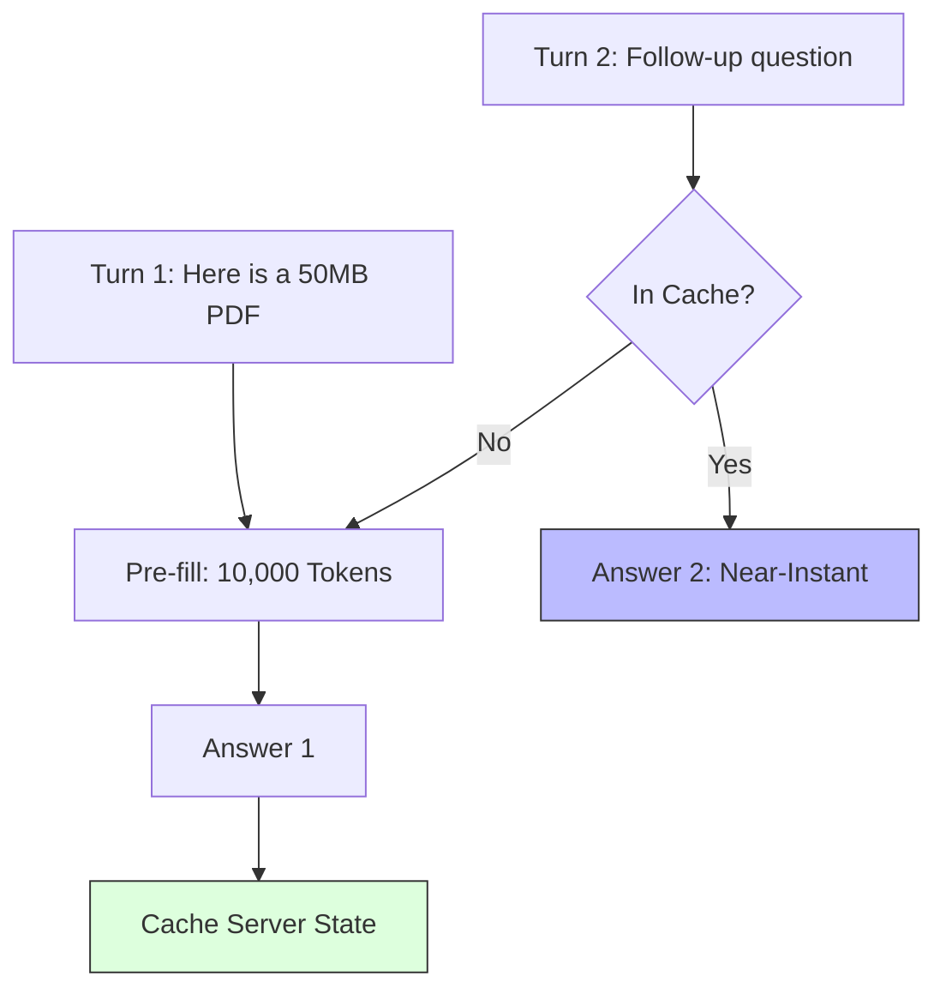

# 45. Caching & Latency Optimization

> **Mentor note:** In production, the "First Token Latency" (TTFT) is the difference between a snappy user experience and a frustrating one. **Prompt Caching** is the biggest breakthrough in LLM cost and speed since quantization. If you have a massive PDF or a long conversation history, the API provider saves the mathematical state of that data so you don't have to "re-pay" or "re-wait" for it on the next turn.

---

## What You'll Learn

- TTFT (Time to First Token) vs. TPOT (Time Per Output Token)
- Prompt Caching: Saving context tokens between turns
- Semantic Caching: Reusing previous answers for similar questions (GPTCache)
- Speculative Decoding: Using a tiny model (Draft) to speed up a big model (Oracle)
- Streaming: Implementing "Chunk-by-chunk" delivery for perceived speed

---

## Theory & Intuition

### The Pre-fill Bottleneck

When you send a 10,000-word document and a question, the LLM must "Pre-fill" its memory by processing those 10,000 words. This takes time ($ and seconds). With **Prompt Caching**, once the pre-fill is done once, the result is locked in the server's VRAM for a few minutes.



**Why it matters:** Cost and Speed. For long documents, Prompt Caching (supported by Gemini and Anthropic) often provides a **50-90% discount** on cached tokens and reduces the wait time from seconds to milliseconds.

---

## Latency Metrics

| Metric | What it means | Target |
|---|---|---|
| **TTFT** | Time to First Token | < 500ms (Feels snappy) |
| **TPOT** | Time Per Output Token | > 30 tokens/sec (Faster than reading)|
| **Tokens/Sec**| Overall generation speed | Variable |
| **E2E Latency**| Total time for a full answer | < 3s for chat |

---

## 💻 Code & Implementation

### Using Context Caching Pattern

This script demonstrates the pattern for creating a persistent context cache in the Gemini API.

```python
import os
from google import genai
from dotenv import load_dotenv

load_dotenv()

def run_cache_demo():
    client = genai.Client(api_key=os.getenv("GOOGLE_API_KEY"))
    
    # Simulation: Caching a large file (> 32k tokens)
    print("Creating Context Cache (Conceptual)...")
    
    # cache = client.caches.create(
    #     model="gemini-1.5-flash",
    #     config={
    #         "display_name": "knowledge_base",
    #         "contents": ["... massive text ..."],
    #         "ttl": "3600s" 
    #     }
    # )

    print("-" * 50)
    print("Cache Created! Subsequent queries about this file will be:")
    print("1. 90% cheaper (on some platforms)")
    print("2. 5x - 10x faster to start generating (TTFT)")
    print("-" * 50)

if __name__ == "__main__":
    run_cache_demo()
```

---

## Interview Questions & Model Answers

**Q: What is 'Speculative Decoding'?**
> **Answer:** It's a technique where a very small, fast model (the Draft model) guesses the next few words. A large, powerful model (the Oracle) then looks at those guesses in parallel. If the guesses are right, we accept them. This can speed up inference by 2x-3x.

**Q: What is the risk of 'Semantic Caching'?**
> **Answer:** Semantic caching (e.g., using Redis to store `{query_embedding: answer}`) can save money, but it risks "Stale Answers." If a user's question is *slightly* different but semantically similar, they might get a cached answer that is technically wrong.

**Q: Why is 'Streaming' considered a latency optimization?**
> **Answer:** It doesn't actually make the model faster, but it significantly improves the **Perceived Latency** for the user. By showing the first word as soon as it's ready, the human can start reading while the AI is still "thinking."

---

## Quick Reference

| Term | Role |
|---|---|
| **TTFT** | The most important metric for user "Vibe" |
| **KV Cache** | The internal GPU memory used for prompt state |
| **Prefill** | The initial heavy lifting of reading the prompt |
| **TTL** | Time-To-Live (How long the cache stays active) |
| **Streaming** | Delivering data piece-by-piece |
